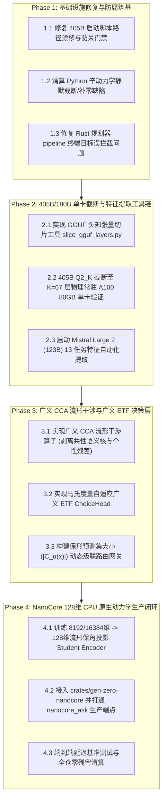

# Gen-Zero × Dense 大模型舰队工程实施主规划 (Implementation Master Plan)

- **创建时间**：2026-09-27
- **主机来源**：`luy-open-box` (Linux / `/ebs/pj/gen-zero`)
- **跨机同步**：已同步至 `~/inbox/gen-zero/docs/260927-openbox-gen-zero-dense-fleet-implementation-plan.md`
- **代码基线**：`/ebs/pj/gen-zero` (HEAD `acb2c0ccf3f30a708cd9a4f638248973c4709188`)
- **前置研究**：
  - `docs/research/b0927c-t1-geom-audit/REPORT.md` (微分几何与辛拓扑升维)
  - `docs/research/b0927c-t2-wm/REPORT.md` (零 Token 连续哈密顿世界模型)
  - `docs/zero/31-multiscale-dense-resonance-etf-dual-process-plan.md` (多尺度流形干涉与广义 ETF)
  - `docs/zero/31-dense-fleet-manifold-anchor-t4-sys-design.md` (405B 单卡 67 层截断与 NanoCore 蒸馏)

---

## 0. 现实底座与防腐四大铁律

在实施本规划时，所有承接任务的外部子代理（Codex / Claude 系列）必须无条件服从 Gen-Zero 防腐铁律：

1. **做了必须真正上线（零孤岛代码）**：
   - 严禁新增任何在生产主干（`crates/gen-zero-service`、`crates/gen-zero-nanocore`、`python/gen_zero/client.py`）中引用数为 0 的自嗨库代码；
   - 必须提供真实的调用拓扑（`Caller -> Callee`）与端到端触发测试证据。
2. **彻底拔除旧逻辑（零历史残留）**：
   - 新上线接口取代旧逻辑时，必须物理连根删除旧符号，`git grep -rn "<旧符号>"` 命中数严格为 0；
   - 绝不允许“出于求稳”搞双轨并存或静默 fallback。
3. **拒绝静默 Bypass 与作弊式实现（Fail-Closed 原则）**：
   - 任何降级必须显式打日志或报错；严禁在维度不匹配时静默补零/截断；严禁使用未绑定的随机哈希伪转移冒充动力学。
4. **拒绝把“数学假设”偷换成“已实现能力”**：
   - 必须严格区分：70B/72B 已提取真实特征 vs 123B/180B/405B 待提取特征；结论永远用数据说话，附带原始退出码、真实运行日志与 `path:line` 证据。

---

## 一、 总体阶段划分与流水线推进图

实施划分为四个自闭环、循序渐进的工程阶段（Phases）：

---

## 二、 阶段任务拆解与子代理派发卡片

### 【Phase 1】 基础设施修复与防腐筑基（Fail-Closed 改造）

#### 任务 1.1：405B 启动脚本路径漂移修复与 GGUF 签名校验
- **目标**：解决 `benchmarks/suites/run_llama405b_extract.bat:8` 默认指向不存在的 Q3_K_M 18 分片的问题，将其与下载器 `queue_dense_fleet_downloads.py:118`（Q2_K 单文件 `Meta-Llama-3.1-405B-Instruct-Q2_K.gguf`）对齐；增加 GGUF 魔数签名和单槽校验。
- **改动文件**：`benchmarks/suites/run_llama405b_extract.bat`
- **派发档位**：Tier 2 (`sonnet` / `xmond`)

#### 任务 1.2：清算 Python 辛动力学静默补零截断与伪动作缺陷
- **目标**：
  - 彻底删除 `python/gen_zero/world_model/hamiltonian_dynamics.py:220` 处的静默补零与截断代码，改为严格的维度尺寸核验，尺寸不合必须抛出 `ValueError`（Fail-Closed）；
  - 解决 `python/gen_zero/world_model/latent_dynamics.py:374` 中由 Python `hash()` 驱动的正弦伪转移行为，拒绝无真实语义的随机退化。
- **改动文件**：
  - `python/gen_zero/world_model/hamiltonian_dynamics.py`
  - `python/gen_zero/world_model/latent_dynamics.py`
  - 补充回归单测：`python/tests/test_fail_closed_dynamics.py`
- **派发档位**：Tier 2 (`opus` / `sapex`)

#### 任务 1.3：修复 Rust Planner Pipeline 终端目标误报拦截问题
- **目标**：解决 `crates/gen-zero-planner/src/pipeline.rs:4` 将所有 `done` 一律当作危险拦截的逻辑漏洞，明确区分 `TerminalGoal`（目标达成）与 `TerminalTrap`（致命陷阱），使世界模型到达目标状态能正确结算而非抛出 Panic/Reject。
- **改动文件**：
  - `crates/gen-zero-planner/src/pipeline.rs`
  - `crates/gen-zero-planner/src/engine.rs`
- **派发档位**：Tier 2 (`sonnet` / `sapex`)

---

## 三、 派发与验收推进规则

1. **严格按流水线逐项执行**：Phase 1 修复为基石，Phase 1 验收完成后即刻开启 Phase 2；
2. **所有代码修改必须在独立隔离工作树（Worktree）中进行**：
   - 派发前由主控预建专属 worktree，避免多 agent 交叉抢写；
3. **双 Reviewer 硬审闭环**：
   - 每个任务交付后，由两名独立 Reviewer（含 Fable / Astra）针对四项一票否决指标（孤岛审查、静默 Bypass 审查、证据链核验、旧残留清算）严格把关；
   - 评审全部通过后，由主控执行合入并删除隔离工作树。
