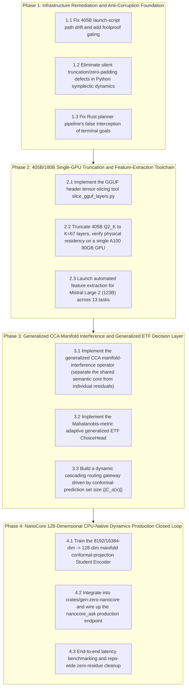

# Gen-Zero × Dense Large-Model Fleet Engineering Implementation Master Plan (Implementation Master Plan)

- **Created**: 2026-09-27
- **Host of origin**: `luy-open-box` (Linux / `/ebs/pj/gen-zero`)
- **Cross-host sync**: synced to `~/inbox/gen-zero/docs/260927-openbox-gen-zero-dense-fleet-implementation-plan.md`
- **Code baseline**: `/ebs/pj/gen-zero` (HEAD `acb2c0ccf3f30a708cd9a4f638248973c4709188`)
- **Prerequisite research**:
  - `docs/research/b0927c-t1-geom-audit/REPORT.md` (differential geometry and symplectic-topology dimension lifting)
  - `docs/research/b0927c-t2-wm/REPORT.md` (zero-token continuous Hamiltonian world model)
  - `docs/zero/31-multiscale-dense-resonance-etf-dual-process-plan.md` (multiscale manifold interference and generalized ETF)
  - `docs/zero/31-dense-fleet-manifold-anchor-t4-sys-design.md` (405B single-GPU 67-layer truncation and NanoCore distillation)

---

## 0. Ground-Truth Foundation and the Four Anti-Corruption Iron Rules

When implementing this plan, all external subagents taking on tasks (the external CLI agent fleet) must unconditionally comply with the Gen-Zero anti-corruption iron rules:

1. **What is built must actually ship (zero orphan code)**:
   - Adding any self-contained library code with a zero reference count in the production trunk (`crates/gen-zero-service`, `crates/gen-zero-nanocore`, `python/gen_zero/client.py`) is strictly forbidden;
   - A real call topology (`Caller -> Callee`) and end-to-end trigger-test evidence must be provided.
2. **Completely remove old logic (zero legacy residue)**:
   - When a newly shipped interface replaces old logic, the old symbol must be physically removed root and branch; the hit count of `git grep -rn “<old symbol>”` must be strictly 0;
   - Dual-track coexistence or a silent fallback “for the sake of stability” is never permitted.
3. **Reject silent bypasses and cheating implementations (Fail-Closed principle)**:
   - Any degradation must be explicitly logged or raised as an error; silently zero-padding/truncating on a dimension mismatch is strictly forbidden; using unbound random-hash pseudo-transitions to impersonate dynamics is strictly forbidden.
4. **Reject substituting a “mathematical assumption” for an “implemented capability”**:
   - A strict distinction must be maintained: 70B/72B have already had real features extracted, versus 123B/180B/405B, for which feature extraction is still pending; conclusions must always be backed by data, accompanied by raw exit codes, genuine run logs, and `path:line` evidence.

---

## I. Overall Phase Breakdown and Pipeline Progression Diagram

The implementation is divided into four self-contained, sequential engineering phases:

---

## II. Phase Task Breakdown and Subagent Dispatch Cards

### [Phase 1] Infrastructure Remediation and Anti-Corruption Foundation (Fail-Closed Retrofit)

#### Task 1.1: 405B Launch-Script Path Drift Fix and GGUF Signature Verification
- **Objective**: Resolve the issue where `benchmarks/suites/run_llama405b_extract.bat:8` defaults to a nonexistent 18-shard Q3_K_M split, and align it with the downloader `queue_dense_fleet_downloads.py:118` (single Q2_K file `Meta-Llama-3.1-405B-Instruct-Q2_K.gguf`); add GGUF magic-number signature and single-slot verification.
- **Files changed**: `benchmarks/suites/run_llama405b_extract.bat`
- **Dispatch tier**: Tier 2 (`sonnet` / `xmond`)

#### Task 1.2: Eliminate Silent Zero-Padding/Truncation and Pseudo-Action Defects in Python Symplectic Dynamics
- **Objective**:
  - Completely remove the silent zero-padding and truncation code at `python/gen_zero/world_model/hamiltonian_dynamics.py:220`, replacing it with strict dimension-size verification; a size mismatch must raise `ValueError` (Fail-Closed);
  - Resolve the sinusoidal pseudo-transition behavior driven by Python `hash()` in `python/gen_zero/world_model/latent_dynamics.py:374`, rejecting random degeneration with no genuine semantics.
- **Files changed**:
  - `python/gen_zero/world_model/hamiltonian_dynamics.py`
  - `python/gen_zero/world_model/latent_dynamics.py`
  - Add regression unit test: `python/tests/test_fail_closed_dynamics.py`
- **Dispatch tier**: Tier 2 (`opus` / `sapex`)

#### Task 1.3: Fix Rust Planner Pipeline's False-Positive Interception of Terminal Goals
- **Objective**: Fix the logic flaw in `crates/gen-zero-planner/src/pipeline.rs:4` that treats every `done` as a dangerous state to intercept; clearly distinguish `TerminalGoal` (goal achieved) from `TerminalTrap` (fatal trap), so that when the world model reaches a goal state it settles correctly instead of raising a Panic/Reject.
- **Files changed**:
  - `crates/gen-zero-planner/src/pipeline.rs`
  - `crates/gen-zero-planner/src/engine.rs`
- **Dispatch tier**: Tier 2 (`sonnet` / `sapex`)

---

## III. Dispatch and Acceptance Progression Rules

1. **Execute strictly item by item along the pipeline**: Phase 1 fixes form the foundation; Phase 2 begins immediately once Phase 1 acceptance is complete;
2. **All code changes must be made in an independent, isolated worktree**:
   - The controller pre-creates a dedicated worktree before dispatch, to avoid cross-writes among multiple agents;
3. **Dual-reviewer hard-gate closed loop**:
   - After each task is delivered, two independent reviewers (including Fable / Astra) strictly gate it against four veto-level criteria (orphan-code review, silent-bypass review, evidence-chain verification, legacy-residue cleanup);
   - Once all reviews pass, the controller performs the merge and removes the isolated worktree.
