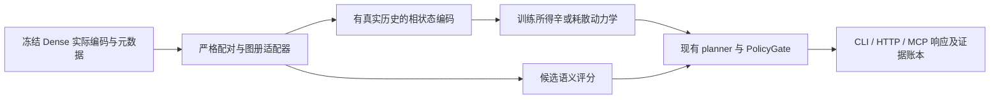

# b0927c-t1-geom：Dense 表征的几何与辛动力学研究方案

研究日期：2026-09-27。工作目录：`/ebs/pj/gen-zero`。检查起点 HEAD：`acb2c0ccf3f30a708cd9a4f638248973c4709188`。

**结论：现有资产足以启动“有配对样本约束的局部切丛对齐”实验，不足以宣称已发现 Dense 模型的内在曲率、已实现跨模型规范不变语义映射，或已获得无 token 世界预测能力。** 最值得实施的是先证明局部几何比全局映射具有样本外收益，再用真实动作轨迹辨识余切相空间与动力学。把已有隐藏向量一分为二、送进稳定振子，得到的只是稳定振子。

> **Pruned 2026-09-29.** The 16 `*.snapshot.txt` source copies were removed from this directory. They duplicated code that has since changed or been deleted. `SHA256.json` keeps their hashes as the record of what was audited. Its entry `gpu_extract_qwen72b_13tasks-suites.snapshot.txt` was already absent before this pruning. `path:line` citations below refer to HEAD `acb2c0c`, not to the current tree.

本次只新增报告、只读核验的命令记录、日志与数据证据，没有修改代码文件、训练模型、部署服务、提交或推送，也没有派子代理。开始时已存在的 `docs/zero/evidence/b0927c-t1-geom/geom_diag.py` 等未跟踪资产没有修改或执行；它们不是本次验证证据。

## 1. 先纠正最危险的前提

### 1.1 三个数学概念不能混用

1. **切丛是 \(TM\)，余切丛是 \(T^*M\)**。前者承载位移/速度，后者承载协向量/动量。给定度量 \(g\) 才能用 \(p=g(v,\cdot)\) 关联二者。\(T^*M\) 有自然辛结构；一般的 \(TM\) 没有无需选择即可获得的同一结构。
2. **高环境维数不等于高内在维数，更不意味着高曲率。** 8192 维向量可以采样自直线、球面的一小片、多个不相连簇或根本不是光滑流形的分层集合。有限点云也不能唯一辨识底层拓扑。
3. **辛性、保体积、保能量、稳定、预测正确是五项不同要求。** 辛性推出相空间体积保持；反向不成立。辛积分器一般不精确保原哈密顿量。能量保持也不保证轨道有界，更不保证语义正确。

### 1.2 当前代码与任务背景已有差异

| 核查项 | 代码事实与证据 | 对研究的影响 |
|---|---|---|
| Procrustes “非对称残差” | `benchmarks/suites/cross_model_manifold_alignment.py:150`，尤其 `:173`：总是低维映入高维；`:183` 用薄 SVD 核计算核范数 | 映射方向仍有意义，但当前**标量残差对交换输入对称**。不能再把解决“非对称残差”作为新贡献 |
| 对齐不等于部署转换器 | 同文件 `:245`、`:265`：加载、核验、输出指标；`:185` 只返回标量 | 当前报告不包含可用于新样本的已部署跨模型转换器 |
| 最后层不等于逐层轨迹 | `gpu_extract_qwen72b_13tasks.py:191`、`:199`、`:203`：完整文本、final post-norm last token、`pair_fields_extracted=False` | 无法从这些 NPZ 直接测层间动力学、真实时间导数或意图动量 |
| ETF 名称与实现不一致 | `crates/gen-zero-model/src/choice_head.rs:7` 说明旧固定顶点绑定已去掉；`:83` 接收候选表示；`:99` 开始余弦打分 | 当前 Rust 服务 head 是内容余弦打分，不可报告成 ETF 极值求解器 |
| Rust 辛模型是先验 | `crates/gen-zero-worldmodel/src/symplectic_dynamics.rs:20`、`:34`、`:132`：未训练，action ID 的正弦中心，手设奖励 | 保结构工程资产真实存在，语义动作因果能力没有由此建立 |
| 服务确有调用链 | `crates/gen-zero-service/src/zero.rs:1546` → `worldsim.rs:240`、`:295` → `SymplecticWorldModelDynamics::transition` | 不能说现有 Rust 辛模块“0 引用”；但本次只验证源码连接，未验证线上执行 |
| Python 静默降级 | `python/gen_zero/world_model/latent_dynamics.py:35` 请求 CUDA 可转 CPU；`:158` 无 Torch 转 `_step_numpy`；`:374` hash 正弦伪转移 | 不符合本任务的能力 provenance 与 fail-closed 标准，应成为后续整改阻断项 |
| “保持熵”名不副实 | 同文件 `:149` 宣称 so(D) dynamics；`:341` 实际只是把 next 向量缩回原模长 | 保范数不等于保熵、保辛，也不等于测地运动 |
| Python 辛控制输入 | `hamiltonian_dynamics.py:188` 随机动作权重，`:220` 静默 pad/truncate，`:247` Python hash 伪动作 | 没有训练与动作语义约束；Python hash 跨进程还受 hash seed 影响 |

这些问题不是本次实现引入的；本次按“不要修改任何代码文件”保留现状并公开列出。不得以“已有数学模块”绕过这些风险。

### 1.3 三类证据状态

**已实现且本次验证：** 既有加载/配对检查、当前对称 Procrustes 标量与历史 13-task 测试集结果；30 项既有对齐测试；真实文件错配 ID 的拒绝行为。具体命令与退出码见第 9 节。

**未验证：** 已有 Rust/Python 辛服务的实际运行行为、当前部署版本、五款 Dense 的完整数据到服务链、历史报告置换对照的本次重算。源码接线不等于 live acceptance。

**未完成：** 本报告提出的局部联络适配器、曲率估计与补偿、可辨识 q/p、训练所得哈密顿量、真实长期前瞻和新生产接入。它们是后续工程与实验计划，不是本次已实现能力。

## 2. 现实数据资产与本次实测

### 2.1 可访问范围

本机 `/ebs/data/extracted_features/` 有 Qwen72B 与 Llama70B 的完整 13-task NPZ；另有 GTE7B 的单任务文件。没有在此目录找到 Mistral123B、Falcon180B、Llama405B 的配对特征。此结论限定于检查的资产目录，不推断其他机器没有数据。

抽取代码约定宽度分别为 Qwen72B/Llama70B 8192、Mistral123B 12288、Falcon180B 14848、Llama405B 16384。后三者的代码证据分别为 `gpu_extract_mistral123b_13tasks.py:62`、`gpu_extract_falcon180b_13tasks.py:63`、`gpu_extract_llama405b_13tasks.py:31`；常量不是成功抽取证明。

本次 26 个 NPZ 的实际 metadata 表明，两款模型用 **GGUF Q4_K_M、llama-server、final post-norm last token、embd_normalize=-1**。因此本报告的实测结论限定于这一量化、pooling、prompt 与后端设置，不能直接推广到 BF16 原生中间层。

### 2.2 核验边界

本次读取全部 train/test ID、train label 与特征；调用现有 `load_features` 和 `verify_id_alignment`；另检查 ID 唯一性与 train/test ID 交集；对每个完整文件计算 SHA256。26/26 哈希与历史报告匹配，各模型各任务 ID 重复和 train/test ID 交集均为零。

但 **相同 ID 不等于原始文本逐字相同**。当前对齐器不核对 `info_json`、token 序列、候选字符串语义顺序或原始文本哈希；本次也没有重新生成抽取输入逐条复核。后续严格配对契约必须补这些信息。metadata 声称 13 个 test 块截断数均为 0，两模型 `max_tok=1536`；这是元数据核查，非本次重跑 tokenizer 的证明。

所有测试集样本用于本次**描述性统计**，没有据此训练或挑选适配器。未来超参数只能在 train 内划分选择，不能把这次探索过的 test 当作从未见过的最终确认集。

### 2.3 真实测量结果

对中心化测试特征 \(X_c\)，令 \(G=X_cX_c^\top\)。使用

\[
\operatorname{CKA}(X,Y)=\frac{\langle G_X,G_Y\rangle_F}{\|G_X\|_F\|G_Y\|_F},\qquad
d_{\rm PR}=\frac{(\sum_i\lambda_i)^2}{\sum_i\lambda_i^2},\quad
\operatorname{CV}_{\|x\|}=\frac{\operatorname{sd}(\|x\|)}{\operatorname{mean}(\|x\|)}.
\]

Gram 形式与既有 CKA 的特征协方差形式代数等价；这是显式记录的只读计算优化，不是隐藏替换生产算法。Procrustes 直接调用当前仓库函数。

| task | test n | CKA | Procrustes | PR Qwen72B | PR Llama70B |
|---|---:|---:|---:|---:|---:|
| aegis_safety | 250 | 0.412279 | 0.802521 | 3.91 | 13.16 |
| boolq | 300 | 0.734506 | 0.647414 | 3.72 | 12.63 |
| civil_comments | 300 | 0.405184 | 0.772942 | 7.01 | 12.21 |
| helpsteer2 | 249 | 0.531555 | 0.741583 | 7.82 | 14.64 |
| massive_de | 350 | 0.678705 | 0.488798 | 25.58 | 31.45 |
| massive_en | 350 | 0.741375 | 0.457384 | 22.47 | 23.84 |
| multinli | 299 | 0.219543 | 0.842391 | 5.85 | 19.33 |
| paws | 250 | 0.424016 | 0.774235 | 10.36 | 31.34 |
| pubmedqa | 250 | 0.539766 | 0.522229 | 35.51 | 67.90 |
| squad2 | 299 | 0.598497 | 0.671883 | 7.63 | 17.08 |
| summeval_consistency | 144 | 0.616939 | 0.592151 | 6.32 | 13.82 |
| summeval_relevance | 240 | 0.428177 | 0.753045 | 9.27 | 7.55 |
| vitaminc | 599 | 0.378081 | 0.761987 | 16.05 | 18.02 |

CKA 与历史 test 值最大绝对差 \(2.220446049250313\times10^{-16}\)；Procrustes 最大差 \(2.3314683517128287\times10^{-15}\)。历史未加权 task 均值为 0.5160 和 0.6791，本次逐项复现。历史 null CKA 均值 0.0569、null Procrustes 均值 1.0580 **只作为历史对照引用，本次未重跑置换分布**。

**尤其注意：当前 `test_full` Procrustes 在测试块自身重新中心化、归一化并求最优残差。它是该点云的描述性拟合，不是 train 上拟合的映射在 test 上泛化的成绩。** 后续泛化实验必须保存 train 的均值、尺度、子空间和映射，只在 test 上应用；不允许每个测试批次重求最优旋转后声称可迁移。

Qwen 的模长 CV 为 0.01763–0.04074；Llama 为 0.00341–0.00758。可支持“该提取方式下径向波动小”；不能支持“数据填满一个球面”或“内在截面曲率为正”。final norm、量化与大均值都可能造成此现象。

PR 是**方差谱有效秩**，不是流形维数估计的替代品。低 PR 可由少数高幅值方向造成；不能据此选一个 4 维流形并宣称无损压缩。中心化测试矩阵秩最多 \(n-1\)，这里仅 143–598，无法辨识整个 8192 维空间的几何。

## 3. 几何升维：从点表示转到局部几何对象

### 3.1 先把假设写清楚

设同一语义样本 \(s_i\) 在模型 \(m\) 的观测为

\[
x_i^{(m)}=f_m(s_i)+\epsilon_i^{(m)}\in\mathbb R^{d_m}.
\]

工作假设是某个局部区域可由低维光滑 \(M_m\) 描述，\(f_m\) 在共享语义子空间上近似局部可逆。**这两个条件都需要检验**：模型可能丢失不同信息；类别边界可能形成分层集合；跨模型共享维数可能随区域变化。

第一版使用提取空间的诱导欧氏度量做可复现基线，并分别记录 raw、train-fitted z-score、去均值/白化等选择。白化改变度量，不是无害坐标更名。若以后能访问冻结模型输出分布，可考虑 pullback Fisher

\[
g_x=\mathbb E_{y\sim p_\theta(y\mid x)}
[\nabla_x\log p_\theta(y\mid x)\nabla_x\log p_\theta(y\mid x)^\top].
\]

它度量表示扰动对输出分布的影响，但需要 logit/梯度接口，可能退化；当前 NPZ 不能计算。不得把普通协方差逆矩阵命名为已获得的 Fisher 度量。

### 3.2 局部切空间与法向残差

仅用训练点构造多尺度 mutual-kNN 图。对锚点 \(i\)：

\[
C_i^{(m)}=\frac{\sum_{j\in N_i}w_{ij}(x_j-x_i)(x_j-x_i)^\top}{\sum_jw_{ij}},
\quad U_i^{(m)}\in\mathbb R^{d_m\times r},\quad U_i^\top U_i=I.
\]

\(U_i\) 为局部 PCA 帧，切坐标 \(v_{ij}=U_i^\top(x_j-x_i)\)。小邻域下它近似 log map；有限邻域误差必须保留，不能把 PCA 投影当成精确黎曼对数。

以留出的邻域样本评价

\[
e_{\perp,i}=\frac{\sum_j\|(I-U_iU_i^\top)(x_j-x_i)\|^2}
{\sum_j\|x_j-x_i\|^2},\quad
e_{\rm frame}=\|U_iU_i^\top-\widetilde U_i\widetilde U_i^\top\|_F.
\]

第二个量比较重采样后的子空间，不比较任意符号的特征向量。建议预注册 \(k\in\{32,64,128,256\}\)、\(r\in\{4,8,16,32\}\)，只保留 \(k\ge4r\) 的组合；这是有限样本工程约束，不是充分性定理。无谱间隙、重复点过多、邻域不连通或基底不稳定时，输出 `geometry_unidentified`，不默认欧氏补位。

局部 PCA + 正交邻域对齐有现成理论基础，但其收敛要求光滑流形、合适采样密度、邻域尺度和充分样本，不能直接套在 250 个离散任务样本上。[Singer & Wu, Vector Diffusion Maps](https://arxiv.org/abs/1102.0075)

### 3.3 曲率必须由多个独立指标支持

在切坐标下拟合法向二阶项：

\[
x(v)\simeq x_i+U_iv+\tfrac12\mathrm{II}_i(v,v).
\]

若欧氏嵌入模型成立，对正交单位切向量 \(u,v\)，Gauss 方程给出

\[
K_i(u,v)=\langle\mathrm{II}_i(u,u),\mathrm{II}_i(v,v)\rangle
-\|\mathrm{II}_i(u,v)\|^2.
\]

高 codimension 下拟合完整二阶张量参数量过大；第一版只估 bootstrap 稳定的少数主法向分量，并公开法向截断误差。至少比较多尺度邻域、训练/留出拟合残差和同协方差谱的无流形 null。导数估计不稳定时不得输出确定曲率符号。

辅助指标可以包含：

- **四点双曲性**：对四个点的三种对边距离和排序 \(s_1\le s_2\le s_3\)，\(\delta=(s_3-s_2)/2\)。报告抽样分布及尺度归一化，不把抽样最大值称为全空间最小双曲常数。小 \(\delta\) 不证明负截面曲率，高维距离集中也可令它变小。
- **球面候选度量**：在明确归一化后用 \(d_S(x,y)=R\arccos(\langle x,y\rangle/R^2)\)；把点强制放到球上只是建模，不是发现球面拓扑。
- **双曲候选度量**：Lorentz 模型 \(\langle x,x\rangle_L=-R^2\)、\(d_H(x,y)=R\operatorname{arcosh}(-\langle x,y\rangle_L/R^2)\)。映射及 \(R\) 只能由训练/验证集确定。
- **持续同调**：对固定度量、多尺度抽样构造过滤，比较稳定的 H0/H1 条形与噪声 null；用地标近似时标明近似。有限点云的洞不自动是模型语义空间的真实洞。

竞争模型应包含 \(\mathbb R^{r_E}\times S^{r_S}(R_S)\times\mathbb H^{r_H}(R_H)\)，而不预设全部语义为负曲率。此类乘积空间是文献中的可训练表示选择，不是现有五款 Dense 几何的证据。Gu 等 2019 工作的 OpenReview 原文访问本次遇到浏览器验证，故不据其未读取正文宣称具体实验或保证。

实际选择标准是留出图距离失真、近邻稳定性、跨模型迁移和下游损失，而不是“图画得更像双曲盘”。如果线性 ridge 持续更好，应接受局部几何模型目前不值得部署。

## 4. 规范场、李群和跨模型平行移动

### 4.1 帧的规范自由度

局部切帧可以换成 \(U_i'=U_iH_i\)，\(H_i\in O(r)\)；同一几何向量坐标变为 \(v_i'=H_i^\top v_i\)。自然结构群是正交标架丛的 \(O(r)\)，不能无条件设成 \(SO(r)\)：PCA 存在反射自由度，空间也未证明可定向。

设 \(P_{ij}\) 表示从点 \(i\) 运到点 \(j\) 的坐标变换。离散估计为

\[
P_{ij}^{(m)}=\operatorname{polar}((U_j^{(m)})^\top U_i^{(m)}),\qquad
P'_{ij}=H_j^\top P_{ij}H_i.
\]

仅在子空间接近、交叠矩阵非退化时接受 polar 因子。这样得到的是**模型内部**的近似平行移动；不同模型环境维数不等，不能直接计算 \((U^B)^\top U^A\)。

### 4.2 跨模型配对给出纤维映射

在共享锚点 ID 及其训练配对邻域上，求

\[
C_i=\arg\min_{C\in O(r)}\sum_{j\in N_i}w_{ij}
\|v_{ij}^{B}-Cv_{ij}^{A}\|^2,
\quad C'_i=(H_i^B)^\top C_iH_i^A.
\]

若局部维数不同，先明确共享秩 \(r\)，报告两模型被丢弃的方差和任务信息；矩形 Stiefel 嵌入不再是可逆规范变换。对于 405B→72B，全维无损等距/辛同构没有根据。

核心联合目标是

\[
\mathcal L=\sum_{i,j}w_{ij}\|v_{ij}^{B}-C_iv_{ij}^{A}\|^2
+\lambda\sum_{(i,j)}w_{ij}\|C_jP^A_{ij}-P^B_{ij}C_i\|_F^2.
\]

第一项绑定真实配对语义；第二项要求“先移动再映射”与“先映射再移动”一致。若无第一项，群同步可能得到漂亮但语义错误的答案。对新样本，必须只靠源模型的训练锚点定位；不允许用其目标模型 test 表征选择邻居。

\(C_i\) 或局部非等距雅可比适配器可以只拟合外置小模型，冻结全部 Dense 权重。这里“不微调权重”指不改教师权重，**不是零训练、零配对数据**。

### 4.3 从局部旋转到联络与曲率

连续记号下，\(A\in\Omega^1(M;\mathfrak{so}(r))\)：

\[
\nabla v=dv+Av,\quad A'=H^{-1}AH+H^{-1}dH,
\quad F=dA+A\wedge A,\quad F'=H^{-1}FH.
\]

沿路径 \(\gamma\)，\(\dot v+A(\dot\gamma)v=0\)，故
\(P_\gamma=\mathcal P\exp(-\int_\gamma A)\)。联络描述坐标帧如何随位置变化，曲率描述沿不同路径运输的差异。

对小闭环 \(i\to j\to k\to i\)，

\[
W_i=P_{ki}P_{jk}P_{ij},\quad W'_i=H_i^\top W_iH_i.
\]

\(\operatorname{tr}W_i\)、\(\|W_i-I\|_F\) 和特征角具有规范不变性；小环且估计可靠时 \(\log W_i\) 与曲率通量相关。实际必须减去采样/帧估计噪声，不能把所有非零 holonomy 都称为语义曲率。

只有在定向一致、变换位于可用对数分支时才使用 \(\Omega=\log P\in\mathfrak{so}(r)\)。\(\det P=-1\) 不能写成实反对称矩阵的指数；接近特征值 -1 的分支歧义必须报出。

**曲率无法通过换 gauge 消掉。** 若两个模型曲率张量并不共轭，就不存在令全部平行移动严格一致的等距束同构。可测的补偿是显式拟合受控局部伸缩 \(J_i=R_iS_i\)，\(S_i\succ0\)，并付出度量失真；不是声称“规范不变性修复任何模型差异”。还要检查局部 Jacobian 场的可积性和图册重叠一致性：一组任意 \(C_i\) 不必来自任何全局微分同胚。

不变的最终对象应是距离、内积、运输后比较或环路谱；单个坐标向量是**等变**的，不是逐坐标不变的。

### 4.4 可部署的局部输出形式

新样本在锚点 \(i\) 附近：

\[
\widehat x^B=\operatorname{Retr}_{x_i^B}
\big(U_i^BC_i(U_i^A)^\top(x^A-x_i^A)\big).
\]

第一版 retraction 可用明确标为一阶近似的 \(x_i^B+U_i^Bv\)，并输出信赖半径、法向残差和映射不确定性。跨图册融合必须先运输到同一帧再加权，不能直接平均不同帧坐标。拒绝域外样本；若另提供线性模式，须由调用者显式选择并在响应里标明模式，不允许失败后悄悄调用它。

## 5. 辛拓扑与 q/p：能成立的严格路线

### 5.1 静态云没有可辨识动量

当前数据只观测 \(x(s)\)，没有 \(\dot x\) 或 \((s,a,s')\)。无穷多个动力系统具有相同静态点集。即使找到了低维坐标，也无法仅凭它确定时间方向、动作响应和奖励。

所需新增数据是同一 episode 的真实 \((o_t,a_t,o_{t+1},\Delta t,r_t,done_t)\)，冻结 Dense 提供各时刻观测编码，至少两帧或历史编码器提供速度可观测性。层索引、token 索引可作为独立的计算过程实验，**不能冒充环境时间**。[Hamiltonian Neural Networks](https://arxiv.org/abs/1906.01563) 的像素实验也通过相邻帧提供速度信息，并训练能量及表示；该论文不能证明任意 LLM 半向量天然是动量。

构造 \(q_t=E_m(o_{\le t})\in Q\)，令 \(p_t=M(q_t)\dot q_t\)，或者通过真实轨迹训练可观测历史编码器 \((q_t,p_t)=E_m(o_{t-k:t})\)。\(p\) 首先是经辨识的动态协变量；要称为“意图”，还需意图干预及混杂控制实验。

### 5.2 正则辛形式与 cotangent lift

在 \(T^*Q\) 上取 \(\theta=p_i dq^i\)、\(\omega=-d\theta=\sum_i dq^i\wedge dp_i\)。令 \(z=(q,p)\)、\(J=\begin{bmatrix}0&I\\-I&0\end{bmatrix}\)，则

\[
\dot z=J\nabla H,\qquad \Phi^*\omega=\omega,\qquad
D\Phi^\top JD\Phi=J.
\]

相同维数的可逆局部位置映射 \(q_B=f(q_A)\)，可提升为

\[
q_B=f(q_A),\qquad p_B=Df(q_A)^{-\top}p_A.
\]

它保持 \(p_B^\top dq_B=p_A^\top dq_A\)，从而保持辛形式。这给出规范对齐和世界模型之间最明确的桥梁：**位置和动量必须按互为逆转置的 Jacobian 变换**，不能各自跑一次不相关的 Procrustes。[Meinrenken, Symplectic Geometry，cotangent lifts](https://www.math.utoronto.ca/mein/teaching/LectureNotes/symplectic.pdf)

若 \(f\) 不可逆、秩不足、维数不同或 Jacobian 条件数超阈值，这一公式不可直接用。显式选择共享子流形会损失信息；不得用伪逆后继续宣称全维辛同构。

### 5.3 拓扑层面的真实限制

非退化反对称二形式要求相空间偶数维；Darboux 坐标只是局部存在结论，**不给原始表示提供 \(\omega\)**，也不保证一个全局 q/p 拆分。若语义底空间近似球面，最自然的相空间是 \(T^*S^r\)，不是把球面向量直接改名为 canonical coordinates。

辛结构比保体积严格：在线性层面 \(S=\operatorname{diag}(a,b,1/a,1/b)\) 依 canonical 配对可为辛变换，单纯令任意矩阵 \(\det S=1\) 则不够。非挤压现象进一步约束共轭平面的可压缩性，但这些数学事实不等于“语义永不丢失”。辛拓扑不是一个可直接从当前 NPZ 输出的推理能力指标。

如果选择非 canonical \(\omega(z)\)，须同时保证反对称、非退化与闭性 \(d\omega=0\)；只学一个反对称矩阵并不充分。Poisson 结构还需 Jacobi 恒等式。第一版优先使用明确的 canonical cotangent charts，避免把额外不可辨识自由度塞进模型。

### 5.4 有界能量的充分条件及其边界

可训练受控结构的候选为

\[
H_\theta(q,p)=\tfrac12 p^\top M^{-1}p+
\tfrac\alpha2\|q\|^2+\operatorname{softplus}(V_\theta(q)),
\quad 0<m_-I\preceq M\preceq m_+I,\quad\alpha>0.
\]

固定 \(M\) 下这是可分离哈密顿量。连续、自治、无外力解满足

\[
\frac{dH}{dt}=\nabla H^\top J\nabla H=0,\quad
H\ge\frac{\|p\|^2}{2m_+}+\frac\alpha2\|q\|^2.
\]

因而在解存在且 \(H_0\) 有限时能界定 \(q,p\) 的范数。\(\alpha\) 与势能参数仍需真实轨迹拟合；过强锚定可能稳定地预测错误。反例 \(H=qp\) 给出 \(q=e^tq_0,p=e^{-t}p_0\)：能量守恒、体积守恒，但轨道可无界。

常质量下使用 Verlet：

\[
p_{n+1/2}=p_n-\tfrac h2\nabla V(q_n),\quad
q_{n+1}=q_n+hM^{-1}p_{n+1/2},\quad
p_{n+1}=p_{n+1/2}-\tfrac h2\nabla V(q_{n+1}).
\]

它保辛但一般不精确保 \(H\)。长时间近似保能量依赖光滑性、足够小步长、轨道控制等条件，不能从 `symplectic` 名称推出。[Gauckler–Hairer–Lubich，§2.4](https://www.unige.ch/~hairer/preprints/icm.pdf)

局部谐振子必要稳定检查为 \(h^2\lambda_{\max}(M^{-1/2}\nabla^2VM^{-1/2})<4\)；非线性系统中它只是局部诊断，不是全球稳定证书。当前 Rust `symplectic_dynamics.rs:76` 已对固定二次井执行 \(kh^2<4\)。若采用 \(M(q)=g(q)\) 的真正测地动能，\(H\) 不再可分离，必须用对应隐式/变分积分器并检查求解残差；不能继续套当前显式 Verlet。

状态依赖自动调步通常破坏普通辛方法的保结构性质。第一版用训练期确定的固定步长；部署中越界明确终止。若未来引入自适应，需扩展相空间等专门方法和独立验证。[Hairer, Variable time step integration with symplectic methods](https://www.unige.ch/~hairer/preprints/varsymp.html)

### 5.5 控制、耗散与“防坍缩”的冲突

有外力与摩擦：

\[
\dot q=M^{-1}p,\qquad \dot p=-\nabla V+B(q)u-\eta p,
\qquad \dot H=\dot q^\top B(q)u-\eta p^\top M^{-1}p.
\]

控制做功必须进入能量账本；随动作切换的 \(H_a\) 不能直接比较成能量漂移。对固定动作切换，记录参数改变导致的 \(H_{a_{t+1}}(z)-H_{a_t}(z)\)；对连续外力记录功积分。bounded action 不自动推出长期能量有界，仍可能共振。

摩擦常数 \(\eta\) 时，\(\Phi_t^*\omega=e^{-\eta t}\omega\)、\(\det D\Phi_t=e^{-r\eta t}\)。仓库对外参数是 \(\eta=2\gamma\)，参见 `conformal_dynamics.rs:16`；所以服务的相体积因子为 \(e^{-2r\gamma h}\)，不能错用底层 ContactIntegrator 的参数名。

耗散允许收敛甚至坍缩，与严格保体积目标不同。严格辛也只禁止全体积坍缩，允许部分方向收缩且其他方向膨胀；不能保证每条语义方向不丢失。应在真实留出轨迹上监测表示协方差有效秩、近邻可分性和预测损失，而非强制每个向量保持旧模长。

固定半径归一化的径向 Jacobian 有零特征值，不能是非退化辛微分同胚。一般的“缩回输入模长”映射同样没有保辛保证。保熵也要求对分布及其雅可比作定义，不能由单样本范数推断。

接触流若带 gauge clamp，须记录 clamp 事件；`contact.rs:221` 的 s 限幅还会改变完整接触空间的可逆性。`conformal_dynamics.rs:23` 每步重新置 s=0，现有接口实际持久化的是 q/p 投影，不能称作完整接触态跨步保持。

### 5.6 训练目标与无 token 的可证明边界

未来训练损失至少包括真实多步预测、观测重建、动作响应、奖励及不确定性校准：

\[
\mathcal L=\sum_{t,k}\beta_k\|D_m(\Phi_{a_{t:t+k-1}}(z_t))-x^m_{t+k}\|^2
+\lambda_{\rm rec}\|D_mE_m(x_{\le t})-x_t\|^2
+\lambda_r\ell(\widehat r_t,r_t)+\lambda_{\rm cal}\ell_{\rm cal}.
\]

若有可信时间导数，可增加 \(\|\dot z-J\nabla H\|^2\)；有限差分噪声须显式建模。不把能量守恒损失作为唯一训练目标，否则零场与无意义振子也会得高分。

“无 token”只表示 rollout 内没有语言解码；观测编码仍有 tokenization 与 Dense 前向成本，训练轨迹生成也有成本。真实验收同时比较 0/1/4/16/64 步预测与决策损失、延迟、编码成本，且与不前瞻、线性动力学、同参数量非保结构模型比较。稳定但无收益就不能声明有效思考。

## 6. ETF 与决策头的衔接

数学上，K 个 simplex ETF 单位顶点满足 \(\langle e_i,e_j\rangle=-1/(K-1)\)，秩为 K−1；等角间隔只描述几何，不能决定哪个候选正确。`crates/gen-zero-core/src/etf.rs:17` 提供 frame 构造，但当前模型 head 已改为候选内容打分。

未来几何 head 可以在同一局部帧内比较 state/candidate，或使用 \(-d_g(q,c)^2/\tau\)，并在 chart 切换时保持得分等变/不变关系。候选表征、局部图册和任务标签都必须来自真实输入；禁止 ActionId 哈希指定语义顶点。若在训练出的类别原型上施加 ETF 正则，必须另证其样本外收益，不能用 label 顶点构造代替推理。

已有温度常量明确是未校准值，见 `choice_head.rs:17`。新方法应在训练内验证集拟合温度，评价 NLL/Brier/ECE 与准确率、拒绝率的联合变化；降低温度穿过 entropy gate 不是能力提升。

## 7. 具体生产衔接与接口契约（全部为待实现设计）

### 7.1 接入图



当前 NPZ→几何报告只是离线分析链，不是上述生产链的实现。

| 现有接点 | 后续契约要求 |
|---|---|
| `cross_model_manifold_alignment.py:101`、`:126`、`:265` | 扩展成 strict feature manifest 校验；训练/验证/测试职责分开，保留当前指标作基线，不能删除对照掩盖退化 |
| `gpu_extract_qwen72b_13tasks.py:194` | manifest 增加模型文件与 tokenizer hash、backend revision、prompt/text hash、候选语义顺序、layer、token/pooling 位置、截断后输入 hash；轨迹另加 episode/time/action/dt |
| `python/gen_zero/world_model/hamiltonian_dynamics.py:190`、`:228` | 不再以任意向量切半当语义编码；调用已训练 phase encoder；严格维数和 finite 检查；无 checkpoint 明确拒绝“trained”模式 |
| `python/gen_zero/client.py:420`、`:471` | 现有可选 Hamiltonian 注入位置可装配真实 checkpoint，但加载成功、实际调用和决策使用三者都要有证据 |
| `crates/gen-zero-core/src/types.rs:152` | `FullLatent=LatentState<1024>` 是硬边界。几何 rank r 通常小于 512，不能零填充后谎称 1024 维非退化 phase state |
| `crates/gen-zero-core/src/traits.rs:40` | 当前 `step(FullLatent, ActionId)` 缺 chart/provenance；需要相状态结构及 metadata 容器，或先在 trait 外显式编码并验证其固定维语义。ActionId 必须索引真实版本化 action embedding |
| `crates/gen-zero-service/src/worldsim.rs:240`、`:283` | 增加显式 trained 模式及工件加载，缺工件/秩错/域外/求解失败返回 Rejection；不能转 residual/contact 继续返回成功 |
| `crates/gen-zero-service/src/zero.rs:1546`、`:2791` | simulate 与 planner 两条入口都必须调用新 dynamics；只接 simulate 不等于决策已生效 |
| `crates/gen-zero-model/src/choice_head.rs:83`；`zero.rs:2542` | 新几何 score 必须从服务选择分支实际调用；候选维度、chart 与 adapter version 要一致 |
| `crates/gen-zero-cli/src/main.rs:632`；`server.rs:891`、`:1755` | CLI simulate 和 HTTP `/v1/simulate` 进入共享 engine；MCP 亦用共享引擎。后续应验证三入口相同数值工件与错误语义 |

第一期只上线观测几何适配/评分，不硬接尚未辨识的 phase dynamics。第二期若 r<512，应真实改造 phase-state/planner 接口，或训练并证实 512 对 canonical 坐标；不得伪装成 1024 维已满足要求。本文不替这一工程决策宣称已经兼容。

### 7.2 建议工件与运行返回值

`GeometryArtifact`（拟议）至少包含：schema_version、模型/特征哈希、训练 ID 集哈希、度量定义、预处理统计、r、图册锚点及基底、合法图边、运输矩阵、跨模型映射、信赖半径、校准误差、适用任务/分布与工件 SHA256。

`PhaseArtifact`（拟议）增加：encoder/dynamics/decoder/action vocabulary checkpoint 哈希、q/p 约定、质量矩阵、步长和适用区间、训练轨迹 manifest、奖励与安全标签来源、calibration split。

每次响应至少记录 `requested_mode`、`executed_mode`、artifact hash、chart/rank、数据来源、是否训练/校准、实际调用次数、超域与限幅事件、能量/功/耗散/数值残差。错误结果不能附一份看似成功的旧算法预测。安全 estimate 缺失仍沿现有 trait `:60` 的拒绝语义处理。

### 7.3 如何防止 0 调用孤岛和旧实现残留

后续替换的验收顺序应为：新工件加载与计算 → 共享服务调用 → planner 确实消费结果 → CLI/HTTP/MCP 集成证据 → 才能删除被替代的旧实现与兼容旁路。不能只以 import 或 `rg` 命中作为实际调用证据。

验收须让两份由不同真实训练数据得到、均合法的工件在同一真实请求上产生可解释的不同中间预测，并验证 planner 消费这些预测；再删除工件确认请求失败。不是注入人为决策常量制造差异。

被替代旧符号、旧注册、旧配置路由、旧测试与活动文档必须有明确迁移清单并全仓检查 0 残留；历史审计证据如需保留应先界定保存位置和搜索范围，不能一边保留活动兼容符号一边声称物理删除。本次没有替换任何模块，因此没有执行删除。CKA/Procrustes 是保留的评价基线，并非待删除算法。

## 8. 实验矩阵、统计与拒绝条件

### 8.1 现有 13-task 可立即做的验证

每个任务独立建立训练/验证切分；相同文档、premise/evidence family 必须成组切分。训练量不同：例如 boolq=9264、massive_de=11247，多数为 1000，pubmedqa=750；同时报告等训练预算对比和全量对比。

比较相同数据预算下：全局正交、ridge、局部正交、无联络正则局部模型、联络约束模型、混合曲率候选。局部模型需加同样样本数的随机邻域对照，避免把更多参数/不同样本量误称曲率优势。所有模型选参只用 train 内 validation。

指标必须逐样本保存 ID 和误差，至少包括：

\[
E_i=\frac{\|\widehat x_i^B-x_i^B\|^2}{s_B^2},\quad
\Delta_i=E_i^{\rm baseline}-E_i^{\rm proposed},\quad
s_B^2=\mathbb E_{\rm train}\|x^B-\mu_B\|^2;
\]

paired retrieval Recall@1/@10、邻域保持、相同候选上的决策正确性/NLL、拒绝覆盖率、P50/P95 延迟、图册存储和拟合成本。拒绝的样本不得从平均收益里悄悄移除，另报固定覆盖率下风险。

联络残差
\(\|C_jP^A_{ij}-P^B_{ij}C_i\|_F/\sqrt r\)
与 holonomy 的跨模型匹配只作为结构指标，不能代替下游任务收益。

统计采用 task 内按 family/episode 的 paired bootstrap，给出 \(\overline\Delta\) 的 95% CI；13-task 报 macro 与各 task 分布。配对置换检验使用真实样本误差交换/符号翻转，进行预声明的多重比较校正。10,000 次置换可作为计划预算；精确数量由统计功效和资源预注册。小样本 CI 跨 0 即“不足以证明改进”。

对非配对 CKA null 也应报告经验 p 值 \((1+\#\{T_b\ge T_{obs}\})/(B+1)\)。现有默认仅 3 次置换、且只留均值和极值，不能支持精细显著性论断；不能把它包装成上述配对下游统计。

真实任务标签不在 NPZ 的 `test_label` 中。应按 `test_ids` 与 `benchmarks/data/full_13/<task>.jsonl` 的 `ground_truth` 显式 join，并校验候选顺序、ID 覆盖与哈希；`grand_challenge_data.py:232` 是现有加载接口。不得按行号猜标签或读取题目格式作为答案。

### 8.2 必须新增数据才能做的验证

| 假设 | 必需数据 | 拒绝条件 |
|---|---|---|
| 405B↔72B 的共享几何 | 405B 同 ID、同文本协议、真实配对特征 | 缺文件、模型 hash 未知、输入被不同截断且未分层分析 |
| 层间曲率演变 | 同样本的多层 token/位置一致隐藏态 | 用最终层静态点代替层轨迹 |
| q/p 可辨识 | 同 episode 的相邻观测、真实动作、时间间隔 | 把 train 样本顺序或两个模型差值当时间导数 |
| 多步世界预测 | 可执行环境或真实轨迹 holdout、真实奖励 | 奖励来自振子能量下降却声称任务回报 |
| 辛/耗散结构适合任务 | 同预算训练的非结构 baseline 与真实 rollout | 只展示谐振子稳定性或守恒误差 |

episode 划分先于相邻窗口构造，避免相邻帧泄漏。若缺 action coverage，对未覆盖动作输出 OOD，不用 hash 生成动作效果。

### 8.3 数值与集成验收

对真实编码得到的 phase state，报告

\[
\epsilon_\omega=\frac{\|D\Phi^\top JD\Phi-J\|_F}{\|J\|_F},\quad
\epsilon_{\rm vol}=|\log|\det D\Phi||,
\]

耗散模式分别将 J 改为 \(e^{-\eta h}J\)，将期望 logdet 改为 \(-r\eta h\)。报告 Jacobian 的计算方式；大维 JVP 抽样只是探针，不能称作全 Jacobian 证明。还测反向误差、步长减半阶数、能量减去控制功和耗散后的残差，以及真实预测误差/有效秩。

容差须按 dtype、维度、积分步长与真实数据噪声在 validation 上冻结，不能为通过测试临时调宽。保守模式、耗散模式、动作切换模式分开验收。

故障注入包括缺工件、坏哈希、错维、NaN/Inf、秩不足、断图、图册外样本、求解不收敛、未训练 checkpoint。要求结构化错误、非成功状态、旧算法调用计数为零。HTTP/MCP 不能只看传输 200，必须核查业务错误 envelope；CLI 必须非零退出。

## 9. 可复验命令、原始退出码与证据

### 9.1 本次实际运行

证据目录就是本报告所在目录。`*.command.json` 保存完整 argv（包括只读 Python `-c` 内容），`*.exit` 保存原始子进程退出码，日志未用管道截断；下述只是尾部展示。

| 实验 | 命令记录 | 原始退出码 | 输出尾部 |
|---|---|---:|---|
| 既有对齐测试 | `alignment-tests.command.json`：`python -m pytest benchmarks/tests/test_cross_model_alignment.py -q -p no:cacheprovider` | 0 | `30 passed in 3.22s` |
| 13-task 实测 | `feature-audit.command.json`：完整 inline 程序；读取真实 NPZ、调用现有 loader/Procrustes、Gram CKA 与谱统计 | 0 | `PASS 13 real feature pairs; historical test metrics reproduced; no curvature or dynamics claim` |
| 错配拒绝 | `negative-id.command.json`：仅在内存中 roll 真实 massive_en 的 test_ids，然后调用现有 verifier | **1（预期拒绝）** | `ValueError: test_ids: not identical ... (350 of 350 positions differ)` |
| VDM 正文核查 | `vdm.command.json`：Firecrawl research read-paper | 0 | 正文摘录含局部 PCA 与正交帧对齐 |
| HNN 正文核查 | `hnn.command.json`：Firecrawl research read-paper | 0 | 正文摘录含导数训练与相邻帧速度可观测性 |

pytest 的部分既有测试使用合成数组检验数值恒等式与拒绝契约；**它们不是实际模型能力证据**。能力相关实测只来自 26 个真实 NPZ；本次没有伪造训练样本或 mock 生产输出。

复跑已记录的任一 argv（以下默认复跑只读特征审计；会重写本证据目录对应 JSON 结果，建议先另存已有证据）：

```bash
cd /ebs/pj/gen-zero
OPENBLAS_NUM_THREADS=1 OMP_NUM_THREADS=1 MKL_NUM_THREADS=1 \
PYTHONDONTWRITEBYTECODE=1 python - <<'PY'
import json, subprocess
from pathlib import Path
p = Path('docs/research/b0927c-t1-geom-audit/feature-audit.command.json')
raise SystemExit(subprocess.run(json.loads(p.read_text())).returncode)
PY
```

预期 0；若真实文件改变、配对不符或历史数值不匹配则非零。要复验拒绝实验，将文件名改成 `negative-id.command.json`，预期原始退出码 1，不能把它误计为成功的正常输入推理。

原始逐任务数据在 `feature-audit.json`；每个模型含完整路径、SHA256、shape、metadata、重复与交集计数、PR/CV。17 个关键源码有编号快照及 `source-hashes.json`，便于共享树变化后复核本报告的 path:line。

### 9.2 现有 CLI 的完整基线命令（本次未执行）

```bash
python benchmarks/suites/cross_model_manifold_alignment.py \
  --dir-a /ebs/data/extracted_features/qwen72b/features \
  --dir-b /ebs/data/extracted_features/llama70b \
  --tasks aegis_safety,boolq,civil_comments,helpsteer2,massive_de,massive_en,multinli,paws,pubmedqa,squad2,summeval_consistency,summeval_relevance,vitaminc \
  --controls --null-permutations 3 --seed 0 \
  --out-json /tmp/b0927c-t1-baseline.json \
  --out-md /tmp/b0927c-t1-baseline.md
```

现有参数见 `cross_model_manifold_alignment.py:329`。正常完成预期 0；缺文件或错 ID 抛异常通常退出 1；参数不完整 argparse 退出 2。这个退出 0 **仅说明计算完成**，不说明局部几何优于线性、也不说明有世界模型能力。

该命令默认重算 train/test，boolq 和 massive_de 的大矩阵会很重；本次没有运行这个全量复算。未来应按用户规范远端执行：先记录 CPU 1m/15m 相对核心数、可用内存≥8GB、磁盘≥10GB，并按实际内存估算再加门槛；复制有哈希 manifest 的无 `.git` 沙箱；记录源数据/源码哈希、命令、原始退出码、完整日志；校验后拉回结果；清理专属临时目录。编译才用 `CARGO_BUILD_JOBS=$(nproc)`，BLAS 不应与多任务并发造成线程乘法超载。

本次本机健康观测为 24 核、1m/15m load 约 30.90/18.52、available RAM 50GB、磁盘 available 72GB，故没有启动全仓编译、多模型抽取或重型全量实验；只执行单 BLAS 线程、逐任务测试块诊断。无远端沙箱或临时调试文件需要回收。保留的日志是本任务审计证据，不作临时垃圾删除。

### 9.3 新方案的验收命令契约（未实现，不可当现有 CLI）

后续实现应提供 `validate-manifest`、`fit-atlas`、`evaluate-paired`、`evaluate-phase-rollout` 四项明确入口；本文不写一条不存在的 `python ...geometry.py` 冒充可以运行。

命令输入契约依次是 feature manifest + 全任务列表、训练/验证 ID manifests、冻结 artifact + 测试 ID/标签、真实 episode manifest + phase checkpoint；输出契约是逐样本 JSONL、聚合统计、工件哈希、实际调用 trace 与退出码。

建议统一返回：0=所有契约及预声明验收通过；2=参数错误；3=数据/配对/provenance 错误；4=不可辨识/数值失败；5=拟合或统计验收未通过。此映射是**提案**，与现有 Python CLI 的 1/2 语义分开。新入口落地前，只能报告“未实现/未运行”。

## 10. 分阶段决策与最终状态

**阶段 A：数据契约。** 补原始输入/候选/tokenizer/model hash，纳入量化和 pooling 因素；取回后三款模型的真实产物，未齐不得输出五模型总表。

**阶段 B：静态几何。** 在现有 13-task 训练特征上做多尺度切空间、噪声校准、held-out 全局/局部/联络对照；先回答局部几何是否值得复杂度。曲率估计失败则记录失败，不以混合曲率名词替代实证。

**阶段 C：只把胜出的静态适配器接入实际决策。** 必须包含共享引擎调用、真实候选、工件失效拒绝、延迟与下游收益；这一步仍不声称世界模型。

**阶段 D：真实轨迹辨识与 phase 编码训练。** 冻结 Dense 权重可以，但 adapter/Hamiltonian 的训练和数据消耗要如实记录。比较保守、耗散和非结构动力学，接受任务可能根本不适合 Hamiltonian 先验。

**阶段 E：多步生产验收与旧路径删除。** 按实际调用与同请求故障拒绝证据判断接入；按逐样本配对统计判断收益；按迁移清单判断被替代旧符号是否确实清零。没有真实训练与执行证据，永远不升级为“已具备”。

最终分类：

- **已实现／已验证：** 本研究报告、源码审计、真实 13-task 配对与历史测试指标复现、30 项对齐测试、错配 fail-closed 实验；详见第 9 节命令/退出码/日志及第 1、7 节 path:line。
- **未验证：** 五模型完整资产、原始文本级跨模型一致性、历史 null 本次复算、当前服务 live acceptance、几何新方案收益。源码存在与数学推导分别只证明存在与条件性结论。
- **未完成：** 新算法实现/生产挂载、phase 训练、长期真实前瞻及旧路径迁移；本任务明确只要求研究报告且禁止改代码，同时当前静态数据缺乏动力学可辨识信息。

## 文献与核查范围

- [Kornblith et al., Similarity of Neural Network Representations Revisited](https://arxiv.org/abs/1905.00414)：CKA 与表征比较；本次检索元数据，不将其作为非线性几何或因果等价证明。
- [Singer & Wu, Vector Diffusion Maps and the Connection Laplacian](https://arxiv.org/abs/1102.0075)：本次核查局部 PCA、polar 对齐及采样假设；正文证据 `vdm.log`。
- [Thunberg et al., Distributed methods for synchronization of orthogonal matrices over graphs](https://arxiv.org/abs/1701.07248)：相关文献检索结果；群同步与有曲率联络不可混为平坦全局一致化。
- [Greydanus et al., Hamiltonian Neural Networks](https://arxiv.org/abs/1906.01563)：本次核查训练损失、轨迹与相邻帧观测；正文证据 `hnn.log`。物理实验不能外推为 LLM 意图动力学。
- [Meinrenken, Symplectic Geometry](https://www.math.utoronto.ca/mein/teaching/LectureNotes/symplectic.pdf)：余切提升与 canonical 结构的数学依据。
- [Gauckler, Hairer & Lubich, Dynamics, Numerical Analysis, and Some Geometry](https://www.unige.ch/~hairer/preprints/icm.pdf)：后向误差分析及长时能量界的条件。
- [Hairer, Variable time step integration with symplectic methods](https://www.unige.ch/~hairer/preprints/varsymp.html)：普通可变步长对保结构性质的风险。

文献发现使用 firecrawl-research-index / firecrawl-research-papers；另用官方大学原文补充数学核查。相关检索返回的无关重尾协方差论文已排除。OpenReview 浏览器验证页未被当作成功读取论文。
