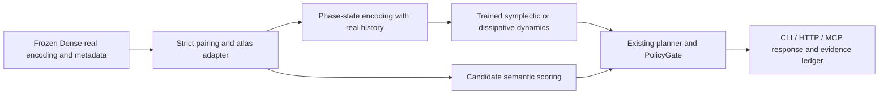

# b0927c-t1-geom: Research Plan for Geometry and Symplectic Dynamics of Dense Representations

Research date: 2026-09-27. Working directory: `/ebs/pj/gen-zero`. Audit start HEAD: `acb2c0ccf3f30a708cd9a4f638248973c4709188`.

**Conclusion: existing assets are enough to start an experiment on "local tangent-bundle alignment under paired-sample constraints," but not enough to claim that the Dense models' intrinsic curvature has been discovered, that a cross-model gauge-invariant semantic mapping has been achieved, or that token-free world prediction has been obtained.** The most worthwhile next step is to first prove that local geometry gives an out-of-sample gain over global mapping, then use real action trajectories to identify a cotangent phase space and dynamics. Splitting an existing hidden vector in half and feeding it into a stable oscillator only produces a stable oscillator.

> **Pruned 2026-09-29.** The 16 `*.snapshot.txt` source copies were removed from this directory. They duplicated code that has since changed or been deleted. `SHA256.json` keeps their hashes as the record of what was audited. Its entry `gpu_extract_qwen72b_13tasks-suites.snapshot.txt` was already absent before this pruning. `path:line` citations below refer to HEAD `acb2c0c`, not to the current tree.

This work only added a report, read-only verification command logs, and evidence data; it did not modify code files, train a model, deploy a service, commit, or push, and it did not dispatch a subagent. Untracked assets that already existed at the start, such as `docs/zero/evidence/b0927c-t1-geom/geom_diag.py`, were not modified or executed; they are not evidence for this verification.

## 1. Correcting the Most Dangerous Premises First

### 1.1 Three Mathematical Concepts That Must Not Be Conflated

1. **The tangent bundle is \(TM\); the cotangent bundle is \(T^*M\)**. The former carries displacement/velocity, the latter carries covectors/momentum. Only with a given metric \(g\) can the two be linked via \(p=g(v,\cdot)\). \(T^*M\) has a natural symplectic structure; a generic \(TM\) does not have that same structure without an additional choice.
2. **A high ambient dimension is not the same as a high intrinsic dimension, and still less does it imply high curvature.** An 8192-dimensional vector can be sampled from a line, a small patch of a sphere, several disconnected clusters, or a stratified set that is not a smooth manifold at all. A finite point cloud also cannot uniquely identify the underlying topology.
3. **Being symplectic, volume-preserving, energy-preserving, stable, and predicting correctly are five different requirements.** Symplecticity implies phase-space volume preservation; the converse does not hold. Symplectic integrators generally do not preserve the original Hamiltonian exactly. Energy preservation also does not guarantee bounded orbits, still less semantic correctness.

### 1.2 Gaps That Already Exist Between the Current Code and the Task Background

| Check item | Code facts and evidence | Impact on the research |
|---|---|---|
| Procrustes "asymmetric residual" | `benchmarks/suites/cross_model_manifold_alignment.py:150`, especially `:173`: always maps low-dimensional into high-dimensional; `:183` computes a nuclear norm via a thin-SVD kernel | The mapping direction is still meaningful, but the current **scalar residual is symmetric under swapping the input pair**. "Solving the asymmetric residual" can no longer be claimed as a new contribution. |
| Alignment is not a deployed converter | Same file `:245`, `:265`: load, verify, output metrics; `:185` returns only a scalar | The current report does not include a deployed cross-model converter usable on new samples. |
| Last layer is not per-layer trajectory | `gpu_extract_qwen72b_13tasks.py:191`, `:199`, `:203`: full text, final post-norm last token, `pair_fields_extracted=False` | Inter-layer dynamics, true time derivatives, or intent momentum cannot be measured directly from these NPZ files. |
| ETF name and implementation diverge | `crates/gen-zero-model/src/choice_head.rs:7` states that the old fixed-vertex binding has been removed; `:83` accepts a candidate representation; `:99` begins cosine scoring | The current Rust service head is content-based cosine scoring; it must not be reported as an ETF extremal solver. |
| The Rust symplectic model is a prior | `crates/gen-zero-worldmodel/src/symplectic_dynamics.rs:20`, `:34`, `:132`: untrained, sinusoidal centering keyed on action ID, hand-set reward | The structure-preserving engineering asset genuinely exists; semantic action-causal capability has not thereby been established. |
| The service does have a call chain | `crates/gen-zero-service/src/zero.rs:1546` → `worldsim.rs:240`, `:295` → `SymplecticWorldModelDynamics::transition` | It cannot be said that the existing Rust symplectic module has "zero references"; but this check only verifies source-code wiring, not live execution. |
| Python silent degradation | `python/gen_zero/world_model/latent_dynamics.py:35` falls back from requested CUDA to CPU; `:158` falls back to `_step_numpy` when Torch is absent; `:374` uses a hashed sine as a pseudo-transition | This does not meet this task's capability-provenance and fail-closed standard, and should become a blocking item for follow-up remediation. |
| "Entropy-preserving" is a misnomer | Same file `:149` claims so(D) dynamics; `:341` in fact only rescales the next vector back to the original norm | Preserving the norm is not the same as preserving entropy, being symplectic, or geodesic motion. |
| Python symplectic control input | `hamiltonian_dynamics.py:188` uses random action weights, `:220` silently pads/truncates, `:247` uses a Python hash as a pseudo-action | There is no training or action-semantic constraint; a Python hash across processes is also affected by the hash seed. |

These issues were not introduced by this work; per the instruction "do not modify any code file," this work preserved the status quo and lists it openly. "An existing math module" must not be used to bypass these risks.

### 1.3 Three Categories of Evidence Status

**Implemented and verified in this work:** the existing load/pairing checks, the current symmetric Procrustes scalar and historical 13-task test-set results, the 30 existing alignment tests, and the rejection behavior on genuinely mismatched file IDs. See Section 9 for the specific commands and exit codes.

**Unverified:** the actual runtime behavior of the existing Rust/Python symplectic service, the currently deployed version, the full data-to-service chain for the five Dense models, and a recomputation in this work of the historical report's permutation controls. Source-code wiring is not the same as live acceptance.

**Not completed:** the local connection adapter, curvature estimation and compensation, identifiable q/p, a trained Hamiltonian, genuine long-horizon lookahead, and new production integration proposed in this report. These are follow-up engineering and experimental plans, not capabilities already implemented in this work.

## 2. Real Data Assets and What Was Actually Measured This Time

### 2.1 Accessible Scope

On this machine, `/ebs/data/extracted_features/` has complete 13-task NPZ files for Qwen72B and Llama70B, plus single-task files for GTE7B. No paired features for Mistral123B, Falcon180B, or Llama405B were found in this directory. This conclusion is limited to the asset directory that was checked; it does not imply that no other machine has the data.

The extraction code specifies widths of 8192 for Qwen72B/Llama70B, 12288 for Mistral123B, 14848 for Falcon180B, and 16384 for Llama405B. The code evidence for the latter three is `gpu_extract_mistral123b_13tasks.py:62`, `gpu_extract_falcon180b_13tasks.py:63`, and `gpu_extract_llama405b_13tasks.py:31` respectively; a constant is not proof of successful extraction.

Actual metadata from the 26 NPZ files checked this time shows that both models used **GGUF Q4_K_M, llama-server, final post-norm last token, embd_normalize=-1**. So the empirical conclusions in this report are limited to this quantization, pooling, prompt, and backend setup, and cannot be directly generalized to native BF16 intermediate layers.

### 2.2 Verification Boundary

This work read all train/test IDs, train labels, and features; called the existing `load_features` and `verify_id_alignment`; additionally checked ID uniqueness and the train/test ID intersection; and computed SHA256 for every complete file. All 26/26 hashes match the historical report, and the duplicate-ID count and train/test ID intersection are zero for every model and task.

But **an identical ID is not the same as identical raw text verbatim**. The current aligner does not cross-check `info_json`, the token sequence, the semantic order of candidate strings, or a raw-text hash; this work also did not regenerate the extraction inputs for a line-by-line recheck. A future strict pairing contract must add this information. The metadata claims zero truncations across the 13 test blocks and `max_tok=1536` for both models; this is a metadata check, not proof that the tokenizer was rerun in this work.

All test-set samples were used this time for **descriptive statistics** only; nothing was trained or selected on this basis. Future hyperparameters may only be chosen within a train-internal split; the test set explored here cannot be treated as a never-seen final confirmation set going forward.

### 2.3 Actual Measurement Results

For centered test features \(X_c\), let \(G=X_cX_c^\top\). Using

\[
\operatorname{CKA}(X,Y)=\frac{\langle G_X,G_Y\rangle_F}{\|G_X\|_F\|G_Y\|_F},\qquad
d_{\rm PR}=\frac{(\sum_i\lambda_i)^2}{\sum_i\lambda_i^2},\quad
\operatorname{CV}_{\|x\|}=\frac{\operatorname{sd}(\|x\|)}{\operatorname{mean}(\|x\|)}.
\]

The Gram form is algebraically equivalent to the existing CKA's feature-covariance form; this is an explicitly recorded read-only computational optimization, not a hidden substitution of the production algorithm. Procrustes calls the current repository function directly.

| task | test n | CKA | Procrustes | PR Qwen72B | PR Llama70B |
|---|---:|---:|---:|---:|---:|
| aegis_safety | 250 | 0.412279 | 0.802521 | 3.91 | 13.16 |
| boolq | 300 | 0.734506 | 0.647414 | 3.72 | 12.63 |
| civil_comments | 300 | 0.405184 | 0.772942 | 7.01 | 12.21 |
| helpsteer2 | 249 | 0.531555 | 0.741583 | 7.82 | 14.64 |
| massive_de | 350 | 0.678705 | 0.488798 | 25.58 | 31.45 |
| massive_en | 350 | 0.741375 | 0.457384 | 22.47 | 23.84 |
| multinli | 299 | 0.219543 | 0.842391 | 5.85 | 19.33 |
| paws | 250 | 0.424016 | 0.774235 | 10.36 | 31.34 |
| pubmedqa | 250 | 0.539766 | 0.522229 | 35.51 | 67.90 |
| squad2 | 299 | 0.598497 | 0.671883 | 7.63 | 17.08 |
| summeval_consistency | 144 | 0.616939 | 0.592151 | 6.32 | 13.82 |
| summeval_relevance | 240 | 0.428177 | 0.753045 | 9.27 | 7.55 |
| vitaminc | 599 | 0.378081 | 0.761987 | 16.05 | 18.02 |

The maximum absolute difference from the historical test values is \(2.220446049250313\times10^{-16}\) for CKA and \(2.3314683517128287\times10^{-15}\) for Procrustes. The historical unweighted per-task means were 0.5160 and 0.6791, reproduced item by item this time. The historical null CKA mean of 0.0569 and null Procrustes mean of 1.0580 **are cited only as a historical reference; this work did not rerun the permutation distribution**.

**Note in particular: the current `test_full` Procrustes re-centers, re-normalizes, and solves the optimal residual within the test block itself. It is a descriptive fit to that point cloud, not the generalization score, on test, of a mapping fitted on train.** A future generalization experiment must save train's mean, scale, subspace, and mapping, and apply them on test only; it must not re-solve the optimal rotation for each test batch and then claim transferability.

Qwen's norm CV ranges 0.01763–0.04074; Llama's ranges 0.00341–0.00758. This can support "radial fluctuation is small under this extraction method"; it cannot support "the data fills a sphere" or "the intrinsic sectional curvature is positive." The final norm, quantization, and a large mean can all produce this pattern.

PR is an **effective rank of the variance spectrum**, not a substitute for manifold-dimension estimation. A low PR can be caused by a small number of high-magnitude directions; it cannot be used to pick a 4-dimensional manifold and claim lossless compression on that basis. The centered test matrix has rank at most \(n-1\), which here is only 143–598, so it cannot identify the geometry of the full 8192-dimensional space.

## 3. Raising the Dimensionality of the Geometry: From Point Representations to Local Geometric Objects

### 3.1 State the Assumptions Clearly First

Let the observation of the same semantic sample \(s_i\) under model \(m\) be

\[
x_i^{(m)}=f_m(s_i)+\epsilon_i^{(m)}\in\mathbb R^{d_m}.
\]

The working assumption is that some local region can be described by a low-dimensional smooth \(M_m\), and that \(f_m\) is approximately locally invertible on a shared semantic subspace. **Both conditions need to be checked**: a model may discard different information; class boundaries may form a stratified set; the shared cross-model dimension may vary by region.

The first version uses the induced Euclidean metric of the extraction space as a reproducible baseline, and records raw, train-fitted z-score, and de-meaned/whitened choices separately. Whitening changes the metric; it is not a harmless renaming of coordinates. If a frozen model's output distribution becomes accessible in the future, a pullback Fisher metric could be considered

\[
g_x=\mathbb E_{y\sim p_\theta(y\mid x)}
[\nabla_x\log p_\theta(y\mid x)\nabla_x\log p_\theta(y\mid x)^\top].
\]

It measures how a representation perturbation affects the output distribution, but it needs a logit/gradient interface and can degenerate; it cannot be computed from the current NPZ files. An ordinary inverse-covariance matrix must not be labeled as an already-obtained Fisher metric.

### 3.2 Local Tangent Space and Normal Residual

Construct a multiscale mutual-kNN graph using train points only. For anchor \(i\):

\[
C_i^{(m)}=\frac{\sum_{j\in N_i}w_{ij}(x_j-x_i)(x_j-x_i)^\top}{\sum_jw_{ij}},
\quad U_i^{(m)}\in\mathbb R^{d_m\times r},\quad U_i^\top U_i=I.
\]

\(U_i\) is the local PCA frame; the tangent coordinates are \(v_{ij}=U_i^\top(x_j-x_i)\). Over a small neighborhood this approximates the log map; the finite-neighborhood error must be kept and reported, and a PCA projection must not be treated as an exact Riemannian logarithm.

Evaluate on held-out neighborhood samples:

\[
e_{\perp,i}=\frac{\sum_j\|(I-U_iU_i^\top)(x_j-x_i)\|^2}
{\sum_j\|x_j-x_i\|^2},\quad
e_{\rm frame}=\|U_iU_i^\top-\widetilde U_i\widetilde U_i^\top\|_F.
\]

The second quantity compares the resampled subspace; it does not compare individual eigenvectors of arbitrary sign. Pre-registering \(k\in\{32,64,128,256\}\) and \(r\in\{4,8,16,32\}\), keeping only combinations with \(k\ge4r\), is recommended; this is a finite-sample engineering constraint, not a sufficiency theorem. When there is no spectral gap, too many duplicate points, a disconnected neighborhood, or an unstable basis, the output should be `geometry_unidentified`; it must not silently fall back to Euclidean.

Local PCA plus orthogonal-neighborhood alignment has an established theoretical basis, but its convergence requires a smooth manifold, adequate sampling density, an appropriate neighborhood scale, and sufficient samples; it cannot be applied directly to 250 discrete task samples. [Singer & Wu, Vector Diffusion Maps](https://arxiv.org/abs/1102.0075)

### 3.3 Curvature Must Be Supported by Multiple Independent Indicators

Fit a second-order normal term in tangent coordinates:

\[
x(v)\simeq x_i+U_iv+\tfrac12\mathrm{II}_i(v,v).
\]

If the Euclidean-embedding model holds, then for orthogonal unit tangent vectors \(u,v\), the Gauss equation gives

\[
K_i(u,v)=\langle\mathrm{II}_i(u,u),\mathrm{II}_i(v,v)\rangle
-\|\mathrm{II}_i(u,v)\|^2.
\]

At high codimension, fitting the full second-order tensor has too many parameters; the first version only estimates the small number of bootstrap-stable principal normal components, and reports the normal-truncation error openly. At minimum, compare across multiscale neighborhoods, train/held-out fit residuals, and a no-manifold null with the same covariance spectrum. When the derivative estimate is unstable, a definite curvature sign must not be output.

Auxiliary indicators can include:

- **Four-point hyperbolicity**: for the three pairwise-sum distances among four points, sorted \(s_1\le s_2\le s_3\), \(\delta=(s_3-s_2)/2\). Report the sampling distribution and scale normalization; do not call a sampled maximum the global minimum hyperbolic constant. A small \(\delta\) does not prove negative sectional curvature; concentration of distances in high dimension can also shrink it.
- **Spherical candidate metric**: after explicit normalization, use \(d_S(x,y)=R\arccos(\langle x,y\rangle/R^2)\); forcing points onto a sphere is only modeling, not the discovery of spherical topology.
- **Hyperbolic candidate metric**: the Lorentz model \(\langle x,x\rangle_L=-R^2\), \(d_H(x,y)=R\operatorname{arcosh}(-\langle x,y\rangle_L/R^2)\). The mapping and \(R\) may only be determined from the train/validation set.
- **Persistent homology**: for a fixed metric and multiscale sampling, build a filtration and compare stable H0/H1 bars against a noise null; when landmark approximation is used, state so explicitly. Holes in a finite point cloud are not automatically genuine holes in the model's semantic space.

The competing model set should include \(\mathbb R^{r_E}\times S^{r_S}(R_S)\times\mathbb H^{r_H}(R_H)\), rather than presupposing that all semantics have negative curvature. Such product spaces are a trainable representation choice found in the literature; they are not evidence about the geometry of the five existing Dense models. Access to the OpenReview original text for the Gu et al. 2019 work hit a browser verification page during this check, so no specific experiment or guarantee from it is claimed without having read the body text.

The actual selection criterion is held-out graph-distance distortion, near-neighbor stability, cross-model transfer, and downstream loss, not "the plot looks more like a hyperbolic disk." If a linear ridge model keeps performing better, it should be accepted that the local geometric model is not currently worth deploying.

## 4. Gauge Fields, Lie Groups, and Cross-Model Parallel Transport

### 4.1 Gauge Freedom of the Frame

A local tangent frame can be changed to \(U_i'=U_iH_i\), \(H_i\in O(r)\); the coordinates of the same geometric vector become \(v_i'=H_i^\top v_i\). The natural structure group is the \(O(r)\) of the orthogonal frame bundle; it cannot be set unconditionally to \(SO(r)\), since PCA has a reflection ambiguity and orientability has not been established for the space.

Let \(P_{ij}\) denote the coordinate transformation transported from point \(i\) to point \(j\). The discrete estimate is

\[
P_{ij}^{(m)}=\operatorname{polar}((U_j^{(m)})^\top U_i^{(m)}),\qquad
P'_{ij}=H_j^\top P_{ij}H_i.
\]

The polar factor is accepted only when the subspaces are close and the overlap matrix is non-degenerate. What this gives is an approximate parallel transport **within a single model**; different models have different ambient dimensions, so \((U^B)^\top U^A\) cannot be computed directly.

### 4.2 Cross-Model Pairing Gives a Fiber Map

On shared anchor IDs and their trained paired neighborhoods, solve

\[
C_i=\arg\min_{C\in O(r)}\sum_{j\in N_i}w_{ij}
\|v_{ij}^{B}-Cv_{ij}^{A}\|^2,
\quad C'_i=(H_i^B)^\top C_iH_i^A.
\]

If the local dimensions differ, first fix an explicit shared rank \(r\) and report the variance and task information discarded by each model; a rectangular Stiefel embedding is no longer an invertible gauge transformation. For 405B→72B, there is no basis for a full-dimensional lossless isometry/symplectomorphism.

The core joint objective is

\[
\mathcal L=\sum_{i,j}w_{ij}\|v_{ij}^{B}-C_iv_{ij}^{A}\|^2
+\lambda\sum_{(i,j)}w_{ij}\|C_jP^A_{ij}-P^B_{ij}C_i\|_F^2.
\]

The first term anchors real paired semantics; the second term requires "transport then map" to agree with "map then transport." Without the first term, group synchronization can produce an answer that looks good but is semantically wrong. For a new sample, positioning must rely only on the source model's trained anchors; it is not allowed to use the target model's test representation to choose neighbors.

\(C_i\), or a local non-isometric Jacobian adapter, may fit only a small external model while keeping all Dense weights frozen. Here "not fine-tuning the weights" means the teacher weights are unchanged, **not** zero training and zero paired data.

### 4.3 From Local Rotations to Connection and Curvature

In continuous notation, \(A\in\Omega^1(M;\mathfrak{so}(r))\):

\[
\nabla v=dv+Av,\quad A'=H^{-1}AH+H^{-1}dH,
\quad F=dA+A\wedge A,\quad F'=H^{-1}FH.
\]

Along a path \(\gamma\), \(\dot v+A(\dot\gamma)v=0\), so
\(P_\gamma=\mathcal P\exp(-\int_\gamma A)\). The connection describes how the coordinate frame changes with position; the curvature describes the difference between transport along different paths.

For a small closed loop \(i\to j\to k\to i\),

\[
W_i=P_{ki}P_{jk}P_{ij},\quad W'_i=H_i^\top W_iH_i.
\]

\(\operatorname{tr}W_i\), \(\|W_i-I\|_F\), and the eigenangles are gauge invariant; for small loops with reliable estimates, \(\log W_i\) correlates with curvature flux. In practice, sampling/frame-estimation noise must be subtracted out; not every non-zero holonomy can be called semantic curvature.

\(\Omega=\log P\in\mathfrak{so}(r)\) may only be used when orientation is consistent and the transformation lies on a usable log branch. \(\det P=-1\) cannot be written as the exponential of a real antisymmetric matrix; branch ambiguity near eigenvalue -1 must be reported.

**Curvature cannot be removed by a change of gauge.** If the curvature tensors of two models are not conjugate, there is no isometric bundle isomorphism that makes all parallel transports agree exactly. A measurable compensation is to explicitly fit a controlled local stretch \(J_i=R_iS_i\), \(S_i\succ0\), and pay a metric-distortion cost; it is not to claim "gauge invariance fixes any model difference." Integrability of the local Jacobian field and consistency of atlas overlaps must also be checked: an arbitrary set of \(C_i\) need not come from any global diffeomorphism.

The invariant final object should be distances, inner products, transported comparisons, or loop spectra; a single coordinate vector is **equivariant**, not invariant coordinate by coordinate.

### 4.4 A Deployable Local Output Form

For a new sample near anchor \(i\):

\[
\widehat x^B=\operatorname{Retr}_{x_i^B}
\big(U_i^BC_i(U_i^A)^\top(x^A-x_i^A)\big).
\]

The first version may use the retraction \(x_i^B+U_i^Bv\), explicitly labeled as a first-order approximation, and output the trust radius, normal residual, and mapping uncertainty. Cross-atlas fusion must transport into the same frame before weighting; it must not directly average coordinates from different frames. Out-of-domain samples should be rejected; if a linear-mode fallback is also offered, the caller must explicitly select it, and the response must label the mode used: it must not be invoked silently after a failure.

## 5. Symplectic Topology and q/p: A Rigorous Path That Can Actually Be Established

### 5.1 A Static Point Cloud Has No Identifiable Momentum

The current data only observes \(x(s)\), not \(\dot x\) or \((s,a,s')\). Infinitely many dynamical systems share the same static point set. Even if a low-dimensional coordinate is found, it alone cannot determine the direction of time, action response, or reward.

The new data needed is real \((o_t,a_t,o_{t+1},\Delta t,r_t,done_t)\) from the same episode, with the frozen Dense model providing the encoding at each time step, and at least two frames or a history encoder providing velocity observability. Layer index and token index can serve as independent computational-process experiments, but **must not be mistaken for environment time**. The pixel experiments in [Hamiltonian Neural Networks](https://arxiv.org/abs/1906.01563) also supply velocity information through adjacent frames and train energy and representation together; that paper does not prove that an arbitrary LLM half-vector is naturally momentum.

Construct \(q_t=E_m(o_{\le t})\in Q\), let \(p_t=M(q_t)\dot q_t\), or train a history encoder on real trajectories to give \((q_t,p_t)=E_m(o_{t-k:t})\). \(p\) is first an identified dynamical covariate; calling it "intent" requires further intent-intervention and confound-control experiments.

### 5.2 The Canonical Symplectic Form and the Cotangent Lift

On \(T^*Q\) take \(\theta=p_i dq^i\), \(\omega=-d\theta=\sum_i dq^i\wedge dp_i\). Let \(z=(q,p)\), \(J=\begin{bmatrix}0&I\\-I&0\end{bmatrix}\); then

\[
\dot z=J\nabla H,\qquad \Phi^*\omega=\omega,\qquad
D\Phi^\top JD\Phi=J.
\]

An invertible local position map \(q_B=f(q_A)\) between spaces of equal dimension can be lifted to

\[
q_B=f(q_A),\qquad p_B=Df(q_A)^{-\top}p_A.
\]

This preserves \(p_B^\top dq_B=p_A^\top dq_A\), and thus preserves the symplectic form. This gives the clearest bridge between gauge alignment and world models: **position and momentum must transform by mutually inverse-transpose Jacobians**, not by two separate, unrelated Procrustes fits. [Meinrenken, Symplectic Geometry, cotangent lifts](https://www.math.utoronto.ca/mein/teaching/LectureNotes/symplectic.pdf)

If \(f\) is not invertible, is rank-deficient, has a different dimension, or the Jacobian condition number exceeds a threshold, this formula cannot be applied directly. Explicitly choosing a shared submanifold loses information; a pseudo-inverse must not be used while still claiming a full-dimensional symplectomorphism.

### 5.3 Real Limits at the Topological Level

A non-degenerate antisymmetric two-form requires the phase space to have even dimension; Darboux coordinates are only a local-existence result, **they do not supply \(\omega\) for the original representation**, nor do they guarantee a global q/p split. If the semantic base space is approximately a sphere, the most natural phase space is \(T^*S^r\), not a sphere vector directly renamed as canonical coordinates.

Being symplectic is stricter than being volume-preserving: at the linear level, \(S=\operatorname{diag}(a,b,1/a,1/b)\) can be a symplectic transformation under the canonical pairing, but merely requiring an arbitrary matrix with \(\det S=1\) is not enough. The non-squeezing phenomenon further constrains the compressibility of conjugate planes, but these mathematical facts do not mean "semantics is never lost." Symplectic topology is not a metric that can be read directly off the current NPZ outputs as a reasoning-capability score.

If a non-canonical \(\omega(z)\) is chosen, antisymmetry, non-degeneracy, and closedness \(d\omega=0\) must all be guaranteed simultaneously; learning only an antisymmetric matrix is not sufficient. A Poisson structure additionally needs the Jacobi identity. The first version prioritizes explicit canonical cotangent charts, to avoid stuffing extra unidentifiable degrees of freedom into the model.

### 5.4 Sufficient Conditions for Bounded Energy, and Their Limits

A candidate trainable, controlled structure is

\[
H_\theta(q,p)=\tfrac12 p^\top M^{-1}p+
\tfrac\alpha2\|q\|^2+\operatorname{softplus}(V_\theta(q)),
\quad 0<m_-I\preceq M\preceq m_+I,\quad\alpha>0.
\]

With \(M\) fixed this is a separable Hamiltonian. A continuous, autonomous, unforced solution satisfies

\[
\frac{dH}{dt}=\nabla H^\top J\nabla H=0,\quad
H\ge\frac{\|p\|^2}{2m_+}+\frac\alpha2\|q\|^2.
\]

So, when a solution exists and \(H_0\) is finite, the norms of \(q,p\) can be bounded. \(\alpha\) and the potential parameters still need to be fit to real trajectories; over-strong anchoring can stably predict the wrong thing. The counterexample \(H=qp\) gives \(q=e^tq_0,p=e^{-t}p_0\): energy is conserved, volume is conserved, but the orbit can be unbounded.

For constant mass, use Verlet:

\[
p_{n+1/2}=p_n-\tfrac h2\nabla V(q_n),\quad
q_{n+1}=q_n+hM^{-1}p_{n+1/2},\quad
p_{n+1}=p_{n+1/2}-\tfrac h2\nabla V(q_{n+1}).
\]

It is symplectic but generally does not preserve \(H\) exactly. Approximate long-time energy preservation depends on smoothness, a sufficiently small step size, orbit control, and similar conditions; it cannot be inferred from the name `symplectic`. [Gauckler–Hairer–Lubich, §2.4](https://www.unige.ch/~hairer/preprints/icm.pdf)

The necessary stability check for a local harmonic oscillator is \(h^2\lambda_{\max}(M^{-1/2}\nabla^2VM^{-1/2})<4\); in a nonlinear system this is only a local diagnostic, not a global stability certificate. The current Rust `symplectic_dynamics.rs:76` already enforces \(kh^2<4\) for a fixed quadratic well. If a genuine geodesic kinetic energy with \(M(q)=g(q)\) is adopted, \(H\) is no longer separable, and a corresponding implicit/variational integrator must be used with the solver residual checked; the current explicit Verlet cannot simply be reused.

State-dependent adaptive step-sizing generally breaks the structure-preserving property of ordinary symplectic methods. The first version uses a fixed step size determined during training, and terminates explicitly on out-of-bounds during deployment. If adaptivity is introduced in the future, it needs extended-phase-space methods and independent verification. [Hairer, Variable time step integration with symplectic methods](https://www.unige.ch/~hairer/preprints/varsymp.html)

### 5.5 The Conflict Between Control, Dissipation, and "Anti-Collapse"

With external force and friction:

\[
\dot q=M^{-1}p,\qquad \dot p=-\nabla V+B(q)u-\eta p,
\qquad \dot H=\dot q^\top B(q)u-\eta p^\top M^{-1}p.
\]

Work done by the controller must enter the energy ledger; an \(H_a\) that switches with the action cannot be directly compared as energy drift. For a fixed action switch, record the change \(H_{a_{t+1}}(z)-H_{a_t}(z)\) caused by the parameter change; for continuous external force, record the work integral. Bounded action does not automatically imply bounded long-term energy; resonance can still occur.

With friction constant \(\eta\), \(\Phi_t^*\omega=e^{-\eta t}\omega\), \(\det D\Phi_t=e^{-r\eta t}\). The repository's external parameter is \(\eta=2\gamma\), see `conformal_dynamics.rs:16`; so the service's phase-volume factor is \(e^{-2r\gamma h}\), and the parameter name of the underlying ContactIntegrator must not be substituted in error.

Dissipation permits convergence or even collapse, unlike a strict volume-preservation goal. Even strict symplecticity only forbids total-volume collapse; it allows contraction along some directions and expansion along others; it cannot guarantee that every semantic direction is preserved. Effective rank of representation covariance, near-neighbor separability, and prediction loss should be monitored on real held-out trajectories, rather than forcing every vector to keep its old norm.

A radial Jacobian from fixed-radius normalization has a zero eigenvalue, so it cannot be a non-degenerate symplectic diffeomorphism. A generic "shrink the input norm back" map likewise carries no symplectic guarantee. Entropy preservation also requires a definition over a distribution and its Jacobian; it cannot be inferred from a single-sample norm.

If a contact flow carries a gauge clamp, the clamp events must be recorded; the s-limiting in `contact.rs:221` also changes the invertibility of the full contact space. `conformal_dynamics.rs:23` resets s=0 at every step, so what the current interface actually persists across steps is the q/p projection; it cannot be called a full contact state preserved across steps.

### 5.6 Training Objectives and the Provable Limits of "Token-Free"

A future training loss should include, at minimum, real multi-step prediction, observation reconstruction, action response, reward, and uncertainty calibration:

\[
\mathcal L=\sum_{t,k}\beta_k\|D_m(\Phi_{a_{t:t+k-1}}(z_t))-x^m_{t+k}\|^2
+\lambda_{\rm rec}\|D_mE_m(x_{\le t})-x_t\|^2
+\lambda_r\ell(\widehat r_t,r_t)+\lambda_{\rm cal}\ell_{\rm cal}.
\]

If credible time derivatives are available, \(\|\dot z-J\nabla H\|^2\) can be added; finite-difference noise must be modeled explicitly. Energy-conservation loss must not be the sole training objective, or a zero field and a meaningless oscillator would also score well.

"Token-free" only means there is no language decoding inside the rollout; observation encoding still has tokenization and Dense forward-pass cost, and generating training trajectories also has a cost. A genuine acceptance test must compare 0/1/4/16/64-step prediction against decision loss, latency, and encoding cost together, and against no-lookahead, linear-dynamics, and equal-parameter-count non-structure-preserving models. Being stable but not beneficial cannot be declared effective thinking.

## 6. Connecting to ETF and the Decision Head

Mathematically, the K unit vertices of a simplex ETF satisfy \(\langle e_i,e_j\rangle=-1/(K-1)\), with rank K−1; equiangular spacing only describes geometry, it does not determine which candidate is correct. `crates/gen-zero-core/src/etf.rs:17` provides the frame construction, but the current model head has already changed to candidate-content scoring.

A future geometric head could compare state/candidate within the same local frame, or use \(-d_g(q,c)^2/\tau\), while preserving the equivariance/invariance relation of the score across chart switches. Candidate representations, local atlases, and task labels must all come from real input; hashing an ActionId to designate a semantic vertex is prohibited. If ETF regularization is applied to trained class prototypes, its out-of-sample benefit must be separately proven; label-derived vertex construction cannot substitute for reasoning.

The existing temperature constant is explicitly an uncalibrated value; see `choice_head.rs:17`. A new method should fit the temperature on a train-internal validation set, and evaluate the joint change in NLL/Brier/ECE against accuracy and rejection rate; lowering the temperature to pass the entropy gate is not a capability improvement.

## 7. Concrete Production Integration and Interface Contract (All Design, Not Yet Implemented)

### 7.1 Integration Diagram



The current NPZ-to-geometry report is only an offline analysis chain; it is not an implementation of the production chain above.

| Existing integration point | Follow-up contract requirement |
|---|---|
| `cross_model_manifold_alignment.py:101`, `:126`, `:265` | Extend into a strict feature-manifest check; separate train/validation/test responsibilities, keep the current metrics as a baseline, and do not remove controls to mask regressions |
| `gpu_extract_qwen72b_13tasks.py:194` | The manifest should add model-file and tokenizer hash, backend revision, prompt/text hash, candidate semantic order, layer, token/pooling position, and post-truncation input hash; trajectories additionally need episode/time/action/dt |
| `python/gen_zero/world_model/hamiltonian_dynamics.py:190`, `:228` | Stop treating an arbitrary vector split as a semantic encoding; call a trained phase encoder; enforce strict dimension and finiteness checks; explicitly reject "trained" mode when there is no checkpoint |
| `python/gen_zero/client.py:420`, `:471` | The existing optional Hamiltonian injection point can be wired to a real checkpoint, but successful loading, actual invocation, and use in the decision all need evidence |
| `crates/gen-zero-core/src/types.rs:152` | `FullLatent=LatentState<1024>` is a hard boundary. The geometric rank r is usually smaller than 512; it must not be zero-padded and then falsely called a non-degenerate 1024-dimensional phase state |
| `crates/gen-zero-core/src/traits.rs:40` | The current `step(FullLatent, ActionId)` lacks chart/provenance; a phase-state struct and a metadata container are needed, or the fixed-dimension semantics must be encoded and verified explicitly outside the trait first. ActionId must index a real, versioned action embedding |
| `crates/gen-zero-service/src/worldsim.rs:240`, `:283` | Add an explicit trained mode and artifact loading; return Rejection on missing artifact/rank mismatch/out-of-domain/solve failure; must not fall back to residual/contact and still return success |
| `crates/gen-zero-service/src/zero.rs:1546`, `:2791` | Both the simulate and planner entry points must call the new dynamics; wiring up simulate alone does not mean the decision path has taken effect |
| `crates/gen-zero-model/src/choice_head.rs:83`; `zero.rs:2542` | The new geometric score must actually be called from the service's selection branch; candidate dimension, chart, and adapter version must be consistent |
| `crates/gen-zero-cli/src/main.rs:632`; `server.rs:891`, `:1755` | CLI simulate and HTTP `/v1/simulate` must enter the shared engine; MCP must also use the shared engine. A follow-up should verify identical numeric artifacts and error semantics across all three entry points |

Phase one should only ship the observational geometry adapter/scoring, without hard-wiring the not-yet-identified phase dynamics. In phase two, if r<512, the phase-state/planner interface should genuinely be changed, or 512 should be trained and proven equivalent to canonical coordinates; it must not be disguised as already meeting the requirement at 1024 dimensions. This document does not make that engineering decision on anyone's behalf, nor claim it already compatible.

### 7.2 Proposed Artifacts and Run Return Values

`GeometryArtifact` (proposed) should include at minimum: schema_version, model/feature hash, train-ID-set hash, metric definition, preprocessing statistics, r, atlas anchors and basis, valid graph edges, transport matrices, cross-model mapping, trust radius, calibration error, applicable task/distribution, and artifact SHA256.

`PhaseArtifact` (proposed) additionally adds: encoder/dynamics/decoder/action-vocabulary checkpoint hash, q/p convention, mass matrix, step size and applicable interval, training-trajectory manifest, reward and safety-label provenance, and calibration split.

Every response should at minimum record `requested_mode`, `executed_mode`, artifact hash, chart/rank, data provenance, whether trained/calibrated, actual invocation count, out-of-domain and clamping events, and energy/work/dissipation/numerical residual. An error result must not be accompanied by an old algorithm's prediction dressed up as success. A missing safety estimate should still be handled by the existing trait's rejection semantics at `:60`.

### 7.3 Preventing Zero-Call Islands and Legacy-Implementation Residue

The acceptance order for any future replacement should be: new artifact loading and computation → shared service invocation → the planner actually consuming the result → CLI/HTTP/MCP integration evidence → only then may the replaced legacy implementation and any compatibility bypass be removed. An import or `rg` hit alone must not be treated as evidence of actual invocation.

Acceptance must show two legitimate artifacts, obtained from different real training data, producing distinguishable and explainable intermediate predictions on the same real request, with the planner verified to consume those predictions; then removing the artifact must be confirmed to fail the request. This is not the same as injecting an artificial decision constant to manufacture a difference.

Replaced legacy symbols, registrations, config routing, tests, and living documentation must have an explicit migration checklist and a whole-repo check for zero residue; if historical audit evidence needs to be kept, its storage location and search scope must be defined first: a living compatibility symbol cannot be kept while claiming physical deletion. This work replaced no module, so no deletion was performed. CKA/Procrustes are retained evaluation baselines, not algorithms pending deletion.

## 8. Experiment Matrix, Statistics, and Rejection Conditions

### 8.1 Verifications That Can Be Done Immediately on the Existing 13 Tasks

Build an independent train/validation split for each task; the same document or premise/evidence family must be split as a group. Training set sizes differ, e.g. boolq=9264, massive_de=11247, most are 1000, pubmedqa=750; report both an equal-training-budget comparison and a full-data comparison.

Compare, at the same data budget: global orthogonal, ridge, local orthogonal, local model without connection regularization, connection-constrained model, and mixed-curvature candidates. The local model needs a random-neighborhood control with the same sample count, to avoid mistakenly calling more parameters or a different sample size a curvature advantage. All model hyperparameter selection uses train-internal validation only.

Metrics must save per-sample ID and error, including at minimum:

\[
E_i=\frac{\|\widehat x_i^B-x_i^B\|^2}{s_B^2},\quad
\Delta_i=E_i^{\rm baseline}-E_i^{\rm proposed},\quad
s_B^2=\mathbb E_{\rm train}\|x^B-\mu_B\|^2;
\]

paired retrieval Recall@1/@10, neighborhood preservation, decision correctness/NLL on the same candidates, rejection coverage, P50/P95 latency, and atlas storage and fitting cost. Rejected samples must not be quietly dropped from the average benefit; risk at a fixed coverage rate should be reported separately.

The connection residual
\(\|C_jP^A_{ij}-P^B_{ij}C_i\|_F/\sqrt r\)
and cross-model holonomy matching serve only as structural indicators; they cannot substitute for downstream task benefit.

Statistics should use within-task paired bootstrap by family/episode, giving a 95% CI for \(\overline\Delta\); report both the macro average and the per-task distribution across the 13 tasks. Paired permutation tests should use real sample-error swaps/sign flips, with pre-declared multiple-comparison correction. 10,000 permutations can serve as a planning budget; the exact number should be pre-registered based on statistical power and resources. A small-sample CI that crosses 0 means "not enough to prove improvement."

For the unpaired CKA null, an empirical p-value \((1+\#\{T_b\ge T_{obs}\})/(B+1)\) should also be reported. The existing default of only 3 permutations, keeping only the mean and extremes, cannot support a fine-grained significance claim, and must not be repackaged as the paired downstream statistic above.

The real task labels are not in the NPZ `test_label`. They should be explicitly joined between `test_ids` and the `ground_truth` in `benchmarks/data/full_13/<task>.jsonl`, checking candidate order, ID coverage, and hash; `grand_challenge_data.py:232` is the existing loading interface. Labels must not be guessed by row number, nor read off the question format as the answer.

### 8.2 Verifications That Require New Data First

| Hypothesis | Data required | Rejection condition |
|---|---|---|
| Shared geometry between 405B↔72B | Real paired features for 405B on the same ID, same text protocol | Missing file, unknown model hash, or inputs truncated differently without stratified analysis |
| Curvature evolution across layers | Consistent hidden state across layers, same sample, same token/position | Substituting the final layer's static point for a layer trajectory |
| q/p identifiability | Adjacent observations, real action, and time interval from the same episode | Treating the train-sample order, or the difference between two models, as a time derivative |
| Multi-step world prediction | An executable environment, or real trajectory holdout with real reward | Reward from an oscillator's declining energy claimed as task return |
| Symplectic/dissipative structure suits the task | A non-structured baseline trained on the same budget, and real rollouts | Showing only harmonic-oscillator stability or conservation error |

Episode splitting should precede adjacent-window construction, to avoid leakage between adjacent frames. If action coverage is missing, output OOD for uncovered actions rather than generating action effects from a hash.

### 8.3 Numerical and Integration Acceptance

For a phase state obtained from real encoding, report

\[
\epsilon_\omega=\frac{\|D\Phi^\top JD\Phi-J\|_F}{\|J\|_F},\quad
\epsilon_{\rm vol}=|\log|\det D\Phi||,
\]

In dissipative mode, replace J with \(e^{-\eta h}J\) and the expected logdet with \(-r\eta h\). Report how the Jacobian was computed; high-dimensional JVP sampling is only a probe, not proof of the full Jacobian. Also measure backward error, the order of convergence under step-size halving, the residual after subtracting control work and dissipation from the energy change, and real prediction error/effective rank.

Tolerances must be frozen on validation according to dtype, dimension, integration step size, and real data noise; they must not be loosened temporarily to pass a test. Conservative mode, dissipative mode, and action-switching mode must be accepted separately.

Fault injection should cover a missing artifact, a bad hash, a wrong dimension, NaN/Inf, rank deficiency, a disconnected graph, an out-of-atlas sample, non-converging solve, and an untrained checkpoint. It requires a structured error, a non-success status, and a legacy-algorithm invocation count of zero. HTTP/MCP must not check only the transport-level 200; the business error envelope must be checked. CLI must exit non-zero.

## 9. Reproducible Commands, Raw Exit Codes, and Evidence

### 9.1 What Was Actually Run This Time

The evidence directory is the directory this report is in. `*.command.json` saves the full argv (including read-only Python `-c` content); `*.exit` saves the raw subprocess exit code; the logs are not pipe-truncated, and what follows is only a displayed tail.

| Experiment | Command record | Raw exit code | Output tail |
|---|---|---:|---|
| Existing alignment tests | `alignment-tests.command.json`: `python -m pytest benchmarks/tests/test_cross_model_alignment.py -q -p no:cacheprovider` | 0 | `30 passed in 3.22s` |
| 13-task real measurement | `feature-audit.command.json`: full inline program; reads real NPZ, calls the existing loader/Procrustes, Gram CKA, and spectral statistics | 0 | `PASS 13 real feature pairs; historical test metrics reproduced; no curvature or dynamics claim` |
| Mismatch rejection | `negative-id.command.json`: only rolls real massive_en test_ids in memory, then calls the existing verifier | **1 (expected rejection)** | `ValueError: test_ids: not identical ... (350 of 350 positions differ)` |
| VDM body-text check | `vdm.command.json`: Firecrawl research read-paper | 0 | Body-text excerpt includes local PCA and orthogonal frame alignment |
| HNN body-text check | `hnn.command.json`: Firecrawl research read-paper | 0 | Body-text excerpt includes derivative training and adjacent-frame velocity observability |

Some of pytest's existing tests use synthetic arrays to check numerical identities and rejection contracts; **they are not evidence of actual model capability**. Capability-relevant measurements come only from the 26 real NPZ files; this work did not fabricate training samples or mock production output.

To rerun any recorded argv (the default below reruns the read-only feature audit; it will overwrite the corresponding JSON result in this evidence directory, so save a copy of existing evidence first):

```bash
cd /ebs/pj/gen-zero
OPENBLAS_NUM_THREADS=1 OMP_NUM_THREADS=1 MKL_NUM_THREADS=1 \
PYTHONDONTWRITEBYTECODE=1 python - <<'PY'
import json, subprocess
from pathlib import Path
p = Path('docs/research/b0927c-t1-geom-audit/feature-audit.command.json')
raise SystemExit(subprocess.run(json.loads(p.read_text())).returncode)
PY
```

Expect 0; expect non-zero if the real files change, the pairing no longer matches, or the historical values no longer match. To re-verify the rejection experiment, change the filename to `negative-id.command.json`; the expected raw exit code is 1, and this must not be miscounted as a successful normal-input inference.

The raw per-task data is in `feature-audit.json`; each model entry includes the full path, SHA256, shape, metadata, duplicate and intersection counts, and PR/CV. The 17 key source files have numbered snapshots and `source-hashes.json`, to make it easier to recheck this report's `path:line` references after the shared tree changes.

### 9.2 Full Baseline Command for the Existing CLI (Not Executed This Time)

```bash
python benchmarks/suites/cross_model_manifold_alignment.py \
  --dir-a /ebs/data/extracted_features/qwen72b/features \
  --dir-b /ebs/data/extracted_features/llama70b \
  --tasks aegis_safety,boolq,civil_comments,helpsteer2,massive_de,massive_en,multinli,paws,pubmedqa,squad2,summeval_consistency,summeval_relevance,vitaminc \
  --controls --null-permutations 3 --seed 0 \
  --out-json /tmp/b0927c-t1-baseline.json \
  --out-md /tmp/b0927c-t1-baseline.md
```

The existing parameters are at `cross_model_manifold_alignment.py:329`. Normal completion is expected to exit 0; a missing file or wrong ID usually raises and exits 1; incomplete arguments make argparse exit 2. This exit-0 **only means the computation finished**; it does not mean local geometry beats a linear model, and it does not mean world-model capability exists.

This command recomputes train/test by default; boolq and massive_de's large matrices are heavy. This work did not run this full recomputation. In the future this should be run remotely per the user's standard: first record CPU 1m/15m load relative to core count, available RAM ≥8GB, disk ≥10GB, and add a threshold based on the actual memory estimate; copy into a `.git`-free sandbox with a hash manifest; record source-data/source-code hash, the command, the raw exit code, and the full log; pull results back after verification; clean up the dedicated temp directory. Only compilation should use `CARGO_BUILD_JOBS=$(nproc)`; BLAS should not create thread multiplication overload alongside concurrent tasks.

This machine's health observation for this work was 24 cores, 1m/15m load about 30.90/18.52, 50GB RAM available, 72GB disk available; so no full-repo compile, multi-model extraction, or heavy full-scale experiment was started: only single-BLAS-thread, per-task test-block diagnostics were run. There is no remote sandbox or temp debug file to reclaim. The logs kept here are audit evidence for this task, not temporary clutter to delete.

### 9.3 Acceptance Command Contract for the New Design (Not Implemented; Do Not Treat as an Existing CLI)

A future implementation should provide four explicit entry points: `validate-manifest`, `fit-atlas`, `evaluate-paired`, `evaluate-phase-rollout`; this document does not write a non-existent `python ...geometry.py` command and pretend it can be run.

The command input contracts are, in order: a feature manifest plus the full task list; train/validation ID manifests; a frozen artifact plus test IDs/labels; a real episode manifest plus a phase checkpoint. The output contract is per-sample JSONL, aggregate statistics, artifact hash, actual invocation trace, and exit code.

The suggested unified return codes: 0 = all contracts and pre-declared acceptance passed; 2 = argument error; 3 = data/pairing/provenance error; 4 = unidentifiable/numerical failure; 5 = fit or statistical acceptance failed. This mapping is a **proposal**, separate from the existing Python CLI's 1/2 semantics. Before the new entry points land, only "not implemented / not run" may be reported.

## 10. Staged Decisions and Final Status

**Stage A: Data contract.** Add raw input/candidate/tokenizer/model hash, incorporating quantization and pooling factors; obtain real artifacts for the remaining three models; do not output a five-model summary table until all are available.

**Stage B: Static geometry.** Do multiscale tangent-space fitting, noise calibration, and held-out global/local/connection controls on the existing 13-task train features; first answer whether local geometry is worth the added complexity. If curvature estimation fails, record the failure; do not substitute mixed-curvature terminology for empirical results.

**Stage C: Wire only the winning static adapter into the actual decision path.** This must include the shared-engine call, real candidates, rejection on artifact failure, and latency and downstream benefit; this step still does not claim a world model.

**Stage D: Real trajectory identification and phase-encoder training.** Freezing the Dense weights is fine, but the training and data consumption of the adapter/Hamiltonian must be recorded truthfully. Compare conservative, dissipative, and non-structured dynamics; accept that the task may not suit a Hamiltonian prior at all.

**Stage E: Multi-step production acceptance and removal of legacy paths.** Judge integration by actual-invocation and same-request failure-rejection evidence; judge benefit by per-sample paired statistics; judge whether replaced legacy symbols are truly gone by the migration checklist. Without real training and execution evidence, never upgrade the status to "already have this capability."

Final classification:

- **Implemented/Verified:** this research report, the source-code audit, the real 13-task pairing and reproduction of the historical test metrics, the 30 existing alignment tests, and the mismatch fail-closed experiment; see the commands/exit codes/logs in Section 9 and the `path:line` references in Sections 1 and 7.
- **Unverified:** the full five-model assets, raw-text-level cross-model consistency, a recomputation of the historical null in this work, current service live acceptance, and the benefit of the new geometric design. Source-code existence and mathematical derivation only prove, respectively, existence and a conditional conclusion.
- **Not completed:** new algorithm implementation/production mounting, phase training, genuine long-horizon lookahead, and legacy-path migration; this task explicitly required only a research report and prohibited code changes, and the current static data in any case lacks dynamics-identifying information.

## Literature and Verification Scope

- [Kornblith et al., Similarity of Neural Network Representations Revisited](https://arxiv.org/abs/1905.00414): CKA and representation comparison; metadata was retrieved this time, and it is not used as evidence for nonlinear geometry or causal equivalence.
- [Singer & Wu, Vector Diffusion Maps and the Connection Laplacian](https://arxiv.org/abs/1102.0075): this work checked local PCA, polar alignment, and the sampling assumptions; body-text evidence in `vdm.log`.
- [Thunberg et al., Distributed methods for synchronization of orthogonal matrices over graphs](https://arxiv.org/abs/1701.07248): a related literature-search result; group synchronization must not be conflated with a curved connection reaching a flat global consensus.
- [Greydanus et al., Hamiltonian Neural Networks](https://arxiv.org/abs/1906.01563): this work checked the training loss, trajectories, and adjacent-frame observation; body-text evidence in `hnn.log`. The physics experiments cannot be extrapolated to LLM intent dynamics.
- [Meinrenken, Symplectic Geometry](https://www.math.utoronto.ca/mein/teaching/LectureNotes/symplectic.pdf): the mathematical basis for the cotangent lift and canonical structure.
- [Gauckler, Hairer & Lubich, Dynamics, Numerical Analysis, and Some Geometry](https://www.unige.ch/~hairer/preprints/icm.pdf): backward error analysis and the conditions for long-time energy bounds.
- [Hairer, Variable time step integration with symplectic methods](https://www.unige.ch/~hairer/preprints/varsymp.html): the risk that ordinary variable-step integration poses to the structure-preserving property.

Literature discovery used firecrawl-research-index / firecrawl-research-papers; official university source text was also used to supplement the mathematical checks. Unrelated heavy-tailed-covariance papers returned by related searches were excluded. The OpenReview browser-verification page was not treated as a successful paper read.
