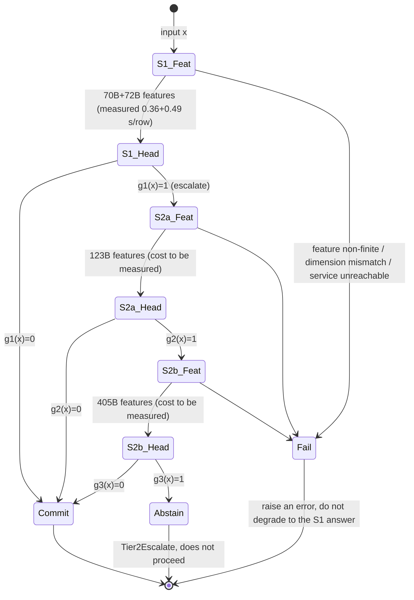

# Spec 31: Multiscale Dense Model Manifold Interference, Generalized ETF, and Dual-Process Coordination Plan (b0927c-t3-multi)

- Date: 2026-09-27 (JST)
- Source baseline: `acb2c0ccf3f30a708cd9a4f638248973c4709188`, working directory `/ebs/pj/gen-zero`
- Evidence directory: `docs/zero/evidence/b0927c-t3-multi/` (commands, exit codes, logs, output JSON in `commands.txt`)
- This document only adds the design document and a set of read-only analysis evidence (scripts, logs, JSON, command records); it does not modify any existing code file, and nothing is committed.

## 0. Conclusions up front, split into three categories

**Implemented (with evidence)**

1. **On-site inventory.** Of the five Dense models, only Llama-3.1-70B and Qwen2.5-72B have the full 13-task features (`/ebs/data/extracted_features/llama70b/`, `.../qwen72b/features/`). Mistral-123B's Q3_K_M weights appear fully downloaded: on `ai`, two shards totaling 59,102,779,264 bytes finished writing at 15:30, matching the downloader's expected ~59 GB; **no sha256 check was performed**. It has **not had features extracted**. Falcon-180B and Llama-405B weights are **not on `ai`**. Evidence: `commands.txt` §2.
2. **A one-shot, training-set-only OOF pre-analysis (70B+72B).** 13 tasks, 5 folds, the same projection and ridge head as the baseline, with no test labels read at all. Command exit code 0, elapsed 2 minutes 23 seconds. Key numbers (13-task macro average): best single model 81.47%, two-model probability average 82.45%, "either model correct" upper bound 86.64%, both models wrong 13.36%. **The AUROC of two-model disagreement (mutual information) predicting error is 0.655, versus 0.794 for total entropy; disagreement loses on all 13 of 13 tasks.** Evidence: `oof_complementarity_probe.{py,log,json}`.
3. **Five task premises that do not match the on-site facts**, each with a `path:line` citation, in §2.
4. **One existing defect**: the 405B launcher's default path points at a file the downloader never produces, see §2.5.

**Unverified (designed, but with no data proving it correct)**

- §4's manifold interference operator, §5's curvature-adaptive generalized ETF, and §6's dual-process cascade: all are design and falsifiable hypotheses. §7 gives the experiments and script specifications that will decide their success or failure.
- "72B leans toward instruction structure, 123B toward long-range reasoning, 405B toward world knowledge": **pure hypothesis**, neither supported nor refuted by current data. H2 in §7 is specifically designed to test it.

**Not done (not attempted, with the reason)**

- Any geometric numbers or cascade gains for 123B/180B/405B: no features exist. 123B is missing an extraction run (estimated ~6 hours on an A100, estimate in §3.3); 180B and 405B are missing weight downloads, with 405B Q2_K at about 141 GB (`queue_dense_fleet_downloads.py:4`), exceeding 80 GB of VRAM and requiring roughly 61 GB of host-memory offload, with throughput untested.
- Any "breakthrough" or "emergence" conclusion: not made in this document. No improvement is claimed before per-sample paired statistics exist.
- Production integration (the server side accepting multi-model features): this document only gives the mounting point and specification (§6.5); it does not modify production code.

## 1. On-site fact table

| Model | Hidden dim | Quantization | Feature status | Measured extraction cost |
|---|---:|---|---|---|
| Llama-3.1-70B | 8192 | Q4_K_M | all 13 tasks complete | 35,211 rows / 12,746 s = **0.362 s/row**, 469 tok/s |
| Qwen2.5-72B | 8192 | Q4_K_M | all 13 tasks complete | 35,211 rows / 17,139 s = **0.487 s/row**, 353 tok/s |
| Mistral-Large-2 123B | 12288 | Q3_K_M | weights on `ai`, **no features** | not measured |
| Falcon-180B | 14848 | Q2_K (downloader) | **no weights** | not measured |
| Llama-3.1-405B | 16384 | Q2_K (downloader) | **no weights** | not measured |

- Quantization source: 70B/72B taken from the npz's `info_json.encoder`; 123B from `benchmarks/suites/run_mistral123b_extract.bat:35`; 180B/405B from `benchmarks/suites/queue_dense_fleet_downloads.py:90`, `:118`.
- Feature form: one vector per record, `llama-server --embedding --pooling last`, the final post-norm state of the last token, at its native scale (`benchmarks/suites/gpu_extract_qwen72b_13tasks.py:17-18`). Not multi-layer features.
- Candidates: each task's `cands` is the embedding of K label texts, shape `(K, dim)`, **shared across the whole task** (e.g. massive_en's `cands` is `(18, 8192)`).
- Hardware: `ai` is a single A100 80GB GPU, 127.6 GB host RAM, 938 GB free on the D: drive (`commands.txt` §2).
- Test set: `benchmarks/data/full_13/*.jsonl`, 3,880 rows total; 144 to 599 rows per task; K ranges from 2 to 18. civil_comments' majority class is 89.3%, summeval_consistency's is 84.0%; for these two tasks, accuracy alone is misleading.

Baseline results (`benchmarks/results/spec21_dual_70b_72b_advanced_ensemble_report.md`): macro accuracy qwen_best 76.14, llama_best 76.23, selected 77.21, a gain of +0.98 pp. **But `selected` is below the better of the two single models on 7 tasks** (difference, pp): summeval_consistency -5.56, summeval_relevance -4.58, civil_comments -3.33, helpsteer2 -2.01, boolq -1.67, squad2 -0.67, massive_de -0.29; 2 more tasks are tied, and only 4 tasks improve. The +0.98 pp macro average comes mostly from a single task, vitaminc (+4.34). Data taken from the per-task metrics in the same-named `.json`. Reason: the OOF search space is 2x18 single-head plus 18x18x3 fusion combinations (`benchmarks/suites/evaluate_dual_70b_72b_advanced_ensemble.py:96-103`), overfitting to selection on a training set of 750 to 11,247 rows per task. **Any new plan must first beat this selection-overfitting problem, rather than adding more options to the search space.**

## 2. Correcting the premises (fix the foundation before discussing design)

### 2.1 "The existing ETF choice head projects K candidates onto a K-1-dimensional regular simplex": no longer true in the production path

- The production Rust head, `crates/gen-zero-model/src/choice_head.rs:7-11`, states explicitly: the simplex-ETF binding **has been removed**. The reason: with fixed-vertex geometry, at T=1 normalized entropy exceeds PolicyGate's 0.65 threshold for every K>=3, escalating every decision with 3 or more choices. The current head is `cos(state, candidate_rep) / T`, with a default T=0.25 (`:25`). The server-side regression test is at `crates/gen-zero-service/src/zero.rs:4504`.
- `SimplexEtfFrame` (`crates/gen-zero-core/src/etf.rs`) has only one remaining call site in a production crate, `crates/gen-zero-nanocore/src/core_type.rs:108`. On the Python side, `python/gen_zero/model/choice_head.py:20-25` still re-exports `FastSimplexETFProjection`.
- The 13-task baseline heads (ridge / LW-LDA / logistic / BBP) **do not use `cands`** at all, nor do they use ETF.
- **Conclusion:** if a "generalized ETF" is built, it must be mounted on the Rust `ActionETFChoiceHead`'s `candidate_reps` input, or added as a new head compared head-to-head with the existing six heads in the 13-task evaluation. Mounting it on nanocore's old Helmert frame would just be building another island.

### 2.2 "System 1 is sub-millisecond": true only for the scoring head

Measured: extracting one feature takes 0.36 s for 70B and 0.49 s for 72B (§1). Sub-millisecond can only apply to "the head applied to an already-cached feature." So the dual-process cost must be written as two numbers: **feature cost** (seconds, measured) plus **head cost** (sub-millisecond, to be measured). System 2's 405B feature cost is currently blank and must not be filled with an estimate passed off as a measurement.

### 2.3 "System 2 triggers MCTS pruning and continuous world-model evolution": has no place on the 13 tasks

All 13 tasks are single-step, fixed-K classification, with no state transitions and no searchable action sequence. There is nothing for MCTS or a world model to search over here. This plan defines System 2, on the 13 tasks, as: **a larger model's features + a heavier head + abstention when necessary.** The MCTS/world-model dual process belongs in the multi-step-environment DeepSWE / terminal-task line (see `docs/architecture/gen_zero_capability_audit_20260927.md`), and does not enter any conclusion for the 13 tasks.

### 2.4 "Scale layering" cannot be separated from quantization, model family, and context length

The model ladder changes four variables at once: parameter count, quantization (Q4 -> Q3 -> Q2), model family and training data, and context length (the Falcon launcher uses `CTX=2048`, `benchmarks/suites/run_falcon180b_extract.bat:38`). Any reading of "405B learned more than 70B" is a mixture of all four. **A same-quantization control must be added**: re-extract features for Llama-3.1-70B at Q2_K and compare against the Q4_K_M version. Only the 405B-Q2 vs. 70B-Q2 difference can be approximately attributed to scale (same family, same quantization, same tokenizer). Comparisons among Mistral, Falcon, and Llama are always confounded by family effects, and can only be called "heterogeneous experts," not "scale tiers."

### 2.5 Existing defect: the 405B launcher's default model path points to a nonexistent file

- After the B18 fix, the launcher must explicitly supply MODEL and MODEL_PROFILE (full/slice), and no longer use a machine-fixed path.
- `benchmarks/suites/queue_dense_fleet_downloads.py:118` downloads and merges `Meta-Llama-3.1-405B-Instruct-Q2_K.gguf`.
- The two do not match. Starting with the default value, llama-server cannot find the model. The launcher's own comment even states that the Q3 weights need several hundred GB spanning VRAM and host memory (`run_llama405b_extract.bat:3-4`), while `ai` only has 80 GB VRAM plus 127.6 GB RAM. This document does not fix it, only reports it.

## 3. Pre-analysis: what 70B+72B can already tell us

Data: `docs/zero/evidence/b0927c-t3-multi/oof_complementarity_probe.json`. Protocol: 5-fold OOF on the training set, the baseline's own 256-dimensional Gaussian random projection (`benchmarks/suites/evaluate_dual_70b_72b_ensemble.py:62`) and ridge regression (`:70`, alpha=100), temperature normalized by the standard deviation of the training-fold predictions. **Training labels only.**

| Task | 72B | 70B | Average | Either correct (upper bound) | Both wrong | AUROC disagreement->error | AUROC total entropy->error |
|---|---:|---:|---:|---:|---:|---:|---:|
| multinli | 87.2 | 79.3 | 87.1 | 91.4 | 8.6 | 0.612 | 0.763 |
| pubmedqa | 78.3 | 77.6 | 80.3 | 85.2 | 14.8 | 0.601 | 0.742 |
| paws | 89.2 | 87.0 | 89.6 | 94.3 | 5.7 | 0.617 | 0.881 |
| helpsteer2 | 40.1 | 39.7 | 42.2 | 55.3 | 44.7 | 0.533 | 0.610 |
| summeval_relevance | 55.2 | 55.2 | 56.2 | 65.8 | 34.2 | 0.515 | 0.593 |
| **13-task average** | | | **82.45** | **86.64** | **13.36** | **0.655** | **0.794** |

(The full 13 rows are in `oof_complementarity_probe.log`. Best single-model average: 81.47.)

Four findings, ordered by impact on the design:

**3.1 Disagreement is a worse escalation signal than total entropy.** This directly refutes the naive version of "use cross-model disagreement as cognitive uncertainty to trigger System 2." On 70B+72B, the two models' errors are highly correlated: the average-fusion error rate is 17.55%, while both-wrong already accounts for 13.36%. They frequently "confidently agree and are wrong together," which disagreement cannot see. Implication: disagreement may only become useful after adding **models with more different training data and architecture**, which is exactly what H3 is designed to test, not something that can be assumed by default.

**3.2 The fusion upper bound is not high.** Even perfect routing (always picking the correct model per row) only reaches 86.64%, while the average is already 82.45%. The headroom to be gained between the two models is about 4 pp; another 13.36% of samples have both models wrong, and **no scheme that routes between the two models' answers can recover them**; probability fusion can in theory recover a small number when K>=3, but average fusion is only 4.19 pp below the upper bound, so the headroom is limited. All of System 2's value can only come from that 13.36%: the larger model must get these samples right for it to count. This sets a measurable target variable for H4.

**3.3 Ordinal tasks are a separate problem.** helpsteer2 and summeval_relevance have both-wrong rates of 44.7% and 34.2%, with disagreement AUROC near 0.5. The bottleneck for these two tasks may not be "which model," but rather "whether the final-layer single-token vector even carries scoring information" and label noise (a hypothesis, untested). Adding ETF to them makes even less sense; see §5.4.

**3.4 A shared subspace genuinely exists, but only in the first few dimensions.** Running CCA on a 64-dimensional slice (fit on the first half of the training set, evaluated on the second half), the first canonical correlation averages 0.858, dropping to 0.453 by the 8th. Interpretation: the two 70B-class models have a small number of strongly shared directions (most likely task/topic), with the remaining directions going their own way. This supports the "shared + residual" decomposition in §4, but the out-of-sample correlation decays quickly, so the rank of the shared subspace must be chosen on a held-out set, not fixed by fiat.

**Cost estimate (an estimate, not a measurement).** 70B Q4 measured at 469 tok/s. The full 13-task set is about 5.98 million tokens; truncated at the default 1000-row cap for boolq and massive_de, about 3.8 million tokens; the test set alone is about 780,000 tokens. If 123B Q3 runs entirely on GPU, scaling roughly linearly with parameter count gives about 270 tok/s, so the full set would take about 6 hours. 405B Q2_K needs host offload, and throughput could be an order of magnitude lower, so the full set could take several days. **This is a load-bearing uncertainty for the plan**, and §7.4's execution order is arranged accordingly.

## 4. Manifold Interference Operator (MIO)

Turning "constructive/destructive interference" into computable, falsifiable linear algebra. No quantity is introduced that cannot be computed on the existing npz files.

### 4.1 Input and preprocessing

For model m in {70B, 72B, 123B, 180B, 405B}, training block X_m in R^{n x d_m} (rows already aligned by `train_ids`; the alignment check reuses `evaluate_dual_70b_72b_ensemble.py`'s `load`, which raises on failure).

1. Per-dimension z-score (using training-fold statistics only). Reason: the raw final-layer state has a small number of extreme-magnitude dimensions, as already documented in `cross_model_manifold_alignment.py`.
2. Reduce to r dimensions: **randomized SVD (PCA)**, not Gaussian random projection. Rationale: d_m is up to 16384, n is as low as 750, n << d. PCA keeps the directions of maximum variance; a 256-dimensional random projection for 405B discards 98% of dimensions with no selection. r is chosen by OOF from {64, 128, 256}, with r < n/4 to keep CCA well-conditioned.
3. Result: U_m in R^{n x r}.

### 4.2 Constructive interference: generalized CCA shared subspace

Perform MAXVAR generalized CCA over M models: find G in R^{n x s} (G^T G = I) and projections W_m, minimizing Sum_m ||G - U_m W_m||^2. Closed-form solution: G is the top s eigenvectors of Sum_m P_m, where P_m = U_m (U_m^T U_m + lambda I)^{-1} U_m^T is a ridge-regularized projection matrix.

- **Invariant**: S_m = U_m W_m, i.e. each model's image in the shared coordinate system. The average S_bar of the M images is the consensus representation.
- **Resonance strength**: the **held-out** correlation rho_j of the j-th canonical direction (fitting and evaluation kept separate, as in §3.4). Only directions where rho_j is above the 95th percentile of a row-permutation null distribution are kept. The null distribution reuses the row-permutation control already in `cross_model_manifold_alignment.py`.
- s and lambda are chosen by OOF.

### 4.3 Destructive interference: model-specific residual

R_m = U_m - S_m W_m^+ (the part of U_m that cannot be explained by the shared coordinates). It carries information unique to that model, and also carries noise. Whether it is useful is decided only by the downstream OOF score.

### 4.4 Disagreement (cognitive uncertainty)

Fit a head on each model separately, obtaining prediction distributions p_m(y|x). Let p_bar = the average:

- Total entropy H[p_bar] = the aleatoric term E_m H[p_m] plus the epistemic term I (mutual information, i.e. a generalized Jensen-Shannon divergence).
- §3.1 has already measured: on 70B+72B, I performs worse than H[p_bar]. So **I only enters the escalation criterion as a second feature alongside H[p_bar], and its conditional gain must be proven** (H3).

### 4.5 Where MIO's output goes

MIO produces three candidate representations: the consensus S_bar, the concatenation [S_bar ; R_1 ; ... ; R_M], and the full concatenation [U_1 ; ... ; U_M] (a control). All three are fed to the **existing six heads** (`evaluate_dual_70b_72b_advanced_ensemble.py:16`), going through the same OOF protocol. This decouples any gain from MIO from the choice of head.

## 5. Curvature-adaptive generalized ETF

### 5.1 Why the original ETF failed, and what the new plan must avoid

Fixed equiangular vertices plus a fixed temperature make the entropy floor determined by K rather than by the data (§2.1). Therefore: **vertex geometry must come from the data, the temperature must be calibrated, and the entropy-gate threshold must be decoupled from K.**

### 5.2 Computable definition

On the shared coordinates from §4, or on single-model PCA coordinates z:

1. **Metric ("curvature")**: the Ledoit-Wolf-shrunk within-class covariance Sigma_hat, defining the Mahalanobis metric d(z, mu) = (z - mu)^T Sigma_hat^{-1} (z - mu). This is the same metric the `lw_lda` head already uses; this plan makes it explicit as "a local metric specific to each model and each scale." Computed on r <= 256 dimensions to avoid O(d^3) on 16384 dimensions.
2. **Prototypes**: mu_k initialized as the whitened class mean.
3. **ETF regularizer**: let M = [mu_1 ... mu_K], centered and normalized in whitened space, with Gram matrix G = M^T M. Penalize lambda*||G - G_ETF||_F^2, where G_ETF = (K/(K-1)) I - (1/(K-1)) 11^T. lambda = 0 degenerates to LW-LDA, lambda -> infinity degenerates to a hard ETF. **lambda is chosen by OOF**, so whether ETF is useful at all is answered by the data, not assumed by the designer.
4. **Scoring**: logit_k = -d(z, mu_k) / T, with T calibrated on the training fold (minimizing NLL).
5. **Permutation equivariance**: prototypes are indexed by candidate content, and the Gram penalty is invariant to simultaneous row/column permutation, so the score is strictly equivariant to the order in which candidates are presented. This is consistent with the invariant in the Rust head (the comment starting at `crates/gen-zero-model/src/choice_head.rs` line 76).

### 5.3 Rewriting "reduced entropy collapse and overfitting" as measurable metrics

"Entropy collapse" is defined here as **overconfidence**: elevated ECE (15 bins) and NLL, with the confidence histogram piled near 1 while accuracy does not match. "Overfitting" is defined as the gap between the OOF score and the test score. "Tight-support geometric metric" has no operational definition in the original task description; the closest measurable proxy is the **size of the support set of a sparsemax output** (the number of candidates with nonzero probability), added as an optional head for comparison, not as a claim.

### 5.4 Tasks where this does not apply

helpsteer2, summeval_relevance, and summeval_consistency have ordinal labels from 1 to 5. ETF makes all classes pairwise equidistant, contradicting |1-2| < |1-5|. These three tasks **do not use ETF**; they use the existing `OrdinalCumulativeHead` (`python/gen_zero/model/choice_head.py:67`) as the candidate head.

## 6. Dual-process coordination topology

### 6.1 State machine

180B is not on the main ladder by default: it is a different family from both 70B and 405B, shares Q2 quantization with 405B, and carries a high extra cost; whether it is worth adding is decided by H5's marginal-gain result.

### 6.2 Escalation criterion (an operational definition of the "singularity")

The original task's "geometric curvature singularity" has no computable definition. This plan substitutes two quantities with statistical guarantees, with the existing PolicyGate gate as a control:

1. **Split-conformal prediction-set size** (the primary criterion). On the calibration fold, use the APS nonconformity score to obtain a threshold q_hat_alpha; the prediction set is C_alpha(x) = {k : score_k(x) <= q_hat_alpha}. **g(x) = 1 if and only if |C_alpha(x)| >= 2.** Guarantee: under the exchangeability assumption, P(y in C_alpha(x)) >= 1 - alpha. This is exactly a version of "near the decision boundary" with a coverage guarantee. **The precondition is that the calibration rows and test rows are exchangeable, which this document has not verified**: the training pool is drawn from a separate public split of each dataset (per the `benchmarks/suites/grand_challenge_data.py` module documentation), and summeval_consistency's training OOF accuracy of 88.4% is noticeably higher than the test majority-class proportion of 84.0%, suggesting a possible distribution shift. So every cascade report must print the **measured test-set coverage rate** alongside the nominal 1 - alpha, and report any gap between the two as a finding, not dismiss it as noise.
2. **Total-entropy gate**: g(x) = 1[H[p_bar(x)] > tau_H], with tau_H chosen by OOF so the escalation rate equals a budget beta. §3.1 shows this is stronger than disagreement.
3. **Control**: PolicyGate's current 0.65 normalized-entropy threshold (`crates/gen-zero-gate/src/policy.rs:47`) and the planner's routing thresholds of 0.20 / 0.70 (`crates/gen-zero-planner/src/router.rs:43-44`). Neither set of thresholds has ever been calibrated on the 13 tasks, so they serve as an "uncalibrated" baseline.
4. Disagreement I only enters as an additional term if H3 holds: g(x) = 1[H > tau_H OR I > tau_I].

### 6.3 Final decision formula

When accepted at tier t (t = 1, 2, 3): y_hat = argmax_k p_hat_t(k|x), where p_hat_t is the OOF-selected fusion of the representation chosen in §4.5 with the head from §5 or an existing head, using "all models through tier t." Abstention: if |C_alpha| >= 2 still holds at tier 3, output Abstain. For safety-class tasks (aegis_safety), abstention follows the semantics already in `benchmarks/suites/conformal_margin_gate.py:1-15`: an abstention never proceeds.

### 6.4 Cost formula

E[cost(x)] = c1 + P(g1=1)*c2 + P(g1=1, g2=1)*c3. c1 = 0.85 s/row (measured average over the full set, 70B+72B combined serially; take the larger value, 0.49 s/row, when the two models are deployed in parallel), c2 and c3 to be measured. The report must present the **full accuracy-vs-expected-cost curve** (beta swept from 0 to 1), not a single point.

### 6.5 Production mounting point (anti-island)

- Offline evaluation: the new script reads directly from `benchmarks/data/full_13` and the npz files, writing output into the same directory as the existing spec21 report, so it can be compared row by row against the baseline.
- Server side: the `decide` operation's `auto` mode already goes through `DynamicKMoERouter` (`crates/gen-zero-planner/src/pipeline.rs:895-904`, service entry point `crates/gen-zero-service/src/pipeline_verb.rs:178-199`, MCP tool enum `crates/gen-zero-service/src/server.rs:674`), which splits into K1/K2/K3 by an entropy threshold (`router.rs:123`). **If this plan's escalation gate is confirmed by H4, the mounting point is that router's entropy input and threshold source**, not a new parallel router. What can be transferred is the **calibration protocol** (choosing tau on OOF to hit a target escalation rate, using conformal-prediction-set size as the trigger); **what cannot be transferred is the numbers**: the tau calibrated on the 13 tasks comes from the LLM feature head's entropy distribution, while the router's entropy comes from the planner's head over the world-model hidden state and `LocalActionFrame`, a different distribution. tau must be recalibrated on the production head's own entropy distribution before being written into `PlannerConfig`'s `router_entropy_threshold_low/high`. The old, uncalibrated defaults of 0.20 / 0.70 are then removed, with no parallel default kept.
- Rust choice head: if §5's prototype head wins, it enters via the existing `candidate_reps` input in the form of "one representation per candidate" (the parameter validation around `crates/gen-zero-service/src/zero.rs:258`), without reviving `SimplexEtfFrame`. If H6 refutes the ETF regularizer, `crates/gen-zero-core/src/etf.rs` and its one call site should be evaluated for removal together.
- The integration above is a **not-done** item, requiring a separate work assignment and review; this document does not do it.

## 7. Experiment design and criteria

### 7.1 Unified protocol (comparable to the baseline)

- 5-fold stratified OOF, using only training labels to select everything (head, fusion weights, s, r, lambda, tau, alpha); test labels are loaded only after selection is finished, following the practice of `evaluate_dual_70b_72b_advanced_ensemble.py`.
- Per-task metrics: accuracy, balanced accuracy, macro F1, ECE, NLL, escalation rate, GPU-seconds per row.
- **Statistics**: paired per-sample analysis over all 3,880 test samples. Macro metrics use a stratified paired bootstrap (stratified by task, 10,000 resamples) for a 95% interval; an exact McNemar test per task; Holm correction on the p-values across the 13 tasks. "Improvement" can only be claimed if the bootstrap interval excludes 0 **and** there is no significant degradation on more than 3 tasks.
- **Search-budget ceiling**: the number of candidate configurations evaluated on OOF for any new plan must not exceed the baseline (2x18 + 18x18x3 = 1,008). Exceeding it is treated as a selection-overfitting risk, and the configuration count must be stated in the report.
- **This plan's configuration accounting** (stating item by item whether it is grid-searched or rule-fixed):
  - Grid search: PCA dimension r in {64, 128, 256} (3); representation in {S_bar, [S_bar;R], [U_1;...;U_M]} (3); head = the existing 6 types x 3 logit-adjustment temperature tiers (18), plus the generalized ETF head x lambda in {0, 0.1, 1, 10} x 3 temperature tiers (12). Total: 3 x 3 x (18 + 12) = **270 <= 1,008**.
  - Rule-fixed, not part of the selection: the GCCA shared dimension s (determined by the 95th percentile of the row-permutation null distribution, §4.2); the GCCA ridge lambda_cca = 1e-3; conformal level alpha = 0.1 (pre-registered); the entropy gate tau_H, determined by the escalation budget beta (the beta sweep is used only to draw the cost curve, not to cherry-pick a point); temperature T, calibrated in closed form from the training-fold NLL.
  - The ETF head does not participate on ordinal tasks (§5.4), so the configuration count is smaller there.

### 7.2 Hypotheses (each with a stated falsification condition)

| ID | Hypothesis | Falsification condition | Dependency |
|---|---|---|---|
| H1 | MIO consensus + residual [S_bar;R] has higher macro accuracy than the full concatenation [U_1;U_2] | On 70B+72B, the paired bootstrap interval contains 0 or is negative | Runnable now |
| H2 | Different scales capture different information: after adding 123B, the number of significant GCCA shared directions does not increase, but the residual R_123B brings an OOF gain | R_123B's gain <= the gain from a same-dimensional random Gaussian feature | 123B features |
| H3 | Disagreement I still predicts error after controlling for total entropy | The 95% interval of I's coefficient in a logistic regression with H as a covariate contains 0. **The AUROC on 70B+72B already hints this may be falsified** | Runnable now (70B+72B), retested after 123B |
| H4 | The cascade beats "everyone always participates" at the same expected cost | The accuracy-vs-cost curve is nowhere above the full-ensemble fusion | 123B features |
| H4b | The larger model can fix samples where S1 has both models wrong | On the test rows where S1 has both models wrong, 123B's accuracy <= that task's majority-class proportion | 123B features |
| H5 | 405B-Q2 has a scale benefit over 70B-Q2 (same family, same quantization) | The paired bootstrap interval contains 0 | 405B and 70B-Q2 features |
| H6 | The ETF regularizer (lambda>0) lowers ECE/NLL without lowering accuracy | The OOF-selected lambda is 0 on most tasks, or test ECE does not decrease | Runnable now |

### 7.3 Script specifications (not yet written; only counts once written)

| Script (planned) | Input | Output | Fail-fast checks |
|---|---|---|---|
| `benchmarks/suites/evaluate_multiscale_mio_13tasks.py` | any M >= 2 feature directories | `benchmarks/results/spec31_mio_report.{json,md}` | row ids and labels match one to one; dimensions match `info_json`; raises on any non-finite value; raises if any model is missing any task, no skipping |
| `benchmarks/suites/evaluate_dual_process_cascade_13tasks.py` | ordered model list + measured per-row seconds for each model | `spec31_cascade_report.{json,md}` (the full cost curve) | raises if cost data is missing; estimated values are never allowed as a substitute |
| `benchmarks/suites/generalized_etf_head.py`, registered in `spec21_advanced_heads.py` | training features and labels | enters the same OOF pool as the 7th head | raises if called on an ordinal task; raises if Sigma_hat is not positive definite |
| Unit tests `benchmarks/suites/test_spec31_*.py` | synthetic data | pytest | permutation equivariance (elementwise equal); lambda=0 output matches LW-LDA; GCCA gives rho_1=1 when both blocks are identical |

Every script's report must record: the sha256 of the input npz files, the sha256 of the test set, all OOF selections, the total configuration count, the command line, and the exit status. This follows the report fields already used by `evaluate_dual_70b_72b_advanced_ensemble.py`.

### 7.4 Execution order (prioritizing steps that do not depend on new features)

1. **Now (70B+72B)**: H1, H3, H6. CPU only, minutes to an hour. If both H1 and H6 are falsified, stop the MIO and ETF lines and put all resources into large-model features.
2. **123B extraction**: first sha256 both shards and compare against the values published in the HF repo; stop if they do not match. Then smoke-test with 3 short-context tasks, measure s/row, and only then decide between the full set or a 1000-row cap. After extraction, run H2, H4, H4b.
3. **70B-Q2 re-extraction**: prepares the same-quantization control for H5, at roughly the same cost as one 70B run.
4. **405B download and extraction**: first fix the path mismatch in §2.5; first measure throughput on the 3,880-row test set plus `cands` (about 780,000 tokens), and only proceed to the training set if throughput is acceptable. 405B's training set can use a smaller cap, but it must use the same set of rows as 70B-Q2, or H5 is not comparable.
5. **180B**: consider only as a substitute second tier if H4 shows a positive gain at the second tier and 405B's cost proves unacceptable.

## 8. Anti-rot self-check (corresponding to the four review items)

1. **Islands**: this document adds no production code. §6.5 designates the single mounting point (the threshold source for `decide`/`auto` -> `DynamicKMoERouter`; the Rust head's `candidate_reps`), explicitly ruling out building a parallel router or reviving `SimplexEtfFrame`.
2. **Silent degradation**: in the §6.1 state machine, any feature failure goes directly to Fail, with no fallback to the S1 answer; §7.3 lists fail-fast conditions for every script; missing cost data raises an error, with estimated values never allowed as a substitute.
3. **Hypotheses passed off as results**: §0 separates the three categories; all 123B+ content is marked not done; the three original-task concepts "scale layering," "singularity," and "tight support" are each marked as having no operational definition or being pure hypothesis, with a measurable substitute given for each. The pre-analysis numbers in §3 come only from training-set OOF, not test-set scores.
4. **Old-for-new replacement**: if H4 is confirmed, the old uncalibrated routing thresholds (0.20 / 0.70) should be replaced by the calibrated values rather than kept alongside them; if H6 is refuted, `etf.rs` and its one call site are listed for removal evaluation.

## 9. Evidence index

| Claim | Evidence |
|---|---|
| All pre-analysis numbers | `docs/zero/evidence/b0927c-t3-multi/oof_complementarity_probe.{py,log,json}`, EXIT=0 |
| Weights on `ai` (file size only, no sha256), VRAM, RAM, disk | `docs/zero/evidence/b0927c-t3-multi/commands.txt` §2 |
| 70B/72B extraction cost | same as above, §3 |
| Router invoked on the production path | same as above, §4; `crates/gen-zero-planner/src/pipeline.rs:895-904`; `crates/gen-zero-service/src/pipeline_verb.rs:178-199` |
| ETF binding already removed | `crates/gen-zero-model/src/choice_head.rs:7-11` |
| 405B path mismatch | `benchmarks/suites/run_llama405b_extract.bat:8`; `benchmarks/suites/queue_dense_fleet_downloads.py:118` |
| Baseline selection overfitting | task table in `benchmarks/results/spec21_dual_70b_72b_advanced_ensemble_report.md` |
