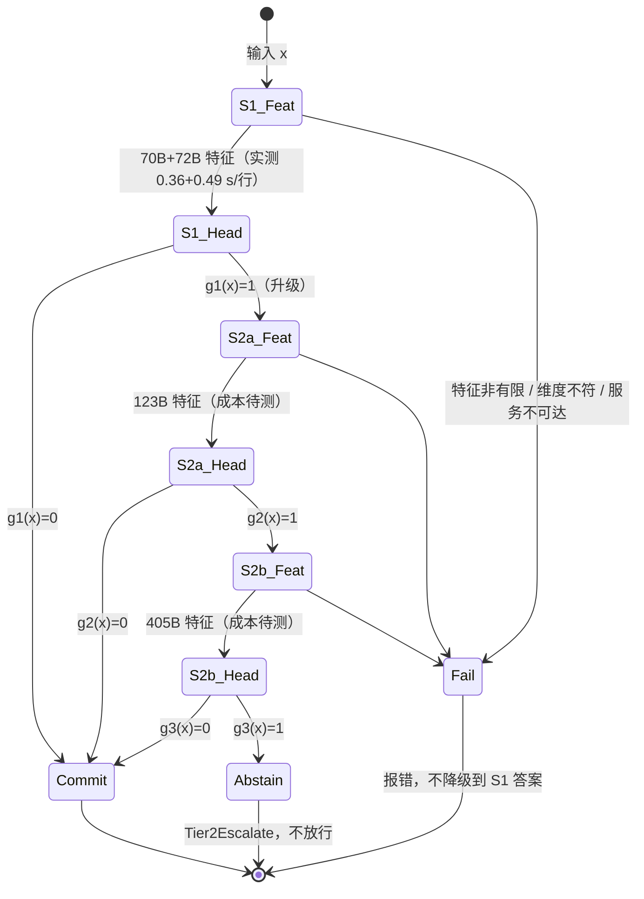

# Spec 31：多尺度 Dense 模型流形干涉、广义 ETF 与双进程协同方案（b0927c-t3-multi）

- 日期：2026-09-27（JST）
- 源码基线：`acb2c0ccf3f30a708cd9a4f638248973c4709188`，工作目录 `/ebs/pj/gen-zero`
- 证据目录：`docs/zero/evidence/b0927c-t3-multi/`（命令、退出码、日志、输出 JSON 见 `commands.txt`）
- 本文只新增设计文档与一组只读分析证据（脚本、日志、JSON、命令记录），不修改任何既有代码文件，不提交。

## 0. 结论先行，三类分开

**已实现（有证据）**

1. **现场盘点。** 五个 Dense 模型里，只有 Llama-3.1-70B 与 Qwen2.5-72B 有 13 任务特征（`/ebs/data/extracted_features/llama70b/`、`.../qwen72b/features/`）。Mistral-123B 的 Q3_K_M 权重看起来已下载完：ai 上两个分片共 59,102,779,264 B，15:30 写完，与下载器预期的约 59 GB 一致；**未做 sha256 校验**。它**没有抽过特征**。Falcon-180B 与 Llama-405B 的权重**不在 ai 上**。证据：`commands.txt` §2。
2. **一次只用训练集的 OOF 预分析（70B+72B）。** 13 任务、5 折、与基线同一投影与 ridge 头，没有读取任何测试标签。命令退出码 0，耗时 2 分 23 秒。关键数字（13 任务宏平均）：最好单模型 81.47%，两模型概率平均 82.45%，「任一模型答对」上界 86.64%，两模型同时答错 13.36%。**两模型分歧度（互信息）预测错误的 AUROC 为 0.655，总熵为 0.794；13 个任务里分歧度 13 个全输。** 证据：`oof_complementarity_probe.{py,log,json}`。
3. **五处任务前提与现场不符**，逐条带 `path:line`，见 §2。
4. **一处现存缺陷**：405B 启动器默认路径指向一个下载器不会产生的文件，见 §2.5。

**未验证（做了设计，没有数据证明它对）**

- §4 流形干涉算子、§5 曲率自适应广义 ETF、§6 双进程级联：全部是设计与可证伪假说。§7 给出判定它们成败的实验和脚本规格。
- 「72B 偏指令结构、123B 偏长程推理、405B 偏世界常识」：**纯假设**，现有数据既不支持也不否定。§7 的 H2 专门检验它。

**未完成（没做，说明原因）**

- 123B/180B/405B 的任何几何数值、任何级联收益：没有特征。123B 缺抽取运行（预计约 6 小时 A100，估算见 §3.3）；180B、405B 缺权重下载，405B Q2_K 约 141 GB（`queue_dense_fleet_downloads.py:4`），超出 80 GB 显存，需要约 61 GB 主机内存卸载，吞吐未测。
- 任何「突破」或「涌现」结论：本文不做。没有逐样本配对统计之前，不声称任何提升。
- 生产接入（服务端接收多模型特征）：本文只给挂载点与规格（§6.5），不改生产代码。

## 1. 现场事实表

| 模型 | 隐层维度 | 量化 | 特征状态 | 抽取实测成本 |
|---|---:|---|---|---|
| Llama-3.1-70B | 8192 | Q4_K_M | 13 任务齐全 | 35,211 行 / 12,746 s = **0.362 s/行**，469 tok/s |
| Qwen2.5-72B | 8192 | Q4_K_M | 13 任务齐全 | 35,211 行 / 17,139 s = **0.487 s/行**，353 tok/s |
| Mistral-Large-2 123B | 12288 | Q3_K_M | 权重在 ai，**无特征** | 未测 |
| Falcon-180B | 14848 | Q2_K（下载器） | **无权重** | 未测 |
| Llama-3.1-405B | 16384 | Q2_K（下载器） | **无权重** | 未测 |

- 量化来源：70B/72B 取自 npz 的 `info_json.encoder`；123B 见 `benchmarks/suites/run_mistral123b_extract.bat:35`；180B/405B 见 `benchmarks/suites/queue_dense_fleet_downloads.py:90`、`:118`。
- 特征形式：每条记录一个向量，`llama-server --embedding --pooling last`，末层 post-norm、最后一个 token、原始尺度（`benchmarks/suites/gpu_extract_qwen72b_13tasks.py:17-18`）。不是多层特征。
- 候选：每个任务的 `cands` 是 K 个标签文本的嵌入，形状 `(K, dim)`，**整个任务共用一套**（例：massive_en `cands` 为 `(18, 8192)`）。
- 硬件：ai 为单卡 A100 80GB、主机内存 127.6 GB、D 盘剩余 938 GB（`commands.txt` §2）。
- 测试集：`benchmarks/data/full_13/*.jsonl` 共 3,880 条；每任务 144 到 599 条；K 从 2 到 18。civil_comments 多数类占 89.3%，summeval_consistency 占 84.0%，这两个任务只看准确率会误导。

基线成绩（`benchmarks/results/spec21_dual_70b_72b_advanced_ensemble_report.md`）：宏准确率 qwen_best 76.14、llama_best 76.23、selected 77.21，提升 +0.98 pp。**但 selected 在 7 个任务上低于两个单模型中较好者**（差值，pp）：summeval_consistency −5.56、summeval_relevance −4.58、civil_comments −3.33、helpsteer2 −2.01、boolq −1.67、squad2 −0.67、massive_de −0.29；另有 2 个任务持平，只有 4 个任务变好。宏平均 +0.98 pp 主要来自 vitaminc（+4.34）一个任务。数据取自同名 `.json` 的逐任务 metrics。原因：OOF 搜索空间为 2×18 单头加 18×18×3 融合组合（`benchmarks/suites/evaluate_dual_70b_72b_advanced_ensemble.py:96-103`），在每任务 750 到 11,247 行训练集上对选择过拟合。**任何新方案都必须先打赢这个对选择过拟合的问题，而不是往搜索空间里再加选项。**

## 2. 前提纠正（先改地基，再谈设计）

### 2.1 「现有 ETF choice head 把 K 个候选投影到 K-1 维正单形」：生产路径上已不成立

- 生产 Rust 头 `crates/gen-zero-model/src/choice_head.rs:7-11` 写明：单纯形 ETF 绑定**已被移除**。原因是固定顶点几何在 T=1 时让归一化熵对每个 K≥3 都高于 PolicyGate 的 0.65 阈值，于是所有 3 选以上的决策都被升级。现在的头是 `cos(state, candidate_rep) / T`，默认 T=0.25（`:25`）。服务端回归测试见 `crates/gen-zero-service/src/zero.rs:4504`。
- `SimplexEtfFrame`（`crates/gen-zero-core/src/etf.rs`）在生产 crate 中只剩 `crates/gen-zero-nanocore/src/core_type.rs:108` 一处调用。Python 侧 `python/gen_zero/model/choice_head.py:20-25` 仍然转导出 `FastSimplexETFProjection`。
- 13 任务基线的头（ridge / LW-LDA / logistic / BBP）**根本不用 `cands`**，也不用 ETF。
- **结论：** 「广义 ETF」如果做，必须挂在 Rust `ActionETFChoiceHead` 的 `candidate_reps` 输入上，或者作为 13 任务评测里的一个新头与现有六头同台对比。挂在 nanocore 的旧 Helmert 帧上，等于造孤岛。

### 2.2 「System 1 亚毫秒」：只对打分头成立

70B 抽一条特征实测 0.36 s，72B 0.49 s（§1）。亚毫秒只可能是「缓存特征上的头」这一步。所以双进程的成本必须写成两个数：**特征成本**（秒级，已测）加 **头成本**（亚毫秒，待测）。System 2 的 405B 特征成本目前是空白，不能填估算值冒充。

### 2.3 「System 2 触发 MCTS 剪枝与连续世界模型演化」：在 13 任务上没有位置

13 个任务全是单步、固定 K 的分类，没有状态转移，也没有可搜索的动作序列。MCTS 与世界模型在这里无物可搜。本方案在 13 任务上把 System 2 定义为：**更大模型的特征 + 更重的头 + 必要时弃权**。MCTS/世界模型的双进程应放到有多步环境的 DeepSWE / 终端任务线（见 `docs/architecture/gen_zero_capability_audit_20260927.md`），不进入 13 任务的任何结论。

### 2.4 「尺度分层」无法和量化、家族、上下文分开

模型阶梯同时改变了四个变量：参数量、量化（Q4 → Q3 → Q2）、模型家族与训练数据、上下文长度（Falcon 启动器 `CTX=2048`，`benchmarks/suites/run_falcon180b_extract.bat:38`）。任何「405B 比 70B 多学到了 X」的读数，都是这四者的混合。**必须加同量化对照**：用 Q2_K 的 Llama-3.1-70B 重抽一次特征，与 Q4_K_M 版对比。只有 405B-Q2 对 70B-Q2 的差异才可近似归因于尺度（同家族、同量化、同 tokenizer）。Mistral 与 Falcon 与 Llama 的比较永远混有家族效应，只能叫「异构专家」，不能叫「尺度层级」。

### 2.5 现存缺陷：405B 启动器默认模型路径指向不存在的文件

- B18 修复后 launcher 必须显式提供 MODEL 和 MODEL_PROFILE（full/slice），不再使用机器固定路径。
- `benchmarks/suites/queue_dense_fleet_downloads.py:118` 下载并合并的是 `Meta-Llama-3.1-405B-Instruct-Q2_K.gguf`。
- 两者不一致。按默认值启动时 llama-server 找不到模型。启动器自己的注释也写明 Q3 权重需要跨显存与内存的数百 GB（`run_llama405b_extract.bat:3-4`），而 ai 只有 80 GB 显存加 127.6 GB 内存。本文不修复，只报告。

## 3. 预分析：70B+72B 现在就能告诉我们什么

数据：`docs/zero/evidence/b0927c-t3-multi/oof_complementarity_probe.json`。协议：训练集 5 折 OOF，基线同款 256 维高斯随机投影（`benchmarks/suites/evaluate_dual_70b_72b_ensemble.py:62`）与 ridge（`:70`，α=100），温度用训练折预测的标准差归一。**只用训练标签。**

| 任务 | 72B | 70B | 平均 | 任一对（上界） | 两者皆错 | AUROC 分歧→错 | AUROC 总熵→错 |
|---|---:|---:|---:|---:|---:|---:|---:|
| multinli | 87.2 | 79.3 | 87.1 | 91.4 | 8.6 | 0.612 | 0.763 |
| pubmedqa | 78.3 | 77.6 | 80.3 | 85.2 | 14.8 | 0.601 | 0.742 |
| paws | 89.2 | 87.0 | 89.6 | 94.3 | 5.7 | 0.617 | 0.881 |
| helpsteer2 | 40.1 | 39.7 | 42.2 | 55.3 | 44.7 | 0.533 | 0.610 |
| summeval_relevance | 55.2 | 55.2 | 56.2 | 65.8 | 34.2 | 0.515 | 0.593 |
| **13 任务平均** | | | **82.45** | **86.64** | **13.36** | **0.655** | **0.794** |

（完整 13 行见 `oof_complementarity_probe.log`。最好单模型平均 81.47。）

四个读数，按对设计的影响排序：

**3.1 分歧度是比总熵更差的升级信号。** 这直接否定了「用跨模型分歧作为认知不确定性去触发 System 2」的朴素版本。在 70B+72B 上，两个模型的错误高度相关：平均融合的错误率为 17.55%，而两者皆错已占 13.36%。它们常常「一起自信地错」，分歧看不到这类错误。含义：分歧只有在加入**训练数据、架构差异更大的模型**后才可能有用，这正是 H3 要检验的，而不是可以默认的。

**3.2 融合的上界不高。** 完美路由（每条选对的那个模型）也只到 86.64%，而平均已经 82.45%。两模型之间可挖的余量约 4 pp；另外 13.36% 的样本两个都错，**在两模型答案之间路由的方案救不回来**；概率融合在 K≥3 时理论上能救回少数，但平均融合只比上界低 4.19 pp，余量有限。System 2 的全部价值只能来自这 13.36%：大模型必须在这些样本上答对才算数。这给 H4 定了一个可测的目标变量。

**3.3 序数任务是另一个问题。** helpsteer2 与 summeval_relevance 两者皆错 44.7% 与 34.2%，分歧度 AUROC 接近 0.5。这两个任务的瓶颈可能不在「哪个模型」，而在「末层单 token 向量是否携带打分信息」与标签噪声（假设，未检验）。给它们加 ETF 更没有道理，见 §5.4。

**3.4 共享子空间真实存在，但只在前几维。** 在 64 维切片上做 CCA（前半训练集拟合、后半测评），首个典型相关平均 0.858，第 8 个降到 0.453。解释：两个 70B 级模型有少量强共享方向（大概率是任务/主题），其余方向各自为政。这支持 §4 的「共享 + 残差」分解，但样本外相关衰减很快，共享子空间的秩要用留出集选，不能拍定。

**成本估算（估算，不是测量）。** 70B Q4 实测 469 tok/s。13 任务全量约 598 万 token；按默认 1000 行上限截断 boolq 与 massive_de 后约 380 万 token；仅测试集约 78 万 token。若 123B Q3 全部上 GPU，按参数量线性缩放约 270 tok/s，全量约 6 小时。405B Q2_K 需要主机卸载，吞吐可能低一个数量级，全量可能要数天。**这是计划的承重不确定性**，§7.4 的执行顺序据此安排。

## 4. 流形干涉算子（Manifold Interference Operator, MIO）

把「相长 / 相消干涉」落成可计算、可证伪的线性代数。不引入任何无法在现有 npz 上计算的量。

### 4.1 输入与预处理

对模型 m ∈ {70B, 72B, 123B, 180B, 405B}，训练块 X_m ∈ R^{n×d_m}（行已按 `train_ids` 对齐，对齐检查复用 `evaluate_dual_70b_72b_ensemble.py` 的 `load` 失败即抛）。

1. 逐维 z-score（仅用训练折统计量）。原因：末层原始状态有少数超大幅值维度，`cross_model_manifold_alignment.py` 的文档已记录这一点。
2. 降到 r 维：**随机化 SVD（PCA）**，不用高斯随机投影。理由：d_m 最高 16384，n 最小 750，n ≪ d。PCA 保留方差最大的方向；随机投影 256 维对 405B 丢掉 98% 的维度且无选择。r 从 {64, 128, 256} 中按 OOF 选，r < n/4 以保证 CCA 条件良好。
3. 结果 U_m ∈ R^{n×r}。

### 4.2 相长干涉：广义 CCA 共享子空间

对 M 个模型做 MAXVAR 广义 CCA：求 G ∈ R^{n×s}（GᵀG = I）与投影 W_m，最小化 Σ_m ‖G − U_m W_m‖²。闭式解：G 取 Σ_m P_m 的前 s 个特征向量，P_m = U_m (U_mᵀU_m + λI)⁻¹ U_mᵀ 为带岭的投影阵。

- **不变量（invariant）**：S_m = U_m W_m，即各模型在共享坐标系下的像。M 个像的平均 S̄ 是共识表征。
- **共振强度**：第 j 个典型方向的**留出**相关 ρ_j（拟合与测评分开，§3.4 的做法）。只保留 ρ_j 在行置换零分布 95% 分位之上的方向。零分布用 `cross_model_manifold_alignment.py` 已有的行置换控制。
- s 与 λ 按 OOF 选。

### 4.3 相消干涉：模型特有残差

R_m = U_m − S_m W_m⁺（U_m 中不能被共享坐标解释的部分）。它承载模型独有的信息，也承载噪声。是否有用，只由下游 OOF 分数判定。

### 4.4 分歧度（认知不确定性）

在每个模型上各自拟合头，得到预测分布 p_m(y|x)。令 p̄ = 平均：

- 总熵 H[p̄] = 偶然项 E_m H[p_m] + 认知项 I（互信息，即广义 Jensen-Shannon 散度）。
- §3.1 已测：在 70B+72B 上 I 比 H[p̄] 差。所以 **I 只作为 H[p̄] 之外的第二特征进入升级判据，且必须证明它带来条件增益**（H3）。

### 4.5 MIO 输出进入哪里

MIO 输出三种候选表征：共识 S̄、拼接 [S̄ ; R_1 ; … ; R_M]、全拼接 [U_1 ; … ; U_M]（对照）。三者都喂给**现有六种头**（`evaluate_dual_70b_72b_advanced_ensemble.py:16`），走同一 OOF 协议。这样 MIO 的任何收益都与头的选择解耦。

## 5. 曲率自适应广义 ETF

### 5.1 为什么原始 ETF 失败，新方案必须避开什么

固定等角顶点 + 固定温度，会让熵的下界由 K 决定，而不是由数据决定（§2.1）。所以：**顶点几何必须来自数据，温度必须标定，熵门阈值必须与 K 解耦。**

### 5.2 可计算定义

在 §4 的共享坐标或单模型 PCA 坐标 z 上：

1. **度量（「曲率」）**：Ledoit-Wolf 收缩的类内协方差 Σ̂，定义马氏度量 d(z, μ) = (z − μ)ᵀ Σ̂⁻¹ (z − μ)。这就是 `lw_lda` 头已经在用的度量；本方案把它显式化为「每个模型、每个尺度各自的局部度量」。在 r ≤ 256 维上做，避免 16384 维的 O(d³)。
2. **原型**：μ_k 初值为白化后的类均值。
3. **ETF 正则**：令 M = [μ_1 … μ_K] 在白化空间中心化、归一，Gram 阵 G = MᵀM。惩罚 λ‖G − G_ETF‖_F²，G_ETF = (K/(K−1)) I − (1/(K−1)) 11ᵀ。λ = 0 退化为 LW-LDA，λ → ∞ 退化为硬 ETF。**λ 由 OOF 选**，所以「ETF 到底有没有用」由数据回答，而不是由设计者假定。
4. **打分**：logit_k = −d(z, μ_k) / T，T 在训练折上标定（最小化 NLL）。
5. **置换等变**：原型按候选内容索引，Gram 惩罚对行列同时置换不变，所以分数对候选呈现顺序严格等变。这与 Rust 头的不变量一致（`crates/gen-zero-model/src/choice_head.rs` 第 76 行起的注释）。

### 5.3 「降低熵崩塌与过拟合」改写成可测指标

「熵崩塌」在本文定义为**过度自信**：ECE（15 桶）与 NLL 偏高、置信度直方图堆在 1 附近而准确率不配。「过拟合」定义为 OOF 分数与测试分数之差。「紧支撑几何度量」在原题中没有可操作定义；可以测的近亲是 **sparsemax 输出的支撑集大小**（非零概率的候选数），作为一个可选头加入对比，不作为主张。

### 5.4 不适用的任务

helpsteer2、summeval_relevance、summeval_consistency 的标签是 1 到 5 的有序分数。ETF 让所有类两两等距，否定 |1−2| < |1−5|。这三个任务**不用 ETF**，用已有的 `OrdinalCumulativeHead`（`python/gen_zero/model/choice_head.py:67`）作为候选头。

## 6. 双进程协同拓扑

### 6.1 状态机

180B 默认不进主干阶梯：它与 70B/405B 不同家族，与 405B 同为 Q2，额外成本高，是否值得加入由 H5 的边际增益决定。

### 6.2 升级判据（「奇异点」的可操作定义）

原题的「几何曲率奇异点」没有可计算定义。本方案用两种有统计保证的量替代，并以 PolicyGate 现行门作对照：

1. **分裂共形预测集大小**（主判据）。在校准折上用 APS 非一致性分数，得到阈值 q̂_α；预测集 C_α(x) = {k : score_k(x) ≤ q̂_α}。**g(x) = 1 当且仅当 |C_α(x)| ≥ 2**。保证：在可交换假设下 P(y ∈ C_α(x)) ≥ 1 − α。这正是「决策边界附近」的有覆盖保证的版本。**前提是校准行与测试行可交换，本文没有证实这一点**：训练池取自各数据集另一公开分区（`benchmarks/suites/grand_challenge_data.py` 模块文档），且 summeval_consistency 训练 OOF 准确率 88.4% 明显高于测试多数类比例 84.0%，提示存在分布偏移。所以每份级联报告必须在名义 1 − α 旁打印**测试集实测覆盖率**，两者的差距作为发现报告，不当噪声处理。
2. **总熵门**：g(x) = 1[H[p̄(x)] > τ_H]，τ_H 由 OOF 选，使升级率等于预算 β。§3.1 显示它比分歧度强。
3. **对照**：PolicyGate 现行 0.65 归一化熵阈值（`crates/gen-zero-gate/src/policy.rs:47`）与 planner 路由阈值 0.20 / 0.70（`crates/gen-zero-planner/src/router.rs:43-44`）。这两组阈值没有在 13 任务上标定过，作为「不标定」基线。
4. 分歧度 I 只在 H3 成立时作为附加项：g(x) = 1[H > τ_H ∨ I > τ_I]。

### 6.3 最终决策公式

在第 t 级（t = 1, 2, 3）接受时：ŷ = argmax_k p̂_t(k|x)，其中 p̂_t 是 §4.5 选出的表征加 §5 或现有头在「前 t 级全部模型」上的 OOF 选定融合。弃权：第 3 级仍有 |C_α| ≥ 2 时输出 Abstain。安全类任务（aegis_safety）弃权沿用 `benchmarks/suites/conformal_margin_gate.py:1-15` 的语义：弃权永不放行。

### 6.4 成本公式

E[cost(x)] = c₁ + P(g1=1)·c₂ + P(g1=1, g2=1)·c₃。c₁ = 0.85 s/行（实测全量平均，70B+72B 串行合计；两模型并行部署时取较大者 0.49 s/行），c₂、c₃ 待测。报告必须给出 **准确率对期望成本** 的整条曲线（β 从 0 扫到 1），不是单点。

### 6.5 生产挂载点（防孤岛）

- 离线评测：新脚本直接读 `benchmarks/data/full_13` 与 npz，与现有 spec21 报告同目录输出，可与基线逐行比较。
- 服务端：`decide` 操作的 `auto` 模式已经走 `DynamicKMoERouter`（`crates/gen-zero-planner/src/pipeline.rs:895-904`，服务入口 `crates/gen-zero-service/src/pipeline_verb.rs:178-199`，MCP 工具枚举 `crates/gen-zero-service/src/server.rs:674`），它按熵阈值分 K1/K2/K3（`router.rs:123`）。**本方案的升级门若被 H4 证实，挂载点是该 router 的熵输入与阈值来源**，而不是另建一个平行路由器。能迁移的是**标定协议**（按目标升级率在 OOF 上选 τ、以共形预测集大小作触发）；**不能迁移的是数值**：13 任务上标定的 τ 来自 LLM 特征头的熵分布，router 的熵来自 planner 在世界模型隐状态与 `LocalActionFrame` 上的头，分布不同。τ 必须在生产头自己的熵分布上重新标定后写入 `PlannerConfig` 的 `router_entropy_threshold_low/high`。旧的未标定默认值 0.20 / 0.70 随之删除，不保留并行默认值。
- Rust choice head：§5 的原型头若胜出，以「每候选一个表征」的形式经已有的 `candidate_reps` 输入进入（`crates/gen-zero-service/src/zero.rs:258` 一带的参数校验），不复活 `SimplexEtfFrame`。若 H6 否定 ETF 正则，`crates/gen-zero-core/src/etf.rs` 与其唯一调用点应一并评估删除。
- 以上接入是**未完成**项，需要单独派单与评审，本文不做。

## 7. 实验设计与判据

### 7.1 统一协议（与基线可比）

- 5 折分层 OOF，只用训练标签选一切（头、融合权重、s、r、λ、τ、α）；测试标签在选择结束后才加载，沿用 `evaluate_dual_70b_72b_advanced_ensemble.py` 的做法。
- 每任务指标：准确率、平衡准确率、宏 F1、ECE、NLL、升级率、每行 GPU 秒。
- **统计**：3,880 条测试样本逐样本配对。宏指标用分层配对 bootstrap（按任务分层，10,000 次）给 95% 区间；每任务 McNemar 精确检验；13 个任务的 p 值做 Holm 校正。只有 bootstrap 区间不含 0 **且** 不在超过 3 个任务上显著变差，才能写「提升」。
- **搜索预算上限**：每个新方案在 OOF 上评估的候选配置数不超过基线（2×18 + 18×18×3 = 1,008）。超过即视为选择过拟合风险，必须在报告中写明配置数。
- **本方案的配置账**（逐项说明是网格搜索还是规则固定）：
  - 网格搜索：PCA 维数 r ∈ {64, 128, 256}（3）；表征 ∈ {S̄, [S̄;R], [U_1;…;U_M]}（3）；头 = 现有 6 种 × logit 调整 τ 3 档（18），加广义 ETF 头 × λ ∈ {0, 0.1, 1, 10} × τ 3 档（12）。合计 3 × 3 × (18 + 12) = **270 ≤ 1,008**。
  - 规则固定，不参与选择：GCCA 共享维数 s（行置换零分布 95% 分位决定，§4.2）；GCCA 岭 λ_cca = 1e-3；共形水平 α = 0.1（预先登记）；熵门 τ_H 由升级预算 β 决定，β 扫描只用于画成本曲线，不用于挑点；温度 T 由训练折 NLL 闭式标定。
  - 序数任务上 ETF 头不参与（§5.4），配置数更少。

### 7.2 假说（每条写明证伪条件）

| 编号 | 假说 | 证伪条件 | 依赖 |
|---|---|---|---|
| H1 | MIO 共识 + 残差 [S̄;R] 比全拼接 [U_1;U_2] 宏准确率更高 | 70B+72B 上配对 bootstrap 区间含 0 或为负 | 现在可跑 |
| H2 | 不同尺度捕获不同信息：加入 123B 后，GCCA 显著共享方向数不增加，但残差 R_123B 带来 OOF 增益 | R_123B 的增益 ≤ 同维度随机高斯特征的增益 | 123B 特征 |
| H3 | 分歧度 I 在控制总熵后仍预测错误 | 以 H 为协变量的逻辑回归中 I 的系数 95% 区间含 0。**70B+72B 上的 AUROC 已预示可能被证伪** | 现在可跑（70B+72B），123B 后复测 |
| H4 | 级联在相同期望成本下优于「全员总是参与」 | 准确率对成本曲线处处不高于全员融合 | 123B 特征 |
| H4b | 大模型能修复 S1 两者皆错的样本 | 在 S1 两者皆错的测试行上，123B 的准确率 ≤ 该任务多数类比例 | 123B 特征 |
| H5 | 405B-Q2 对 70B-Q2（同家族同量化）有尺度收益 | 配对 bootstrap 区间含 0 | 405B 与 70B-Q2 特征 |
| H6 | ETF 正则（λ>0）降低 ECE/NLL 且不降准确率 | OOF 选出的 λ 在多数任务上为 0，或测试 ECE 不降 | 现在可跑 |

### 7.3 脚本规格（尚未编写，写完才算数）

| 脚本（拟） | 输入 | 输出 | 失败即停的检查 |
|---|---|---|---|
| `benchmarks/suites/evaluate_multiscale_mio_13tasks.py` | 任意 M ≥ 2 个特征目录 | `benchmarks/results/spec31_mio_report.{json,md}` | 行 id 与标签逐一相等；维度与 info_json 一致；非有限值即抛；某模型缺任一任务即抛，不跳过 |
| `benchmarks/suites/evaluate_dual_process_cascade_13tasks.py` | 有序模型列表 + 各模型每行实测秒数 | `spec31_cascade_report.{json,md}`（整条成本曲线） | 缺成本数据即抛，禁止用估算值填充 |
| `benchmarks/suites/generalized_etf_head.py` + 在 `spec21_advanced_heads.py` 注册 | 训练特征与标签 | 作为第 7 种头进入同一 OOF 池 | 序数任务调用即抛；Σ̂ 不正定即抛 |
| 单元测试 `benchmarks/suites/test_spec31_*.py` | 合成数据 | pytest | 置换等变（逐位相等）；λ=0 与 LW-LDA 输出一致；GCCA 在两块相同输入时 ρ₁=1 |

每个脚本的报告必须写入：输入 npz 的 sha256、测试集 sha256、全部 OOF 选择、配置总数、命令行、退出状态。沿用 `evaluate_dual_70b_72b_advanced_ensemble.py` 的报告字段。

### 7.4 执行顺序（按「不依赖新特征」优先）

1. **现在（70B+72B）**：H1、H3、H6。只需要 CPU，几分钟到一小时。若 H1 与 H6 均被证伪，停止 MIO 与 ETF 线，把资源全给大模型特征。
2. **123B 抽取**：第一步先对两个分片做 sha256，与 HF 仓库公布值比对；不一致即停。然后用 3 个短上下文任务冒烟，实测 s/行，再决定全量或 1000 行上限。抽完跑 H2、H4、H4b。
3. **70B-Q2 重抽**：为 H5 准备同量化对照，成本约同 70B 一次。
4. **405B 下载与抽取**：先修 §2.5 的路径不一致；先在测试集 3,880 条与 `cands` 上测吞吐（约 78 万 token），吞吐可接受再做训练集。405B 的训练集可以用更小的上限，但必须与 70B-Q2 用同一行集合，否则 H5 不可比。
5. **180B**：只在 H4 显示第二级有正收益、且 405B 成本不可接受时考虑作为替代第二级。

## 8. 防腐自查（对应评审四项）

1. **孤岛**：本文不新增生产代码。§6.5 指定了唯一挂载点（`decide`/`auto` → `DynamicKMoERouter` 的阈值来源；Rust 头的 `candidate_reps`），明确不另建平行路由器、不复活 `SimplexEtfFrame`。
2. **静默降级**：§6.1 状态机中任何特征失败直接进 Fail，不回落到 S1 答案；§7.3 每个脚本列了失败即抛条件；成本数据缺失即抛，禁止估算值填充。
3. **假设当成果**：§0 三类分开；所有 123B+ 内容标为未完成；「尺度分层」「奇异点」「紧支撑」三个原题概念均标为无操作定义或纯假设，并给出可测替代物。§3 的预分析数字只来自训练集 OOF，不是测试成绩。
4. **新旧替换**：若 H4 证实，旧的未标定路由阈值（0.20 / 0.70）应被标定值取代而非并存；若 H6 证伪，`etf.rs` 及其唯一调用点列入删除评估。

## 9. 证据索引

| 主张 | 证据 |
|---|---|
| 预分析全部数字 | `docs/zero/evidence/b0927c-t3-multi/oof_complementarity_probe.{py,log,json}`，EXIT=0 |
| ai 上权重（仅文件大小，无 sha256）、显存、内存、磁盘 | `docs/zero/evidence/b0927c-t3-multi/commands.txt` §2 |
| 70B/72B 抽取成本 | 同上 §3 |
| router 在生产路径被调用 | 同上 §4；`crates/gen-zero-planner/src/pipeline.rs:895-904`；`crates/gen-zero-service/src/pipeline_verb.rs:178-199` |
| ETF 绑定已移除 | `crates/gen-zero-model/src/choice_head.rs:7-11` |
| 405B 路径不一致 | `benchmarks/suites/run_llama405b_extract.bat:8`；`benchmarks/suites/queue_dense_fleet_downloads.py:118` |
| 基线选择过拟合 | `benchmarks/results/spec21_dual_70b_72b_advanced_ensemble_report.md` 任务表 |
