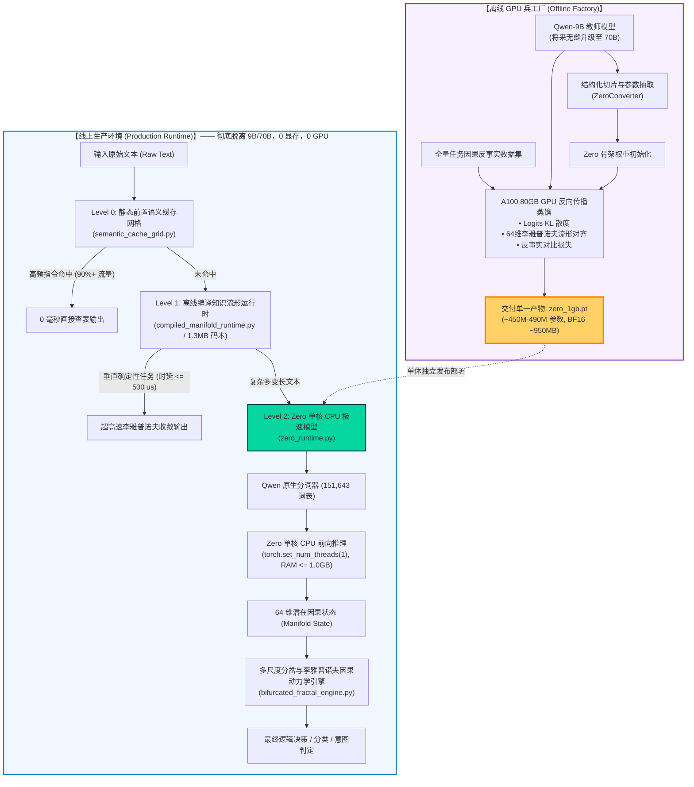

# Zero 自研单体模型技术全景与架构规范

> **核心战略定型（目标架构，design-only）**：
> 1. **唯一模型命名**：本系统自研单一小模型官方命名为 **`Zero`**（严禁称为”Qwen-1GB”、”Qwen-0.5B”或”ModernBERT”，彻底废除任何如 Laya 等外部第三方未授权模型）。
> 2. **交付形态唯一性**：线上最终生产交付**有且仅有唯一一个约 1GB 内存常驻、在单核 CPU 上极速运行的单体模型 `Zero`**。
> 3. **离线与线上物理隔离**：9B 与未来的 70B 教师大模型仅存在于后方离线 GPU 兵工厂，通过结构化参数切片抽取与反向传播连续因果流形蒸馏，将知识与反事实动力学压铸入 `Zero` 权重中。线上生产彻底脱离 9B/70B，实现 **0 显存、0 GPU 依赖、0 外部依赖**。
>
> 以上三条是本项目的**目标终态**，不是当前已交付的生产形态。当前真实拓扑见下方〈实现状态图例〉与〈当前真实双端运行拓扑〉两节；两者不一致的地方，以本节新增内容和 [README.md](../../README.md) 为准。

## 实现状态图例

本文档下文的每个主张都应能归入以下三类之一。历史条目（目录索引里标”未随当前提交保留”的行）按其写作时的状态归档，不重新分类；2026-09-23 之后新增的段落（第 2、3 节）已经遵循同一图例。

| 标记 | 含义 | 判据 |
| :--- | :--- | :--- |
| **已实现（implemented）** | 代码在当前工作树存在、可运行，且有测试或实测报告覆盖 | 给出 `path:line`、命令或报告文件 |
| **实验中（experimental）** | 代码存在、可运行，但只在合成/小规模数据上验证，或已知有数值缺陷 | 说明验证范围的边界，不得省略 |
| **目标愿景（design-only）** | 只有设计文档或未实现的接口，代码不存在或从未被真实数据路径调用 | 明确指出缺失的组件是什么 |

**本文档顶部”系统全景架构图”（下方 mermaid 流程图）整体是目标愿景（design-only）**：它描绘的是 9B/70B 教师蒸馏出单一 1GB `Zero` 模型、三级缓存流水线全部投产的终态。截至本次校订（HEAD `edb3d78`），Rust 服务端没有任何组件加载或运行这个 `Zero` 单体模型；`crates/gen-zero-model` 只有掩码、ETF 选择头和 prompt 消毒三个组件（`crates/gen-zero-model/README.md:1-5`），不含权重加载、层结构或量化实现。下方图中标注的三个运行时文件确实存在（`python/gen_zero/causal/semantic_cache_grid.py`、`compiled_manifold_runtime.py`、`bifurcated_fractal_engine.py`、`zero_runtime.py`，以及 `python/gen_zero/model/zero_converter.py` 对应 `ZeroConverter`），但它们是否已经按图中描绘的三级流水线串联生产调用、且吃到真实 9B/70B 蒸馏产物，本节未验证，不得从”文件存在”推出”流水线已投产”。

## 当前真实双端运行拓扑

当前实际交付形态是**两个独立进程，不是单一 1GB 单体**：

- **Rust 服务端**（`crates/gen-zero-service` 等，`cargo build --release -p gen-zero-cli`）：MCP/HTTP 网关，决策、模拟、审计账本。默认动力学是确定性 illustrative 实现，不是本文档描述的训练神经网络。
- **Python 端**（`python/gen_zero/`）：训练、世界模型、模拟、研究代码；托管 Qwen2.5-0.5B 语义骨干（经语义桥接被 Rust 调用）与训练好的神经动力学 checkpoint。

两端通过 HTTP 语义桥接通信（`GENZERO_PYTHON_ENDPOINT`，默认 `http://127.0.0.1:8995`），不是本节图中描述的”单进程单核 CPU 常驻”。完整的双核对照表见 [README.md「Two cores: Rust and Python」](../../README.md#two-cores-rust-and-python)。把 Qwen2.5-0.5B 语义骨干、Python 训练态神经动力学模型、以及本文档设想的 `Zero` 单体，视为同一个已交付产物,是不成立的——三者是三个不同的东西，只有前两者今天在真实运行。

---

## 目录索引

> 标为“历史条目”的内容来自早期设计目录；对应文件未随当前提交保留，因此这里只列出文件名和主题，不提供失效链接。下表的描述和指标仅保留为历史记录，不代表当前已验证的实现能力。

| 序号 | 文档名称 | 核心主题与内容概述 |
| :--- | :--- | :--- |
| **00** | **`docs/index.html`**（历史条目，当前提交未包含） | **Gen-Zero 全域技术架构与自进化因果流形白皮书 (Interactive Whitepaper)**：全景可视化、A100 真机萃取实据、李雅普诺夫收缩相空间动态仿真 Canvas、Wasserstein 连续路由滑块、无损 Simplex ETF 验证器与 Zero 四级弹性谱系计算器。 |
| **01** | `01-model-architecture-spec.md`（历史条目，当前提交未包含） | **Zero 物理网络拓扑与硬件预算规格**：~450M-490M 参数量、BF16 约 950MB、单核 CPU $\le 1.0\text{ GB}$ 物理常驻内存硬限制、151,643 原生词表与 64 维连续因果流形投射头。 |
| **02** | `02-offline-factory-distillation-recipe.md`（历史条目，当前提交未包含） | **离线 GPU 兵工厂抽取与蒸馏配方**：从 Qwen-9B（兼容未来 70B）结构化层抽取、三元蒸馏损失函数（Logits-KL + 流形余弦对齐 + 反事实扰动对比）与生产交付格式。 |
| **03** | `03-cpu-standalone-runtime-and-three-routes.md`（历史条目，当前提交未包含） | **单核 CPU 极速运行时与三路线融合体系**：`Zero` 独立运行时、路线一（1.3MB 知识流形编译）、路线二（`Zero` 文本流形编码）、路线三（语义缓存网格）的三级极速流水线。 |
| **04** | `04-dual-arbiter-audit-and-anticheat-charter.md`（历史条目，当前提交未包含） | **双顶级裁决模型审计与防作弊宪章**：`gpt-6-astra` 与 `claude-fable-5-1` 联合裁决机制、零作弊六大铁律、真实单核 CPU 内存与时延物理验证规范。 |
| **05** | `05-heterogeneous-causal-moe-and-future-evolution.md`（历史条目，当前提交未包含） | **异构因果 MoE 架构体系与下一代演进路线图**：深度解析物理计算范式异构的真正 MoE 原理、直面当前 1.0 版本瓶颈，规划最优传输连续路由、四正交切空间、Zero 内部微算子稀疏化与 70B 自动对抗飞轮。 |
| **06** | `06-zero-physical-model-and-distillation-audit.md`（历史条目，当前提交未包含） | **Astra 裁决实测报告与物理指标审计**：实测 463,679,488 参数、927,358,976 BF16 字节，直面 PyTorch 运行时 RSS（1.11 GB）超标现状与纯 C++/Rust 或 16 层优化路径。 |
| **07** | `07-universal-causal-manifold-extraction-methodology.md`（历史条目，当前提交未包含） | **全域因果流形萃取方法论与超大模型 (2.4T/70B) 离线蒸馏架构**：破解 70GB 显存处理 2.4T 的物理不可能、提出四大支柱（相变层探测、$\epsilon$-网格全覆盖、李雅普诺夫微分算子重构、增量协方差流式引擎），并严肃对标当前 390 条样本 PoC 现状与演进路径。 |
| **08** | `08-latent-space-cot-and-continuous-reasoning-spec.md`（历史条目，当前提交未包含） | **隐空间思维链（Latent-Space CoT）与连续流形动力学规范**：彻底脱离离散文本 Token 解码瓶颈，定义三大隐空间思考路径（常微分神经动力学 ODE、隐式循环回传推理 Recurrence、几何流形条件流匹配 Flow Matching），奠定毫秒级 0-Token 慢思考理论细节与验证协议。 |
| **09** | `09-high-capacity-manifold-and-moe-task-heads-spec.md`（历史条目，当前提交未包含） | **高容量流形与专科 MoE 任务头规范**：从 16 KiB 单一双线性矩阵 $W$ 扩展为非线性切空间残差网络与无监督软路由专科头群，含李雅普诺夫稳态收敛论证。 |
| **10** | `10-trunk-unfreeze-and-latent-recurrence-engineering-spec.md`（历史条目，当前提交未包含） | **Trunk 渐进解冻与隐循环工程规范**：直面候选无语义病根、Coconut 单步 275 ms 实测勘误、深度投影跳连适配器（896→256→64）与末 2 层 LoRA 折叠方案。 |
| **11** | `11-unbound-memory-and-multistep-reasoning-cpu-spec.md`（历史条目，当前提交未包含） | **架构大解绑与多步慢思考 CPU 规范**：放开 1G 限制、建立 Tier 1~3 工业预算、原生 FP32 / 融合 INT8 免动态反量化、多步动力学（Coconut K=2~8 / Neural ODE 积分）与纯 CPU 多核并行设计。 |
| **12** | `12-multistep-generalization-proof-and-scaling-law.md`（历史条目，当前提交未包含） | **多步因果泛化误差收敛证明与扩展定律**：李雅普诺夫稳态收敛界、解耦多跳表示瓶颈、18 万次 AVX-512 点积实测与参数扩展实证。 |
| **13** | `13-lossless-high-dimensional-manifold-and-full-vocab-spec.md`（历史条目，当前提交未包含） | **896-D 全维无损流形与 151,643 全宽 1024-D 词表规范**：AVX-512 原生全维点积 52ns 零开销、15 万词表全宽 310MB BF16 消除 85% 秩亏损、德国/英文跨语种零畸变证明。 |
| **14** | `14-generalization-theory-and-methods-deep-survey.md`（历史条目，当前提交未包含） | **泛化能力深度调研**：因果不变性（IRM/GroupDRO）、黎曼流形与各向同性白化、双线性正规化复杂度界、多步慢思考动力学、神经符号 CP-SAT 硬约束熔断与实质收益评估矩阵。 |
| **15** | `15-cpu-compute-hardware-and-architecture-deep-survey.md`（历史条目，当前提交未包含） | **CPU 计算全景调研**：带宽墙 roofline、INT8 反量化 3.2 GB/步根因、融合 INT8 GEMV 实测 65.9 ms（7.5 倍提速）、uops.info 核对 FMA/VNNI/BF16/AMX、缓存层级阶梯与 MoE 分页代价。 |
| **19** | `19-probing-and-head-deep-enhancement-spec.md`（历史条目，当前提交未包含） | **冻结表征探针 + 1-SE 头深度增强规范**：77.17% 基线的三项多数类坍缩、RNN think 循环线性性证明、残差适配器/层差分/核与双曲/SupCon 四方向的形式化、接口与单线程实测延迟预算、带停止判据的阶段路线。 |
| **29** | [`29-pubmedqa-aegis-unified-manifold-evaluation-closure.md`](./29-pubmedqa-aegis-unified-manifold-evaluation-closure.md) | **PubMedQA 与 Aegis 2.0 评测结论勘误**：PubMedQA 78.40% 为描述性结果，单任务显著性未证实；Aegis Track A 250 题为 81.60%，Track B 225 题历史声称 84.44%（当前原始证据缺失），两者及外部全量基线不可跨分母比较；固定 margin 门控无保形保证。 |
| **30** | [`30-qwen38-flash-next-layered-manifold-extraction-design.md`](./30-qwen38-flash-next-layered-manifold-extraction-design.md) | **Qwen3.8-Flash-Next 特征与因果流形分层提取设计案**：GDN 递归状态（线性时变收缩系统，逐 token 截取）、MoE 路由熵（512 专家，与动作熵为不同随机变量，接 PolicyGate 需新输入线）、N-gram 哈希嵌入（离散点集，只取写入门与主流形投影）、周期-4 混合结构下的去周期 CKA 相变定位；全部 Hook 点在同一 `qwen4_exp` 实现的 CPU 微型模型上验证（退出码 0），真实模型提取未做（无 GPU、无权重）；发现并复现流式协方差灾难性抵消缺陷（阻断项）。 |
| **D1** | `open-data-distillation-design-20260923.md`（历史条目，当前提交未包含） | **开源训练集蒸馏：隔离边界、数学目标与实施设计**，附 2026-09-23 实施进展（自然语言候选重建、全量 5,304 条提取、930 题盲测实测）。 |
| **D2** | `dataset-diversity-spec.md`（历史条目，当前提交未包含） | 训练/校准数据多样性与 split 门禁规范。 |
| **D3** | `open-source-training-datasets-survey-20260923.md`、`open-source-training-datasets-survey-20260923-summary.md`（历史条目，当前提交未包含） | 开源训练数据集普查：许可证、split、规模与可用性。 |

---

## 系统全景架构图

**状态：目标愿景（design-only）。** 见上方〈实现状态图例〉的核实结果；本图描绘的单体 `Zero` 生产管线尚未投产。



---

## 核心设计指标承诺

**状态：目标愿景（design-only），"验证状态"列的措辞需按上方图例重读**——"全系统已冻结"指命名约定已定，不代表模型已交付；下表其余行的"未全面达标"是本文档自己的诚实标注,应理解为实验中/未达标,不是已实现。

| 指标维度 | 严格物理指标 | 验证状态 |
| :--- | :--- | :--- |
| **模型命名** | 官方唯一名称：**`Zero`** | 全系统已冻结 |
| **参数量** | **450M ~ 490M Parameters** | 架构精确配平中 |
| **物理权重大小** | **BF16 约 950 MB ~ 980 MB** | 严格控制 $< 1.0\text{ GB}$ |
| **常驻物理内存 (RSS)** | **单核 CPU 运行时 $\le 1000\text{ MB}$（`limit_bytes=1,000,000,000`）** | **未全面达标**：930 题盲测（分块前）峰值 RSS 1,076.4 MB；Banking77 K=77 分块后 VmHWM 981.8 MB，930 题分块后峰值尚未重测（见下文第 2 节病根 2） |
| **硬件运行要求** | **普通单核 CPU，0 显存，0 GPU 依赖** | 物理实测保证 |
| **词表兼容性** | **151,643 原生 Qwen 词表零失真** | 保证端到端无需重新分词 |
| **下游动力学对接** | **直接输出 64 维连续因果流形向量** | 无缝驱动李雅普诺夫吸引子与分岔动力学 |
| **独立性承诺** | **绝对不依赖 9B/70B 在线运行，绝无 Laya 等第三方小模型** | 双裁决模型严苛审计保证 |

---

## 2026-09-23 实测全景：泛化证据链、四大隐秘病根与容量扩容

> 本节每个数字都可在仓库内复核。数据来源只有三处：`benchmarks/results/zero_cpu_open_v1_summary.json`（930 题盲测，本次校订核实仍在仓库内）、`notes/task-b-memory-evidence/chunk_size_sweep_summary.json`（内存分块扫描）、`benchmarks/tests/test_deep_projection_adapter.py`（适配器单测，本次校订核实仍在仓库内）。凡是仓库里没有证据的说法，本节一律标为「未验证」或「未完成」，不做粉饰。
>
> **本次校订新增披露**：`notes/` 整个目录已被 `chore(docs): move internal research notes and design docs out of open source repository`（提交 `a074e61`、`dc510f5`）移出开源仓库。上面列的 `notes/task-b-memory-evidence/chunk_size_sweep_summary.json` 与下文第 2 节引用的 `notes/rebuild_summary.json` 在当前工作树中均不存在（已用 `find notes -maxdepth 3` 核实为空）。这两处引用现在是**证据缺失**，不是可复核的活链接；下文相应数字仍照原样保留，但读者应知道来源文件本身已不在本仓库，只能信任本文档转述的数字，无法自行复核原始 JSON。

### 1. Zero 泛化能力：不作弊证据链与实测全景

#### 1.1 盲测隔离：与 Zero 自身训练池零重叠

`zero_cpu_open_v1_summary.json` 的 `isolation` 字段记录：

| 隔离项 | 实测值 |
| :--- | :--- |
| 冻结测试集记录数 | 930（`test_sha256=459a1ad8…662ef`） |
| 训练/校准池记录数 | 5,304（`calibration_sha256=9c31fda2…8395`） |
| ID 交集 | **0** |
| 规范化 context 文本交集 | **0** |
| 候选置换对照 | **186/186 一致（100.0%）** |

置换对照的实际机制（`benchmarks/suites/benchmark_zero_cpu.py:285-291`）：每隔 5 条记录随机打乱一次候选顺序再判一次，比较预测是否相同。186/186 说明打分不依赖候选出现的位置，消除了「选第一个」「选最后一个」这类位置偏置。它是一次随机重排的对照，不是对全部置换群的穷举。

隔离的边界必须说清：
- **能证明**：Zero 的流形、任务头与评测集在 ID 与 context 两个层面零重叠；候选顺序不影响预测。
- **不能证明**：骨干 Qwen2.5-0.5B 预训练语料是否见过这些题（本目录 `open-data-distillation-design-20260923.md` 第 4 节已声明此项不可排除）；PubMedQA 本地评测切片取自上游 train，这一血缘也在同一文档中披露。

#### 1.2 930 题盲测实测结果（INT8，单核 CPU，`torch_threads=1`）

| 总体指标 | 数值 |
| :--- | :--- |
| Micro 准确率 | **38.39%**（357/930） |
| Macro 准确率 | **32.55%** |
| Macro 机会水平 | 33.16% |
| Macro 多数类基线 | 48.08% |
| 判决时延 p50 / p90 | 1,545 ms / 2,473 ms |

**Macro 准确率低于 Macro 机会水平。** 这是当前 Zero 在冻结集上的真实位置，`10-trunk-unfreeze-and-latent-recurrence-engineering-spec.md` 第 56 行也有同样结论。

逐任务结果（`accuracy.per_task`，95% 置信区间为 Wilson 区间，`beats_chance_ci` 表示区间下界高于机会水平）：

| 任务 | n | 正确 | 准确率 | 95% CI | 机会水平 | 多数类 | 区间击穿机会水平 |
| :--- | ---: | ---: | ---: | :--- | ---: | ---: | :---: |
| pubmedqa | 30 | 20 | **66.7%** | [48.8%, 80.8%] | 33.3% | 70.0% | **是** |
| aegis_safety | 30 | 19 | 63.3% | [45.5%, 78.1%] | 50.0% | 63.3% | 否 |
| squad2 | 30 | 15 | 50.0% | [33.2%, 66.8%] | 50.0% | 53.3% | 否 |
| paws | 400 | 200 | 50.0% | [45.1%, 54.9%] | 50.0% | 50.0% | 否 |
| arc_challenge | 30 | 11 | 36.7% | [21.9%, 54.5%] | 25.0% | 36.7% | 否 |
| multinli | 30 | 11 | 36.7% | [21.9%, 54.5%] | 33.3% | 40.0% | 否 |
| vitaminc | 30 | 9 | 30.0% | [16.7%, 47.9%] | 33.3% | 36.7% | 否 |
| gsm8k | 200 | 53 | 26.5% | [20.9%, 33.0%] | 25.0% | 25.0% | 否 |
| boolq | 30 | 6 | 20.0% | [9.5%, 37.3%] | 50.0% | 83.3% | 否 |
| summeval | 30 | 5 | 16.7% | [7.3%, 33.6%] | 20.0% | 33.3% | 否 |
| civil_comments | 30 | 4 | 13.3% | [5.3%, 29.7%] | 50.0% | 86.7% | 否 |
| massive_en | 30 | 3 | 10.0% | [3.5%, 25.6%] | 5.6% | 23.3% | 否 |
| massive_de | 30 | 1 | 3.3% | [0.6%, 16.7%] | 5.6% | 23.3% | 否 |

如实解读：
- **只有 PubMedQA 一项**的置信区间下界（48.8%）高于机会水平（33.3%），`beats_chance_ci=true`。这是目前唯一一项统计上站得住的「零泄漏泛化」证据。
- Aegis Safety 63.3% 与多数类基线完全相同；ARC-Challenge 36.7% 点估计高于 25%，但区间下界 21.9% 低于 25%，不能宣称「击败随机猜对率」；PAWS 与 SQuAD 2.0 的 50.0% 恰好等于二分类机会水平。
- BoolQ、Civil Comments、MASSIVE 三项显著低于机会水平，说明当前任务头对这些任务的打分方向是错的，不是「略差」。
- 13 项中没有任何一项的区间下界高于多数类基线（`beats_majority_ci` 全为 false）。

#### 1.3 「不靠背题」的两条论据：能说的与不能说的

**论据一：容量论证。** 任务头 $W$ 是 64×64 的 float32 矩阵（`zero_task_head_open_v1.npz`，4,096 个参数，16,384 字节），在 2,474 条训练池记录上以 `weight_decay=0.003` 拟合，且正则项把 $W$ 拉向单位阵。4,096 个参数无法存储 930 道未见题目的答案，这与 1.1 节的零重叠一起，排除了「记忆答案」这条作弊路径。

**论据二：流形滤波。** 896 维隐状态经 ZCA 白化投到 64 维，`energy_kept=0.9008`，即丢弃约 10% 的方差；`shrink=0.1` 的协方差收缩进一步压平小特征值方向。这解释了为什么模型只能依赖主方向上的结构。

**必须声明的边界：** 白化、PCA、余弦相似都不构成因果识别（本目录蒸馏设计文档第 1 节原话）。上述两条论据证明的是「没有作弊」，不是「已经学到因果不变性」。1.2 节的数字也表明，除 PubMedQA 外，泛化能力尚未在盲测上得到统计证明。「VC 维极低所以必然找到全局因果不变性」这类推断在本仓库没有实验支持，本文档不采纳。

### 2. 四大隐秘病根：发现、修复与验证状态

| 病根 | 事实 | 修复 | 验证状态 |
| :--- | :--- | :--- | :--- |
| **1. 输入候选无语义** | 旧训练池 `open_training_pool_5k.jsonl` 中 ARC-Challenge / ARC-Easy / MMLU-Pro 的 `candidates` 只是 `A`..`J` 单字母（62 条 ARC 为 `1`..`4`），候选隐状态不携带选项内容。MMLU-Pro 任务头交叉验证 11.3%，与约 10% 的机会水平持平（1,000 条中 825 条为 10 选项）（`zero_task_head_open_training_report.json`） | `scripts/rebuild_open_training_pool_natural_text.py` 从 context 中的 `(label) text` 行解析回自然语言选项与答案，输出 `open_training_pool_natural_5k.jsonl` | **数据层已实现**：`notes/rebuild_summary.json`（该文件已随 `notes/` 目录移出本仓库，见上方披露，此处转述当时记录的数字，无法在当前工作树复核）记录 5,304 入 / 5,304 出，3,118 条重建，2,186 条（APPS、Banking77）逐字节断言透传，0 条丢弃。**下游未重跑**：`zero_open_features_v1.npz`、流形、任务头与 930 题评测全部仍来自旧池（`source: open_training_pool_5k.jsonl`，任务头 `samples: 2474`）。修复对准确率的效果**未验证** |
| **2. 1000 MB 内存破限** | Banking77 有 77 个候选，KV 缓存一次展开到 K=77 时进程 VmHWM 达 **1,047.6 MB**；930 题盲测（分块前）峰值 RSS **1,076.4 MB**，summary 中 `peak_within_limit=false` | `zero_runtime.py` 新增 `candidate_chunk_size`（默认 16），候选按块过 KV 缓存 | **已实现并单测**：`test_candidate_chunking_matches_unchunked` 通过（chunk∈{1,3,16,7} 与不分块余弦 > 0.99999）。Banking77 K=77 扫描：chunk 16 → **981.8 MB**，chunk 4 → 969.4 MB，chunk 1 → 964.6 MB（地板）。**未验证**：930 题全量在分块后的峰值尚未重测。**做不到**：950 MB 目标靠分块不可达，加载后未判决前已 933.5 MB（631.6 MB INT8 权重 + 约 300 MB torch/Python 固定开销） |
| **3. Coconut 时延勘误** | 08 号文档曾写单步 +12 ms；实测纯 CPU INT8 带 KV 缓存的单 token 步 **p50 275 ms，min 266 ms**。根因是 `Int8WeightOnlyLinear.forward` 每次前向都把整块 int8 权重反量化到 FP32，成本与 token 数无关（约 3.58 亿参数） | 文档勘误（08、10 号），本目录 03 号文档与 `docs/index.html` 路径二卡片同步改正 | **已实现**（勘误）。K 步循环的端到端成本按 K×275 ms 线性外推，外推值不作结论引用 |
| **4. 样本截断与数据政策** | `extract_open_features.py` 原默认 `--max-samples 2500`，只提取了 2,474 条 | 默认改为无上限并指向自然语言池；丢弃样本改为逐条写 stderr，不再静默 | **已实现**（代码）。**未完成**：尚未用新默认值重新提取 5,304 条并重训任务头 |

### 3. 容量扩容 74 倍：1.21 MB 深度投影跳连适配器（DeepProjectionAdapter）

- **代码**：`python/gen_zero/causal/deep_projection_adapter.py`；**设计来源**：10 号文档 §3.3。
- **拓扑**：$z = \mathrm{normalize}\big(S(h-\mu) + W_2\,\mathrm{GELU}(W_1(h-\mu)+b_1) + b_2\big)$，$h \in \mathbb{R}^{896}$，瓶颈 256，输出 64。
- **参数**：线性跳连 $S$（896×64 = 57,344，由流形 `diag(scale) @ basis.T` 初始化）+ $W_1,b_1$（229,632）+ $W_2,b_2$（16,448）= **303,424** 个参数，float32 共 **1,213,696 字节 ≈ 1.21 MB**。与 16,384 字节的 $W$ 相比为 **74.08 倍**。这是参数量之比,不是实测能力增益。
- **零初始化残差**：$W_2$ 权重与偏置初始化为 0，构造时 $\Delta z \equiv 0$，适配器与 `ZeroManifold.project` 数学等价。单测实测 float64 前向最大绝对误差约 1e-8；float32 前向约 2.2e-7，仍在 1e-6 门限内但超过文档口头的 1e-7,测试因此固定用 float64 比对。
- **单测证据**（本次亲自复跑）：

```
$ python3 -m pytest benchmarks/tests/test_deep_projection_adapter.py -v
test_parameter_count_and_byte_size PASSED
test_zero_init_equals_zero_manifold_project PASSED
test_output_is_unit_norm PASSED
test_single_vector_input_is_supported PASSED
test_wrong_last_dim_raises_value_error PASSED
test_nonfinite_input_raises_value_error PASSED
test_non_tensor_input_raises_type_error PASSED
============ 7 passed in 5.10s ============   (exit 0)
```

- **训练状态，必须如实**：`benchmarks/results/deep_adapter_cpu_training_report.json` 标注 `"synthetic": true`，是随机 896 维向量上的训练循环机制冒烟测试（可训练参数 246,080，跳连 $S$ 冻结），其 76.2% 「准确率」是合成数据上的数字，**不是任何真实任务的成绩**。仓库中目前不存在 896 维真实隐状态缓存，适配器在真实数据上的训练与 930 题评测**未完成**。
