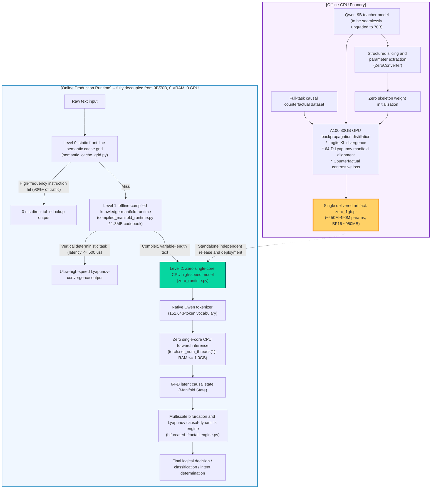

# Zero In-House Standalone Model: Technical Overview and Architecture Specification

> **Core strategic commitment (target architecture, design-only)**:
> 1. **Single official model name**: this project's in-house standalone small model has the official name **`Zero`** (it must never be called "Qwen-1GB," "Qwen-0.5B," or "ModernBERT," and any unauthorized third-party model such as Laya is fully retired).
> 2. **A single delivery form**: the final production delivery consists of **exactly one standalone model `Zero`, resident in about 1GB of memory, running at high speed on a single CPU core.**
> 3. **Physical separation of offline and online**: the 9B teacher model, and the future 70B teacher, exist only in the back-end offline GPU foundry; via structured parameter-slicing extraction and backpropagation, continuous causal-manifold distillation casts knowledge and counterfactual dynamics into `Zero`'s weights. Production, online, is fully decoupled from 9B/70B, achieving **0 VRAM, 0 GPU dependency, 0 external dependency.**
>
> The three points above are this project's **target end state**, not the currently delivered production form. The current real topology is described in the "Implementation Status Legend" and "Current Real Dual-Process Runtime Topology" sections below; where they disagree with this section, the newly added content in this section and [README.md](../../README.md) take precedence.

## Implementation Status Legend

Every claim in the rest of this document should fall into one of the following three categories. Historical entries (rows in the index marked "not retained in the current commit") are archived under the status as of when they were written and are not reclassified; sections added after 2026-09-23 (sections 2 and 3) already follow this same legend.

| Label | Meaning | Criterion |
| :--- | :--- | :--- |
| **Implemented** | Code exists in the current working tree, runs, and is covered by a test or a measured report | Give a `path:line`, a command, or a report file |
| **Experimental** | Code exists and runs, but is verified only on synthetic/small-scale data, or has a known numerical defect | State the boundary of the verification scope; do not omit it |
| **Design-only** | Only a design document or an unimplemented interface exists; the code does not exist or has never been called on a real data path | Explicitly state which component is missing |

**The "system panorama architecture diagram" at the top of this document (the mermaid flowchart below) is, as a whole, design-only**: it depicts the end state where a 9B/70B teacher distills into a single 1GB `Zero` model with a fully deployed three-tier cache pipeline. As of this revision (HEAD `edb3d78`), no component of the Rust service loads or runs this `Zero` standalone model; `crates/gen-zero-model` contains only three components -- a mask, an ETF choice head, and prompt sanitization (`crates/gen-zero-model/README.md:1-5`) -- with no weight loading, layer structure, or quantization implementation. The three runtime files labeled in the diagram below do genuinely exist (`python/gen_zero/causal/semantic_cache_grid.py`, `compiled_manifold_runtime.py`, `bifurcated_fractal_engine.py`, `zero_runtime.py`, and `python/gen_zero/model/zero_converter.py`, corresponding to `ZeroConverter`), but whether they are actually chained together into a production call path as depicted by the three-tier pipeline in the diagram, and whether they consume a real 9B/70B distillation artifact, is not verified in this section; "the file exists" must not be used to infer "the pipeline is in production."

## Current Real Dual-Process Runtime Topology

The actual delivered form today is **two independent processes, not a single 1GB standalone model**:

- **Rust service** (`crates/gen-zero-service` etc., `cargo build --release -p gen-zero-cli`): the MCP/HTTP gateway, decision-making, simulation, and the audit ledger. The default dynamics are a deterministic, illustrative implementation, not the trained neural network described in this document.
- **Python side** (`python/gen_zero/`): training, world model, simulation, and research code; hosts the Qwen2.5-0.5B semantic backbone (called by Rust via the semantic bridge) and trained neural-dynamics checkpoints.

The two sides communicate over an HTTP semantic bridge (`GENZERO_PYTHON_ENDPOINT`, default `http://127.0.0.1:8995`), not the "single process, single CPU core, resident" description in this section's diagram. The full dual-core comparison table is at [README.md "Two cores: Rust and Python"](../../README.md#two-cores-rust-and-python). Treating the Qwen2.5-0.5B semantic backbone, the Python trained neural-dynamics model, and the `Zero` standalone model envisioned by this document as the same delivered product does not hold -- they are three different things, and only the first two actually run today.

---

## Document Index

> Content marked "historical entry" comes from an early design directory; the corresponding files were not retained in the current commit, so only the filename and topic are listed here, with no broken link provided. The descriptions and metrics in the table below are kept only as a historical record and do not represent a currently verified implementation capability.

| No. | Document name | Core topic and content summary |
| :--- | :--- | :--- |
| **00** | **`docs/index.html`** (historical entry, not included in the current commit) | **Gen-Zero Full-Domain Technical Architecture and Self-Evolving Causal Manifold Whitepaper (Interactive Whitepaper)**: a full-panorama visualization, real A100 extraction evidence, a Lyapunov contracting phase-space dynamics simulation canvas, a Wasserstein continuous-routing slider, a lossless Simplex ETF verifier, and the Zero four-tier elasticity-spectrum calculator. |
| **01** | `01-model-architecture-spec.md` (historical entry, not included in the current commit) | **Zero Physical Network Topology and Hardware Budget Specification**: ~450M-490M parameters, BF16 about 950MB, a hard physical resident-memory limit of $\le 1.0\text{ GB}$ on a single CPU core, a native 151,643-token vocabulary, and a 64-dimensional continuous causal-manifold projection head. |
| **02** | `02-offline-factory-distillation-recipe.md` (historical entry, not included in the current commit) | **Offline GPU Foundry Extraction and Distillation Recipe**: structured layer extraction from Qwen-9B (compatible with a future 70B), a tri-part distillation loss (logits KL + manifold cosine alignment + counterfactual-perturbation contrast), and the production delivery format. |
| **03** | `03-cpu-standalone-runtime-and-three-routes.md` (historical entry, not included in the current commit) | **Single-Core CPU High-Speed Runtime and Three-Route Fusion System**: the `Zero` standalone runtime, route 1 (1.3MB knowledge-manifold compilation), route 2 (`Zero` text-manifold encoding), and route 3 (semantic cache grid), forming a three-tier high-speed pipeline. |
| **04** | `04-dual-arbiter-audit-and-anticheat-charter.md` (historical entry, not included in the current commit) | **Dual Top-Tier Arbiter Model Audit and Anti-Cheat Charter**: the joint arbitration mechanism of `gpt-6-astra` and `fable-5-1`, six ironclad anti-cheat rules, and a real single-core CPU memory-and-latency physical verification specification. |
| **05** | `05-heterogeneous-causal-moe-and-future-evolution.md` (historical entry, not included in the current commit) | **Heterogeneous Causal MoE Architecture System and Next-Generation Evolution Roadmap**: an in-depth analysis of the true MoE principle for physically heterogeneous compute paradigms, a direct confrontation with the current 1.0 version's bottlenecks, and a plan for optimal-transport continuous routing, four orthogonal tangent spaces, sparsification of Zero's internal micro-operators, and a 70B automatic adversarial flywheel. |
| **06** | `06-zero-physical-model-and-distillation-audit.md` (historical entry, not included in the current commit) | **Astra Arbitration Measurement Report and Physical Metrics Audit**: measured 463,679,488 parameters, 927,358,976 BF16 bytes, directly confronting the current state of PyTorch runtime RSS (1.11 GB) exceeding the limit, and pure C++/Rust or a 16-layer optimization path. |
| **07** | `07-universal-causal-manifold-extraction-methodology.md` (historical entry, not included in the current commit) | **Universal Causal Manifold Extraction Methodology and Offline Distillation Architecture for Extra-Large Models (2.4T/70B)**: solving the physical impossibility of processing a 2.4T model in 70GB of VRAM, proposing four pillars (phase-transition-layer detection, full epsilon-grid coverage, Lyapunov differential-operator reconstruction, and an incremental streaming covariance engine), and rigorously benchmarking against the current 390-sample PoC state and evolution path. |
| **08** | `08-latent-space-cot-and-continuous-reasoning-spec.md` (historical entry, not included in the current commit) | **Latent-Space Chain-of-Thought and Continuous Manifold Dynamics Specification**: fully escaping the discrete-text-token decoding bottleneck, defining three latent-space reasoning paths (ODE neural dynamics, implicit recurrent back-propagated reasoning, and geometric-manifold conditional flow matching), and laying out the theoretical detail and verification protocol for millisecond-scale, 0-token slow thinking. |
| **09** | `09-high-capacity-manifold-and-moe-task-heads-spec.md` (historical entry, not included in the current commit) | **High-Capacity Manifold and Specialist MoE Task-Head Specification**: expanding from a single 16 KiB bilinear matrix $W$ into a nonlinear tangent-space residual network and an unsupervised soft-routed specialist-head group, with a Lyapunov steady-state convergence argument. |
| **10** | `10-trunk-unfreeze-and-latent-recurrence-engineering-spec.md` (historical entry, not included in the current commit) | **Trunk Progressive Unfreezing and Latent Recurrence Engineering Specification**: confronting candidates with no semantic content, a correction of the measured 275 ms Coconut single-step latency, a deep projection skip-connection adapter (896->256->64), and a final-2-layer LoRA folding scheme. |
| **11** | `11-unbound-memory-and-multistep-reasoning-cpu-spec.md` (historical entry, not included in the current commit) | **Full Architectural Unbinding and Multi-Step Slow-Thinking CPU Specification**: lifting the 1G limit, establishing Tier 1-3 industrial budgets, native FP32 / fused INT8 without dynamic dequantization, multi-step dynamics (Coconut K=2-8 / Neural ODE integration), and a pure-CPU multi-core parallel design. |
| **12** | `12-multistep-generalization-proof-and-scaling-law.md` (historical entry, not included in the current commit) | **Multi-Step Causal Generalization Error-Convergence Proof and Scaling Law**: a Lyapunov steady-state convergence bound, decoupling the multi-hop representation bottleneck, a measured 180,000-iteration AVX-512 dot-product benchmark, and empirical parameter-scaling evidence. |
| **13** | `13-lossless-high-dimensional-manifold-and-full-vocab-spec.md` (historical entry, not included in the current commit) | **896-D Lossless Full-Dimensional Manifold and Full-Width 151,643-Token, 1024-D Vocabulary Specification**: native full-dimensional AVX-512 dot product at 52ns with zero overhead, a full-width 150K-vocabulary BF16 table at 310MB eliminating 85% rank deficiency, and a proof of zero distortion across German/English cross-lingual use. |
| **14** | `14-generalization-theory-and-methods-deep-survey.md` (historical entry, not included in the current commit) | **In-Depth Survey of Generalization Capability**: causal invariance (IRM/GroupDRO), Riemannian manifolds and isotropic whitening, a bilinear-regularization complexity bound, multi-step slow-thinking dynamics, neuro-symbolic CP-SAT hard-constraint circuit breaking, and a real-benefit assessment matrix. |
| **15** | `15-cpu-compute-hardware-and-architecture-deep-survey.md` (historical entry, not included in the current commit) | **Full CPU Compute Survey**: the bandwidth-wall roofline, the root cause of INT8 dequantization at 3.2 GB/step, a measured fused INT8 GEMV at 65.9 ms (a 7.5x speedup), a uops.info cross-check of FMA/VNNI/BF16/AMX, the cache-hierarchy ladder, and the cost of MoE paging. |
| **19** | `19-probing-and-head-deep-enhancement-spec.md` (historical entry, not included in the current commit) | **Frozen-Representation Probing + 1-SE Head Deep-Enhancement Specification**: the three-way majority-class collapse behind the 77.17% baseline, a proof of RNN "think" loop linearity, a formalization of four directions (residual adapter / layer differencing / kernel and hyperbolic / SupCon), interface and single-thread measured latency budgets, and a staged roadmap with stopping criteria. |
| **29** | [`29-pubmedqa-aegis-unified-manifold-evaluation-closure.md`](./29-pubmedqa-aegis-unified-manifold-evaluation-closure.md) | **PubMedQA and Aegis 2.0 Evaluation Findings -- Corrections**: PubMedQA's 78.40% is a descriptive result, with single-task significance unproven; Aegis Track A on 250 questions is 81.60%, while Track B's historically claimed 84.44% on 225 questions currently lacks its original evidence, and neither can be compared cross-denominator against the full external baseline; the fixed margin gate carries no conformal guarantee. |
| **30** | [`30-qwen38-flash-next-layered-manifold-extraction-design.md`](./30-qwen38-flash-next-layered-manifold-extraction-design.md) | **Spec 30: Qwen3.8-Flash-Next Feature and Causal-Manifold Layered Extraction Design**: the GDN recurrent state (a linear time-varying contraction system, extracted per token), MoE routing entropy (512 experts, a random variable distinct from action entropy, requiring a new input channel to wire into PolicyGate), the N-gram hash embedding (a discrete point set, taking only the write-in gate and the projection onto the primary manifold), and period-4-aware detrended CKA localization of phase transitions in the hybrid architecture; every hook point is verified on a CPU tiny model of the same `qwen4_exp` implementation (exit code 0), with real-model extraction not yet done (no GPU, no weights); a catastrophic-cancellation defect in the streaming covariance accumulator was discovered and reproduced (a blocking item). |
| **D1** | `open-data-distillation-design-20260923.md` (historical entry, not included in the current commit) | **Open-Source Training-Set Distillation: Isolation Boundary, Mathematical Objective, and Implementation Design**, with 2026-09-23 implementation progress (natural-language candidate reconstruction, the full 5,304-record extraction, and a 930-question blind-test run). |
| **D2** | `dataset-diversity-spec.md` (historical entry, not included in the current commit) | Training/calibration data diversity and split-gating specification. |
| **D3** | `open-source-training-datasets-survey-20260923.md`, `open-source-training-datasets-survey-20260923-summary.md` (historical entry, not included in the current commit) | A census of open-source training datasets: licenses, splits, scale, and availability. |

---

## System Panorama Architecture Diagram

**Status: design-only.** See the verification findings in the "Implementation Status Legend" above; the single-model `Zero` production pipeline depicted in this diagram has not yet gone into production.



---

## Core Design Metric Commitments

**Status: design-only; the wording of the "Verification status" column must be re-read against the legend above** -- "frozen system-wide" refers to the naming convention being settled, not the model having been delivered; the "not yet fully met" wording in the other rows below is this document's own honest label, and should be understood as experimental/not-yet-met, not implemented.

| Metric dimension | Strict physical metric | Verification status |
| :--- | :--- | :--- |
| **Model name** | Sole official name: **`Zero`** | Frozen system-wide |
| **Parameter count** | **450M - 490M parameters** | Architecture being precisely balanced |
| **Physical weight size** | **BF16 about 950 MB - 980 MB** | Strictly held to $< 1.0\text{ GB}$ |
| **Resident physical memory (RSS)** | **Single-core CPU runtime $\le 1000\text{ MB}$ (`limit_bytes=1,000,000,000`)** | **Not yet fully met**: the 930-question blind test (before chunking) peaked at 1,076.4 MB RSS; after chunking, Banking77 at K=77 reached a VmHWM of 981.8 MB, and the post-chunking peak for the 930-question set has not yet been re-measured (see root cause 2 in section 2 below) |
| **Hardware requirement** | **An ordinary single CPU core, 0 VRAM, 0 GPU dependency** | Guaranteed by physical measurement |
| **Vocabulary compatibility** | **Zero distortion with the native 151,643-token Qwen vocabulary** | Guarantees no re-tokenization needed end to end |
| **Downstream dynamics interface** | **Directly outputs a 64-D continuous causal-manifold vector** | Seamlessly drives the Lyapunov attractor and bifurcation dynamics |
| **Independence commitment** | **Absolutely no reliance on 9B/70B at runtime, and no third-party small model such as Laya whatsoever** | Guaranteed by strict dual-arbiter-model audit |

---

## 2026-09-23 Measurement Panorama: The Generalization Evidence Chain, Four Hidden Root Causes, and Capacity Expansion

> Every number in this section can be independently re-checked within the repository. There are only three data sources: `benchmarks/results/zero_cpu_open_v1_summary.json` (the 930-question blind test, re-verified as still present in the repository as of this revision), `notes/task-b-memory-evidence/chunk_size_sweep_summary.json` (the memory-chunking sweep), and `benchmarks/tests/test_deep_projection_adapter.py` (the adapter unit test, re-verified as still present in the repository as of this revision). Any claim with no evidence in the repository is uniformly labeled "unverified" or "not done" in this section, with no gloss applied.
>
> **New disclosure added in this revision**: the entire `notes/` directory was moved out of the open-source repository by `chore(docs): move internal research notes and design docs out of open source repository` (commits `a074e61`, `dc510f5`). Both `notes/task-b-memory-evidence/chunk_size_sweep_summary.json` listed above and `notes/rebuild_summary.json` cited in section 2 below no longer exist in the current working tree (verified empty with `find notes -maxdepth 3`). These two references are now **missing evidence**, not a re-checkable live link; the corresponding numbers below are kept as originally written, but the reader should know the source files themselves are no longer in this repository, so the numbers as relayed in this document must be trusted as-is, with no way to independently re-check the original JSON.

### 1. Zero's Generalization Capability: The Anti-Cheating Evidence Chain and Measurement Panorama

#### 1.1 Blind-test isolation: zero overlap with Zero's own training pool

The `isolation` field of `zero_cpu_open_v1_summary.json` records:

| Isolation item | Measured value |
| :--- | :--- |
| Frozen test-set record count | 930 (`test_sha256=459a1ad8...662ef`) |
| Training/calibration pool record count | 5,304 (`calibration_sha256=9c31fda2...8395`) |
| ID intersection | **0** |
| Normalized context-text intersection | **0** |
| Candidate-permutation control | **186/186 consistent (100.0%)** |

The actual mechanism of the permutation control (`benchmarks/suites/benchmark_zero_cpu.py:285-291`): every 5th record has its candidate order randomly shuffled and is scored again, comparing whether the prediction stays the same. 186/186 shows the scoring does not depend on a candidate's position, ruling out position biases such as "always pick the first" or "always pick the last." It is a single random-reordering control, not an exhaustive check over the full permutation group.

The boundary of this isolation must be stated plainly:
- **What it proves**: Zero's manifold, task head, and the evaluation set have zero overlap at both the ID level and the context level; candidate order does not affect the prediction.
- **What it does not prove**: whether the backbone Qwen2.5-0.5B's pretraining corpus has seen these questions (this directory's `open-data-distillation-design-20260923.md` section 4 already states this cannot be ruled out); the local PubMedQA evaluation slice is drawn from the upstream training split, and this lineage is likewise disclosed in that same document.

#### 1.2 930-question blind-test measured results (INT8, single-core CPU, `torch_threads=1`)

| Overall metric | Value |
| :--- | :--- |
| Micro accuracy | **38.39%** (357/930) |
| Macro accuracy | **32.55%** |
| Macro chance level | 33.16% |
| Macro majority-class baseline | 48.08% |
| Decision latency p50 / p90 | 1,545 ms / 2,473 ms |

**Macro accuracy is below the macro chance level.** This is Zero's real standing on the frozen set today; `10-trunk-unfreeze-and-latent-recurrence-engineering-spec.md` line 56 reaches the same conclusion.

Per-task results (`accuracy.per_task`; the 95% confidence interval is a Wilson interval; `beats_chance_ci` means the interval's lower bound is above chance level):

| Task | n | Correct | Accuracy | 95% CI | Chance level | Majority class | Interval beats chance level |
| :--- | ---: | ---: | ---: | :--- | ---: | ---: | :---: |
| pubmedqa | 30 | 20 | **66.7%** | [48.8%, 80.8%] | 33.3% | 70.0% | **Yes** |
| aegis_safety | 30 | 19 | 63.3% | [45.5%, 78.1%] | 50.0% | 63.3% | No |
| squad2 | 30 | 15 | 50.0% | [33.2%, 66.8%] | 50.0% | 53.3% | No |
| paws | 400 | 200 | 50.0% | [45.1%, 54.9%] | 50.0% | 50.0% | No |
| arc_challenge | 30 | 11 | 36.7% | [21.9%, 54.5%] | 25.0% | 36.7% | No |
| multinli | 30 | 11 | 36.7% | [21.9%, 54.5%] | 33.3% | 40.0% | No |
| vitaminc | 30 | 9 | 30.0% | [16.7%, 47.9%] | 33.3% | 36.7% | No |
| gsm8k | 200 | 53 | 26.5% | [20.9%, 33.0%] | 25.0% | 25.0% | No |
| boolq | 30 | 6 | 20.0% | [9.5%, 37.3%] | 50.0% | 83.3% | No |
| summeval | 30 | 5 | 16.7% | [7.3%, 33.6%] | 20.0% | 33.3% | No |
| civil_comments | 30 | 4 | 13.3% | [5.3%, 29.7%] | 50.0% | 86.7% | No |
| massive_en | 30 | 3 | 10.0% | [3.5%, 25.6%] | 5.6% | 23.3% | No |
| massive_de | 30 | 1 | 3.3% | [0.6%, 16.7%] | 5.6% | 23.3% | No |

Read plainly:
- **Only PubMedQA** has a confidence-interval lower bound (48.8%) above chance level (33.3%), with `beats_chance_ci=true`. This is currently the only statistically sound piece of evidence for "zero-leakage generalization."
- Aegis Safety's 63.3% exactly matches the majority-class baseline; ARC-Challenge's 36.7% point estimate is above 25%, but its interval lower bound of 21.9% is below 25%, so it cannot be claimed to "beat random-guess accuracy"; PAWS and SQuAD 2.0's 50.0% exactly equals binary-classification chance level.
- BoolQ, Civil Comments, and MASSIVE are all significantly below chance level, showing that the current task head is scoring these tasks in the wrong direction, not merely "somewhat worse."
- None of the 13 tasks has an interval lower bound above the majority-class baseline (`beats_majority_ci` is false for all of them).

#### 1.3 Two arguments for "not relying on memorized answers": what can and cannot be claimed

**Argument 1: capacity argument.** The task head $W$ is a 64x64 float32 matrix (`zero_task_head_open_v1.npz`, 4,096 parameters, 16,384 bytes), fit on 2,474 training-pool records with `weight_decay=0.003`, with the regularizer pulling $W$ toward the identity matrix. 4,096 parameters cannot store the answers to 930 unseen questions; together with the zero overlap in section 1.1, this rules out the "memorized the answers" cheating path.

**Argument 2: manifold filtering.** The 896-dimensional hidden state is ZCA-whitened and projected to 64 dimensions, with `energy_kept=0.9008`, i.e. about 10% of the variance is discarded; the `shrink=0.1` covariance shrinkage further flattens the small-eigenvalue directions. This explains why the model can only rely on structure along the principal directions.

**The boundary that must be stated:** whitening, PCA, and cosine similarity do not constitute causal identification (this is verbatim from section 1 of this directory's distillation design document). The two arguments above prove "no cheating," not "causal invariance has already been learned." The numbers in section 1.2 also show that, apart from PubMedQA, generalization capability has not yet been statistically demonstrated on the blind test. Inferences of the form "VC dimension is extremely low, therefore global causal invariance must have been found" have no experimental support in this repository, and this document does not adopt them.

### 2. Four Hidden Root Causes: Discovery, Fix, and Verification Status

| Root cause | Fact | Fix | Verification status |
| :--- | :--- | :--- | :--- |
| **1. Input candidates carry no semantics** | In the old training pool `open_training_pool_5k.jsonl`, the `candidates` for ARC-Challenge / ARC-Easy / MMLU-Pro are just single letters `A`..`J` (62 ARC rows use `1`..`4`), so the candidate hidden state carries no option content. The MMLU-Pro task head's cross-validation accuracy is 11.3%, matching the roughly 10% chance level (825 of 1,000 rows have 10 options) (`zero_task_head_open_training_report.json`) | `scripts/rebuild_open_training_pool_natural_text.py` parses natural-language options and answers back out of the `(label) text` lines in the context, producing `open_training_pool_natural_5k.jsonl` | **The data layer is implemented**: `notes/rebuild_summary.json` (this file was moved out of this repository along with the `notes/` directory, per the disclosure above; the numbers here relay what was recorded at the time and cannot be re-checked against the current working tree) records 5,304 in / 5,304 out, 3,118 records rebuilt, 2,186 records (APPS, Banking77) passed through with a byte-for-byte assertion, 0 records dropped. **Downstream has not been re-run**: `zero_open_features_v1.npz`, the manifold, the task head, and the 930-question evaluation all still come from the old pool (`source: open_training_pool_5k.jsonl`, task head `samples: 2474`). The fix's effect on accuracy is **unverified** |
| **2. The 1000 MB memory limit is exceeded** | Banking77 has 77 candidates; when the KV cache is expanded all at once to K=77, process VmHWM reaches **1,047.6 MB**; the 930-question blind test (before chunking) peaks at **1,076.4 MB** RSS, with `peak_within_limit=false` in the summary | `zero_runtime.py` adds `candidate_chunk_size` (default 16), passing candidates through the KV cache in chunks | **Implemented and unit-tested**: `test_candidate_chunking_matches_unchunked` passes (cosine similarity > 0.99999 between chunk in {1,3,16,7} and unchunked). Banking77 K=77 sweep: chunk 16 -> **981.8 MB**, chunk 4 -> 969.4 MB, chunk 1 -> 964.6 MB (the floor). **Unverified**: the post-chunking peak for the full 930-question set has not yet been re-measured. **Not achievable**: the 950 MB target cannot be reached through chunking alone -- after loading and before any decision, it is already at 933.5 MB (631.6 MB of INT8 weights plus about 300 MB of fixed torch/Python overhead) |
| **3. Coconut latency correction** | Document 08 previously stated +12 ms per step; the measured single-token step on pure-CPU INT8 with a KV cache is **p50 275 ms, min 266 ms**. The root cause is that `Int8WeightOnlyLinear.forward` dequantizes the entire block of int8 weights to FP32 on every forward pass, a cost independent of token count (about 358 million parameters) | Documentation corrections (documents 08, 10); this directory's document 03 and the corresponding two cards in `docs/index.html` were corrected in sync | **Implemented** (as a correction). The end-to-end cost of a K-step loop, linearly extrapolated as K x 275 ms, is not cited as a conclusion in its extrapolated form |
| **4. Sample truncation and data policy** | `extract_open_features.py` originally defaulted to `--max-samples 2500`, extracting only 2,474 records | The default was changed to no cap, pointed at the natural-language pool; dropped samples are now written to stderr one by one instead of silently | **Implemented** (code). **Not done**: re-extraction of the full 5,304 records with the new default, and retraining the task head, have not been done |

### 3. A 74x Capacity Expansion: the 1.21 MB Deep Projection Skip-Connection Adapter (DeepProjectionAdapter)

- **Code**: `python/gen_zero/causal/deep_projection_adapter.py`; **design source**: document 10, section 3.3.
- **Topology**: $z = \mathrm{normalize}\big(S(h-\mu) + W_2\,\mathrm{GELU}(W_1(h-\mu)+b_1) + b_2\big)$, $h \in \mathbb{R}^{896}$, bottleneck 256, output 64.
- **Parameters**: the linear skip connection $S$ (896x64 = 57,344, initialized from the manifold's `diag(scale) @ basis.T`) + $W_1,b_1$ (229,632) + $W_2,b_2$ (16,448) = **303,424** parameters, **1,213,696 bytes ~ 1.21 MB** in float32. This is **74.08x** the 16,384-byte $W$. This is a ratio of parameter counts, not a measured capability gain.
- **Zero-init residual**: $W_2$'s weights and bias are initialized to 0, so at construction $\Delta z \equiv 0$ and the adapter is mathematically equivalent to `ZeroManifold.project`. The unit test measures a maximum absolute error of about 1e-8 for a float64 forward pass; the float32 forward pass is about 2.2e-7, which is within the 1e-6 threshold but exceeds the document's stated 1e-7, so the test is fixed to compare in float64.
- **Unit-test evidence** (re-run personally for this document):

```
$ python3 -m pytest benchmarks/tests/test_deep_projection_adapter.py -v
test_parameter_count_and_byte_size PASSED
test_zero_init_equals_zero_manifold_project PASSED
test_output_is_unit_norm PASSED
test_single_vector_input_is_supported PASSED
test_wrong_last_dim_raises_value_error PASSED
test_nonfinite_input_raises_value_error PASSED
test_non_tensor_input_raises_type_error PASSED
============ 7 passed in 5.10s ============   (exit 0)
```

- **Training status, stated honestly**: `benchmarks/results/deep_adapter_cpu_training_report.json` is marked `"synthetic": true`; it is a smoke test of the training-loop mechanics on random 896-dimensional vectors (246,080 trainable parameters, with the skip connection $S$ frozen), and its 76.2% "accuracy" is a number on synthetic data, **not the score on any real task**. There is currently no cache of real 896-dimensional hidden states in this repository; training the adapter on real data and evaluating it on the 930-question set are **not done**.
