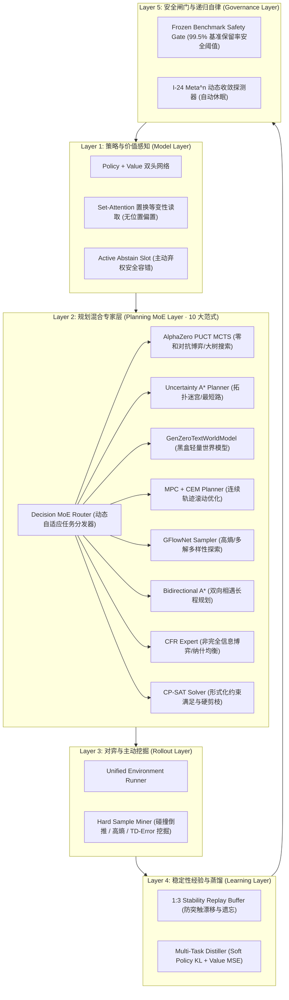

# Gen-Zero: 通用自进化决策引擎 (Experimental Decision Engine)

[](https://www.python.org/)
[](../../LICENSE)


> **Gen-Zero** 是一个集成了 **Set-Attention 置换等变性网络**、**PUCT 双头树搜索 (MCTS)**、**不确定性 A\* 规划器**、**文字/动力学世界模型** 以及 **RSI 自动自博弈进化飞轮** 的通用下一代决策引擎。支持在业务工单审批、连续/离散图搜索、零和对抗博弈以及局部受限物理控制等多任务中实现**结构化候选评分、多样性探索与约束决策**。

---

## 一、核心技术特性与五层架构



1. **候选集合等变结构**：Set-Attention 的结构性质不等于端到端决策不变性；编码、并列分数和动作选择仍需单独验证。
2. **System 1 与 System 2 动态双模态**：
   - **System 1 (Reflex)**：单步候选评分；当前无可复现的端到端 <0.1ms 测量。
   - **System 2 (Lookahead/MCTS)**：模型驱动规划；陷阱规避结果仅适用于对应评测环境，不能推广为普遍安全保证。
3. **无人值守安全进化闭环（RSI Flywheel）**：
   - 在线长程自博弈；
   - 困难样本前溯捕捉；
   - 1:3 经验回放（缓解遗忘的实验配置，不保证消除遗忘）；
   - 冻结基准安全闸门自动仲裁热部署（`DEPLOY_HOT_UPDATE`）。

---

## 二、安装与环境配置

### 1. 本地环境
完整 Python 决策框架需要 Python 3.10+，运行依赖详见 `python/pyproject.toml` 的 `dependencies`（包括 numpy、torch、scipy、pydantic、mcp、aiohttp、httpx、zstandard、fastapi、uvicorn），可选依赖见 `[project.optional-dependencies]`。
单机独立轻量 9B smoke demo（`examples/run_9b_demo.py`）是唯一例外：它只加载 `gen_zero/causal/rnn_set_adapter.py`，仅需 Python 3.10+ 和 numpy。
```bash
# 克隆仓库并进入根目录
cd python

# 安装完整依赖 (torch 是必需依赖；没有 GPU 时 torch 在 CPU 上运行)
pip install -r requirements.txt  # requirements.txt 还额外包含 ortools、transformers、huggingface_hub
```

### 2. A100 GPU 算力集群 (`ai-server`)
支持在多卡或 A100 80GB 服务器上运行：
```bash
# 验证 GPU 就绪
ssh ai "nvidia-smi"
```

---

## 三、快速开始 (Quick Start)

### 1. 30 秒极简决策调用

```python
from gen_zero import GenZero

# 实例化 Gen-Zero 统一决策引擎
engine = GenZero()
# 默认没有训练好的双头权重；必须检查 degraded / scorer 等元数据。

# 示例：复杂业务异常决策（自然语言状态）
state = "Production DB alert: CPU usage at 96%, latency spike observed."
candidates = ["scale_up", "restart_instance", "ignore"]

# 自动多专家自适应决策 (Dynamic-K Planning MoE)
result = engine.decide(
    state=state,
    candidates=candidates,
    mode="auto"  # 模型自主感知输入特征与熵，自适应决定激活专家数 K ∈ [1, 3]
)

print("degraded:", result.get("degraded"), "scorer:", result.get("scorer"))
print(f"推荐共识动作: {result['action']}")         # 经软加权共识或安全剪枝后的最高融合得分动作
print(f"动态专家数 K: {result['k_experts']}")       # 1 (极速), 2 (安全流水线), 3 (多专家委员会)
print(f"激活专家列表: {result['experts_activated']}") # ['cp_sat', 'mcts'] 等
print(f"专家加权配比: {result['expert_weights']}")    # {'cp_sat': 0.84, 'world_model': 0.16}
print(f"动作概率分布: {result['probs']}")
print(f"决策耗时: {result['latency_ms']} ms")       # 进程内单步执行耗时（依负载与环境而定）
```

### 2. 图搜索与无回环规划 (`plan_path`)

```python
from gen_zero import GenZero

engine = GenZero()

start = (0, 0)
goal = (5, 5)
walls = {(1, 1), (1, 2), (2, 2), (3, 2)}

# 目标判定与邻居状态生成
is_goal = lambda pos: pos == goal
def get_neighbors(pos):
    r, c = pos
    nbrs = []
    for dr, dc, act in [(-1, 0, "north"), (1, 0, "south"), (0, 1, "east"), (0, -1, "west")]:
        nxt = (r + dr, c + dc)
        if 0 <= nxt[0] <= 6 and 0 <= nxt[1] <= 6 and nxt not in walls:
            nbrs.append((nxt, act, 0.99))  # (next_state, action_name, safety_prob)
    return nbrs

# 启发距离
heuristic = lambda pos: abs(pos[0] - goal[0]) + abs(pos[1] - goal[1])

# 执行图搜索
plan = engine.plan_path(start, is_goal, get_neighbors, heuristic)
print("规划成功:", plan["success"])
print("规划动作链:", plan["path"])
```

---

## 四、核心参数配置 (`GenZeroConfig`)

通过 [`gen_zero/config.py`](config.py) 可以对全流程进行灵活微调：

| 参数字段 | 默认值 | 作用说明与调优建议 |
| :--- | :---: | :--- |
| `mcts_simulations` | `64` | MCTS 树搜索单步虚拟展开次数。需要更强博弈能力可设为 `128` 或 `256`。 |
| `mcts_depth` | `6` | 虚拟世界模型的前瞻最大深度。深层死胡同迷宫建议 `8`。 |
| `astar_lambda` | `1.0` | 不确定性边权公式 $1 + \lambda(-\log p)$ 中的惩罚系数。 |
| `hard_to_gold_ratio`| `0.25` | 回放池中困难样本上限（1:3 黄金配比，防止策略漂移）。 |
| `hard_sample_history_steps`| `5` | 发生碰撞或低价值事件时向前追溯捕捉的步数。 |
| `gate_min_accuracy_retention`| `0.995`| 安全闸门允许的基线准确率最低保留率（严禁低于 99.5%）。 |
| `metan_convergence_delta` | `0.005` | $\text{Meta}^n$ 增益饱和阈值。连续 2 轮增量 $<0.5\%$ 时自动停止飞轮。 |

---

## 五、自博弈飞轮 (RSI)

`run_flywheel.py` 依赖已不存在的 `snake_game` 模块，已于 2026-09-26 删除。飞轮组件 (`gate/`, `train/`, `rollout/`) 仍在，需自行编写驱动脚本。

---

## 六、实测性能基准 (Benchmark Results)

### 1. 跨领域高阶基准实测表 (`evaluate_universal_suite.py`)

> 以下数字来自历史实验记录；当前提交缺少其源数据和生成产物，无法从本仓库复现，不应作为当前性能承诺。

| 领域 / 评测基准 | 任务场景与考察重点 | 单步直觉基线 (1-Step) | **Gen-Zero 规划 (MCTS/A\*)** | 性能增益 |
| :--- | :--- | :---: | :---: | :---: |
| **Games v2 (Test)** | Tic-Tac-Toe Minimax 零和对抗博弈 | 68.75% | **96.25%** | **+27.50%** 🚀 |
| **Games v2 (Test)** | Grid Navigation 最短路径规划 | 95.00% | **100.00%** | **+5.00%** |
| **Games v2 (OOD)** | 障碍高密集度分布外寻路 | 87.50% | **100.00%** | **+12.50%** 🚀 |
| **Workflows v2** | 智能家居 / 实体属性检索业务流 | 40.00% | **73.21%** (家居 **98.44%**) | 规则约束零样本求解 |
| **Scaled Local Maze** | POMDP 5x5 局部几何受限穿障 | - | **100.00%** | 几何连通性完美解析 |

> 原「视野深度 A/B/C 对比实验」(`evaluate_lookahead_comparison.py`) 的数字来自已删除的失效脚本，不再引用。

---

## 七、项目工程结构

```text
gen_zero/
├── __init__.py               # 公共导出模块 (GenZero, GenZeroConfig)
├── client.py                 # 统一高层调用接口 (decide, plan_path, evolve_round)
├── config.py                 # 全局超参数与路径配置
├── model/                    # [Layer 1] 模型层
│   ├── dual_head.py          # Policy + Value 双头网络与 Set-Attention
│   └── prefix_cache.py       # 前缀 KV-Cache 共享加速
├── planner/                  # [Layer 2] 规划层
│   ├── astar.py              # 不确定性 A* 规划器 (1 + λ(-log p))
│   ├── mcts.py               # AlphaZero PUCT MCTS 树搜索
│   └── world_model.py        # 轻量级文字/动力学世界模型
├── rollout/                  # [Layer 3] 交互与采样层
│   ├── runner.py             # 统一环境长程交互执行器
│   └── hard_miner.py         # 碰撞倒推与高熵困难样本挖掘器
├── train/                    # [Layer 4] 学习与沉淀层
│   ├── replay_buffer.py      # 1:3 黄金锚点防遗忘经验回放池
│   └── distiller.py          # 多任务双头蒸馏训练器
├── gate/                     # [Layer 5] 安全与治理层
│   ├── safety_gate.py        # 冻结天梯 99.5% 不退化安全闸门
│   └── rsi_orchestrator.py   # RSI 自博弈长周期总调度器 (含 Meta^n 探测)
└── evaluate_universal_suite.py # 跨域通用高阶基准评测
```

---

## 八、开源许可证

本项目采用 [Apache License 2.0](../../LICENSE) 开源。
